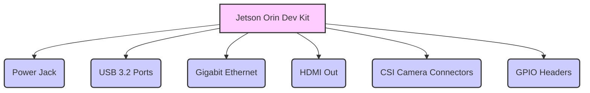
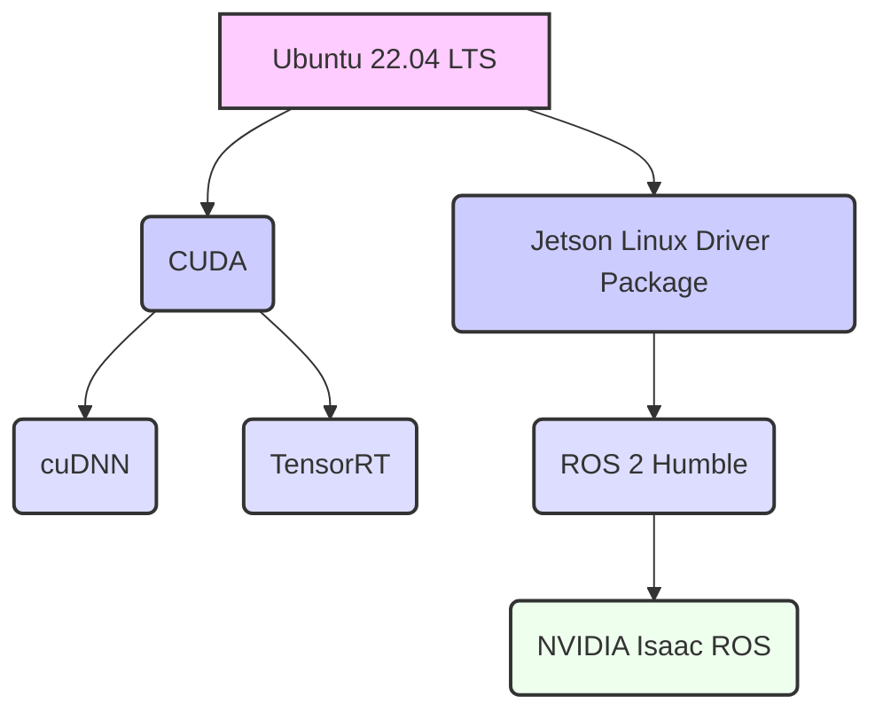

# Hardware Appendix: Jetson Orin Setup

## A.1 Understanding the NVIDIA Jetson Orin Platform

The NVIDIA Jetson Orin platform represents a significant leap forward in edge AI and robotics. It offers unparalleled compute performance for AI workloads in a compact, power-efficient form factor, making it ideal for deploying sophisticated Physical AI and humanoid robotics applications.

**Key Capabilities of Jetson Orin:**
*   **High AI Performance**: Up to 275 TOPS (Trillions of Operations Per Second) for AI, enabling complex deep learning models to run on the edge.
*   **Integrated NVIDIA GPU**: Powerful GPU with CUDA cores, Tensor Cores, and NVDLA (NVIDIA Deep Learning Accelerator) for accelerated AI and vision tasks.
*   **CPU**: High-performance ARM-based CPU for general-purpose computing.
*   **Memory**: High-speed LPDDR5/LPDDR5x memory for demanding workloads.
*   **Connectivity**: Rich I/O including USB 3.2, PCIe Gen4, Gigabit Ethernet, and camera interfaces.
*   **Software Stack**: Supported by NVIDIA JetPack SDK, which includes Linux OS, CUDA, cuDNN, TensorRT, and various developer tools.

## A.2 Setting Up and Configuring a Jetson Orin Device

Setting up your Jetson Orin developer kit involves flashing the JetPack SDK and configuring the device for your development needs.

### A.2.1 Flashing the JetPack SDK

The JetPack SDK is a comprehensive software stack that includes the Linux operating system (L4T), CUDA, cuDNN, TensorRT, and developer tools crucial for AI and robotics on Jetson.

**High-level Lab Task**: Flash the JetPack SDK onto a Jetson Orin developer kit.
1.  **Download NVIDIA SDK Manager**: This is the recommended tool for flashing Jetson devices. Install it on your host Ubuntu PC.
2.  **Connect Jetson**: Put your Jetson Orin into recovery mode and connect it to your host PC via USB.
3.  **Flash OS**: Use SDK Manager to download and flash the latest JetPack OS image onto your Jetson.

**Example A.1: Shell script for flashing JetPack (high-level steps) (`flash_jetson_orin.sh`)**

```bash
#!/bin/bash
# High-level script for guiding Jetson Orin flashing process using NVIDIA SDK Manager

echo "This script provides high-level instructions to flash your Jetson Orin device."
echo "For detailed, step-by-step instructions, please refer to the official NVIDIA documentation."
echo ""
echo "Prerequisites:"
echo "1. An Ubuntu host PC (18.04 LTS or newer) with NVIDIA SDK Manager installed."
echo "2. Your NVIDIA Jetson Orin Developer Kit."
echo "3. A USB-C cable for connecting the Jetson to the host PC."
echo "4. A display, keyboard, and mouse connected to the Jetson Orin (for initial setup)."
echo ""

read -p "Press Enter to continue with instructions..."

echo "Step 1: Install NVIDIA SDK Manager on your Ubuntu Host PC"
echo "   Download from: developer.nvidia.com/nvidia-sdk-manager"
echo "   Install using: sudo apt install ./sdkmanager_[version].deb"
echo ""

echo "Step 2: Connect your Jetson Orin to your Host PC in Recovery Mode"
echo "   - Ensure Jetson is powered off."
echo "   - Connect the USB-C cable to the Jetson's USB-C port (next to the power barrel jack) and to your host PC."
echo "   - Hold down the 'Recovery' button, then press and release the 'Power' button."
echo "   - Wait 2 seconds, then release the 'Recovery' button."
echo "   - The Jetson should now be in Recovery Mode (no display output)."
echo ""

echo "Step 3: Launch SDK Manager and Flash JetPack"
echo "   - Launch SDK Manager on your host PC: sdkmanager"
echo "   - Log in with your NVIDIA Developer account."
echo "   - Follow the GUI instructions to select your Jetson Orin device and the JetPack version."
echo "   - Select 'Flash OS' and other components you wish to install (CUDA, cuDNN, TensorRT, etc.)."
echo "   - Accept licenses and proceed. SDK Manager will download and flash the OS."
echo ""

echo "Once flashing is complete, your Jetson Orin will reboot. Complete the initial Ubuntu setup on the Jetson."
echo "Setup is complete. For further details, consult NVIDIA's official Jetson documentation."
```

### A.2.2 Basic Configuration

After flashing, you'll complete initial Ubuntu setup on the Jetson. This includes setting up user accounts, locale, and network.

**High-level Lab Task**: Configure network settings for communication between Jetson and host PC.
*   Configure a static IP for your Jetson, or ensure it's on the same network as your host PC for ROS 2 communication.

## A.3 Installing ROS 2 and Key Libraries

ROS 2 is essential for robotics development on Jetson.

**High-level Lab Task**: Install ROS 2 Humble on the Jetson Orin.
*   Follow the official ROS 2 Humble installation guide for Ubuntu ARM64, ensuring you use the `ros-humble-desktop` metapackage.

**Example A.2: Shell script for ROS 2 Humble installation on Jetson (`install_ros2_jetson.sh`)**

```bash
#!/bin/bash
# Script to install ROS 2 Humble (Desktop) on NVIDIA Jetson Orin (Ubuntu 22.04 ARM64)

echo "This script will install ROS 2 Humble (Desktop) on your Jetson Orin."
echo "Ensure you have a fresh Ubuntu 22.04 installation on your Jetson."
echo ""

read -p "Press Enter to begin ROS 2 Humble installation..."

# Set locale
sudo locale-gen en_US en_US.UTF-8
sudo update-locale LC_ALL=en_US.UTF-8 LANG=en_US.UTF-8
export LANG=en_US.UTF-8

# Setup sources
sudo apt update && sudo apt install -y curl gnupg lsb-release
sudo curl -sSL https://raw.githubusercontent.com/ros/rosdistro/master/ros.key -o /usr/share/keyrings/ros-archive-keyring.gpg
echo "deb [arch=$(dpkg --print-architecture) signed-by=/usr/share/keyrings/ros-archive-keyring.gpg] http://packages.ros.org/ros2/ubuntu $(source /etc/os-release && echo UBUNTU_CODENAME) main" | sudo tee /etc/apt/sources.list.d/ros2.list > /dev/null

# Install ROS 2 packages
sudo apt update
sudo apt upgrade -y
sudo apt install -y ros-humble-desktop

# Environment setup
echo "source /opt/ros/humble/setup.bash" >> ~/.bashrc
source ~/.bashrc

echo "ROS 2 Humble installation complete!"
echo "Please restart your terminal or run 'source ~/.bashrc' to apply changes."
```

## A.4 Troubleshooting Common Setup Issues

Common issues include:
*   **SDK Manager Connectivity**: Ensure USB-C cable is correctly connected and Jetson is in recovery mode.
*   **Package Dependencies**: `sudo apt update && sudo apt upgrade` often resolves many dependency issues.
*   **ROS 2 Environment**: Always remember to `source /opt/ros/humble/setup.bash` in each new terminal.

## A.5 Optimizing Performance on Jetson Orin

Jetson Orin devices offer configurable power modes to balance performance and power consumption.

**Figure A.1: Jetson Orin Developer Kit Board Layout**



*Figure A.1: Illustrates a simplified layout of the Jetson Orin Developer Kit board, highlighting key external ports and connectors essential for setup and integration.*

**High-level Lab Task**: Optimize Jetson Orin power modes and performance settings.

**Example A.3: Shell script to switch Jetson power modes (`jetson_power_modes.sh`)**

```bash
#!/bin/bash
# Script to set Jetson Orin power modes

echo "Available power modes for Jetson Orin:"
sudo nvpmodel -q --verbose | grep -E "Power Mode"
echo ""

read -p "Enter desired power mode ID (e.g., 0 for MAXN, 1 for 15W): " MODE_ID

if [[ "$MODE_ID" =~ ^[0-9]+$ ]]; then
  echo "Setting power mode to ID: $MODE_ID"
  sudo nvpmodel -m "$MODE_ID"
  echo "Power mode set. Verify with 'sudo nvpmodel -q --verbose'."
else
  echo "Invalid input. Please enter a numeric power mode ID."
fi
```

**Figure A.2: Jetson Orin Software Stack**



*Figure A.2: Depicts the typical software stack on an NVIDIA Jetson Orin device, showing the foundational Linux OS (L4T) supporting NVIDIA's accelerated computing libraries (CUDA, cuDNN, TensorRT) and higher-level robotics frameworks like ROS 2 and Isaac ROS.*

## Exercises and Practice Tasks

1.  **Jetson Orin Setup**:
    *   Follow the steps to flash JetPack SDK onto your Jetson Orin developer kit.
    *   Complete the initial Ubuntu setup.
    *   Output: A functioning Jetson Orin device with Ubuntu and JetPack installed.
2.  **ROS 2 on Jetson**:
    *   Install ROS 2 Humble on your Jetson Orin using the provided script.
    *   Run a basic ROS 2 example (e.g., `ros2 run demo_nodes_cpp talker` and `ros2 run demo_nodes_py listener`) directly on the Jetson.
    *   Output: ROS 2 successfully running on Jetson Orin.
3.  **Network Configuration**:
    *   Configure your Jetson Orin's network interface to have a static IP address.
    *   Test SSH connectivity from your host PC to the Jetson.
    *   Output: Successful SSH connection to Jetson.
4.  **Power Mode Experimentation**:
    *   Use the provided script to query available power modes and set your Jetson to different modes (e.g., MAXN, 15W).
    *   Monitor CPU/GPU usage and temperature (e.g., using `tegrastats`) to observe the performance differences.
    *   Output: Understanding of power mode impact on Jetson performance.
5.  **Benchmarking (Optional)**:
    *   Run a simple AI benchmark (e.g., `trtexec` with a sample TensorRT model) on your Jetson Orin in different power modes.
    *   Compare the inference performance to highlight the Jetson's capabilities.
