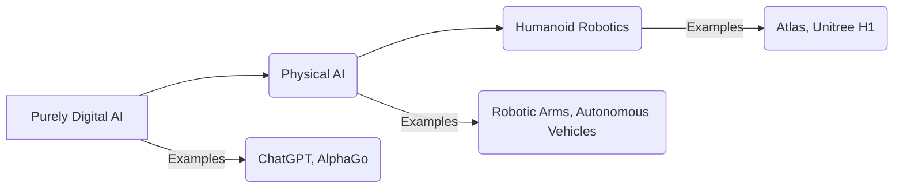

# Introduction to ROS 2

## 1.1 What is Physical AI and Humanoid Robotics?

Physical AI represents the cutting edge of artificial intelligence, where computational intelligence transcends virtual environments to directly interact with the real world through robotic bodies. Unlike purely digital AI, which processes information in cyberspace, Physical AI is embodied intelligence. It involves robots perceiving their surroundings, making decisions based on real-world physics, and executing actions that have tangible consequences.

Humanoid robotics, a significant subset of Physical AI, focuses on developing robots that mimic the human form and capabilities. This form factor is not merely an aesthetic choice; it is driven by the need for robots to operate effectively and naturally in human-centric environments. From navigating complex indoor spaces designed for people to using tools engineered for human hands, humanoid robots are uniquely positioned to integrate seamlessly into our daily lives and workplaces.

**Figure 1.1: The Spectrum of AI**

*Figure 1.1: Illustrates the progression from purely digital AI to embodied Physical AI, culminating in humanoid robotics.*

## 1.2 Bridging Digital Intelligence with Physical Embodiment

The core challenge and ultimate goal of Physical AI is to bridge the gap between advanced digital intelligence (the "brain") and the physical embodiment of robotics (the "body"). This involves complex interactions between perception, cognition, and action, all constrained by the laws of physics. Humanoid robots, in particular, must master:

*   **Perception**: Interpreting sensory data (vision, touch, sound) from a dynamic, unstructured environment.
*   **Cognition**: Planning, decision-making, and learning from experience, often in real-time.
*   **Manipulation**: Interacting with objects using dexterous hands or end-effectors.
*   **Locomotion**: Moving robustly and gracefully in diverse terrains, including bipedal walking.
*   **Human-Robot Interaction (HRI)**: Communicating and collaborating safely and intuitively with humans.

## 1.3 Introducing ROS 2, Gazebo, Unity, and NVIDIA Isaac

To tackle these complexities, modern robotics development relies on a suite of powerful software tools and frameworks:

*   **ROS 2 (Robot Operating System 2)**: The de facto standard open-source framework for robot application development. ROS 2 provides a structured communication layer, tools, and libraries to build complex robot behaviors from modular components. It is the "nervous system" that allows different parts of a robot's software to communicate.
*   **Gazebo**: A robust 3D robotics simulator that accurately simulates the physics of robots and their environments. Gazebo is essential for testing robot algorithms safely and efficiently before deployment on physical hardware.
*   **Unity**: A versatile real-time 3D development platform, increasingly used in robotics for high-fidelity visualization, human-robot interaction design, and synthetic data generation, especially when photorealism is key.
*   **NVIDIA Isaac Sim**: Built on NVIDIA Omniverse, Isaac Sim is a scalable robotics simulation application and synthetic data generation tool. It offers highly realistic physics, advanced rendering, and seamless integration with NVIDIA's AI platforms, making it ideal for training AI-powered robots.

These tools, when used in concert, create a powerful ecosystem for designing, simulating, and deploying intelligent physical AI systems.

## 1.4 How Humanoid Robots Understand Physical Laws

Humanoid robots don't "understand" physical laws in a human-like cognitive sense, but their control systems and AI algorithms are designed to operate within these laws. This understanding is embedded through:

*   **Physics Engines**: Simulators like Gazebo and Isaac Sim use physics engines to model gravity, friction, collision detection, and rigid body dynamics.
*   **Kinematics and Dynamics**: Roboticists program the mathematical relationships describing robot motion (kinematics) and the forces/torques required to produce that motion (dynamics).
*   **Sensor Feedback**: Robots use sensors (IMUs, force sensors, vision) to perceive deviations from expected physical behavior and adjust their actions accordingly.
*   **Learning Algorithms**: AI algorithms, especially in reinforcement learning, learn optimal behaviors by interacting with the environment, implicitly discovering physical constraints through trial and error.

**Table 1.1: Key Tools in Physical AI Development**

| Tool          | Primary Function                     | Role in Physical AI                         |
| :------------ | :----------------------------------- | :------------------------------------------ |
| **ROS 2**     | Robot Application Framework          | Communication backbone, modular software    |
| **Gazebo**    | Physics-based 3D Simulator           | Safe testing, environment interaction       |
| **Unity**     | Real-time 3D Platform                | High-fidelity visualization, HRI design     |
| **NVIDIA Isaac Sim** | Advanced Robotics Simulator & Synthetic Data | AI training, realistic physics and rendering |

*Table 1.1: Overview of essential software tools and their contributions to Physical AI and humanoid robotics development.*

## 1.5 Book Overview: Structure and Modules

This book is designed to guide you through the exciting world of Physical AI and Humanoid Robotics, providing a comprehensive understanding and practical skills using the tools introduced above. The content is structured into four main modules, complemented by essential appendices and references:

### Module 1: The Robotic Nervous System (ROS 2)
This module introduces ROS 2 fundamentals, covering its architecture, core communication patterns (nodes, topics, services, actions), and how to develop basic robot control applications using Python.

### Module 2: The Digital Twin (Gazebo & Unity)
Here, you will delve into the creation and utilization of digital twins. We will explore physics-based simulation with Gazebo, learn URDF for robot modeling, and discover how Unity can be leveraged for high-fidelity visualization and interaction.

### Module 3: The AI-Robot Brain (NVIDIA Isaac)
This module focuses on NVIDIA Isaac Sim, a powerful platform for photorealistic simulation and AI-driven robotics. You will learn about synthetic data generation, robot integration, and implementing perception and AI algorithms within Isaac Sim.

### Module 4: Vision-Language-Action (VLA)
The final core module brings together vision, language, and action. You will learn to integrate speech recognition (e.g., OpenAI Whisper), natural language understanding (NLU) for robot commands, and action planning to create truly intelligent and interactive robots.

## 1.6 Prerequisites for This Book

To get the most out of this book, a basic foundation in the following areas is recommended:

*   **Linux Command Line**: Familiarity with basic commands (navigation, file operations, executing scripts).
*   **Programming Concepts**: Understanding of variables, loops, functions, and object-oriented programming, primarily in Python and optionally C++.
*   **Robotics Interest**: A general curiosity and enthusiasm for robotics, AI, and automation.

## Exercises and Practice Tasks

1.  **Define Physical AI**: In your own words, define Physical AI and explain how it differs from purely digital AI. Provide two examples of Physical AI systems not mentioned in this chapter.
2.  **Role of Humanoid Robotics**: Discuss why the humanoid form factor is particularly relevant for robots operating in human-centric environments. What are the unique challenges?
3.  **Tool Comparison**: Research one alternative to each tool introduced (ROS 2, Gazebo, Unity, NVIDIA Isaac Sim). Briefly compare their strengths and weaknesses in the context of Physical AI development.
4.  **Initial Setup**: Follow the Quickstart Guide to install Ubuntu 22.04 and ROS 2 Humble in a virtual machine or on a dedicated machine. Verify your installation by running the provided ROS 2 demo commands.
5.  **Book Navigation**: Review the Table of Contents (implied from the module structure) and identify which module you are most excited to explore first and why.
