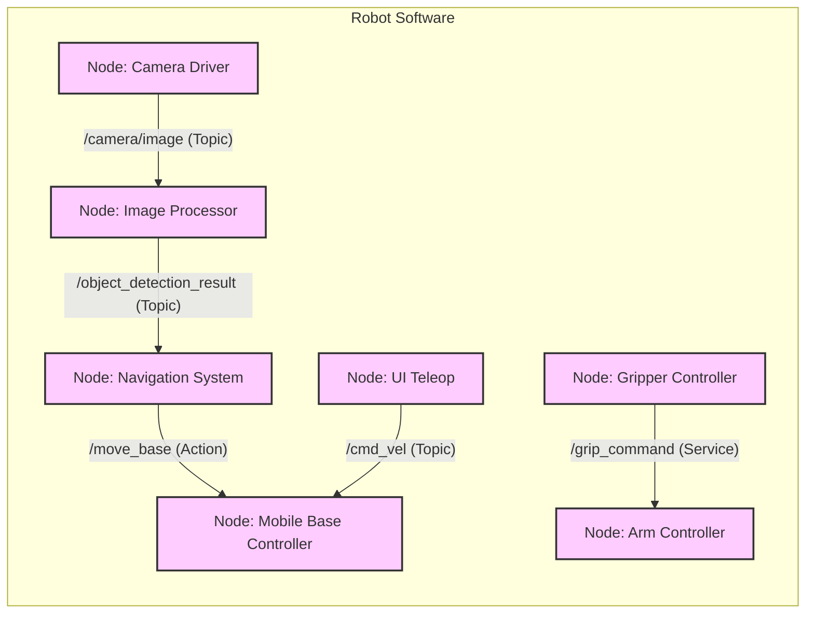

# ROS 2 Architecture and Core Concepts

## 2.1 The Layered Architecture of ROS 2

ROS 2 (Robot Operating System 2) is designed with a layered architecture, providing flexibility, modularity, and robust communication for robotic systems. This layered approach isolates concerns, making it easier to develop, debug, and maintain complex robotic applications. At its heart lies the Data Distribution Service (DDS), which handles the intricate details of inter-process communication.

**Figure 2.1: ROS 2 Layered Architecture**

```mermaid
graph TD
    A[Application Layer: User Code, Algorithms] --> B[Client Libraries: rclpy, rclcpp];
    B --> C[ROS Middleware Interface (RMW)];
    C --> D[DDS (Data Distribution Service): e.g., Fast RTPS, Cyclone DDS];
    D --> E[Operating System / Network];
    style A fill:#f9f,stroke:#333,stroke-width:2px;
    style B fill:#bbf,stroke:#333,stroke-width:2px;
    style C fill:#ccf,stroke:#333,stroke-width:2px;
    style D fill:#ddf,stroke:#333,stroke-width:2px;
    style E fill:#efe,stroke:#333,stroke-width:2px;
```

*Figure 2.1: Illustrates the layered architecture of ROS 2, from user applications down to the operating system and network layers.*

### 2.1.1 Application Layer

This is where your robot's high-level logic resides—your custom algorithms, behaviors, and control strategies. It interacts with the rest of ROS 2 through the client libraries.

### 2.1.2 Client Libraries (rclpy, rclcpp)

ROS 2 offers client libraries in various languages, with Python (`rclpy`) and C++ (`rclcpp`) being the most common. These libraries provide the APIs that developers use to interact with ROS 2 primitives like nodes, topics, services, and actions. They abstract away the complexities of the underlying communication layers.

### 2.1.3 ROS Middleware Interface (RMW)

The RMW layer is a crucial abstraction that allows ROS 2 to be agnostic to the specific DDS implementation. It provides a common API for the client libraries to interact with any compatible DDS provider. This pluggable architecture means you can swap out DDS implementations without changing your application code.

### 2.1.4 Data Distribution Service (DDS)

DDS is an ISO standard for publish-subscribe communication, optimized for real-time, mission-critical applications. It handles discovery, serialization, transport, and quality of service (QoS) for all data exchanged between ROS 2 components. Popular DDS implementations include eProsima Fast RTPS (now Fast-DDS), RTI Connext, and Cyclone DDS.

## 2.2 Key ROS 2 Computational Graph Elements

The computational graph of ROS 2 describes the peer-to-peer network of ROS 2 processes that communicate with each other. Understanding these fundamental elements is key to building modular and distributed robot applications.

**Figure 2.2: ROS 2 Computational Graph**



*Figure 2.2: An example ROS 2 computational graph showing various components and their communication mechanisms.*

### 2.2.1 Nodes

Nodes are the fundamental computational units in ROS 2. Each node is an executable process that performs a specific, single-purpose task (e.g., a camera driver, a motor controller, a navigation algorithm). Breaking down a robot's functionality into many small nodes promotes modularity and reusability.

*   **Example**: A single robot might have nodes for:
    *   Reading sensor data (e.g., LiDAR node, IMU node)
    *   Processing perception data (e.g., object detection node, SLAM node)
    *   Controlling actuators (e.g., motor controller node, gripper node)
    *   High-level decision-making (e.g., mission planning node)

### 2.2.2 Topics

Topics are a publish-subscribe communication mechanism for asynchronous, many-to-many data streaming. Nodes publish messages to a named topic, and other nodes subscribe to that topic to receive the messages. There is no guarantee that a message will be received, making topics suitable for continuous data streams like sensor readings or odometry.

*   **Example**: A LiDAR sensor node might publish `sensor_msgs/LaserScan` messages to the `/scan` topic, and a navigation node would subscribe to `/scan` to receive this data.

### 2.2.3 Services

Services provide a synchronous, one-to-one request-response communication pattern. A client node sends a request to a service server node, which performs a computation and returns a response. The client waits for the response, making services suitable for tasks that require immediate results, such as setting a robot parameter or triggering a specific action.

*   **Example**: A UI node (client) might request a "reset odometry" service from a mobile base controller node (server).

### 2.2.4 Actions

Actions are a more complex communication pattern designed for long-running, goal-based tasks. Unlike services, action clients can receive continuous feedback on the progress of a goal and can also cancel a goal before completion. An action server processes the goal, sends feedback, and eventually returns a result. Actions are ideal for tasks like "navigate to a point" or "pick up an object," where monitoring progress is important.

*   **Example**: A mission planning node (client) might send a "navigate to kitchen" action goal to a navigation action server, receiving feedback on the robot's current position along the way.

## 2.3 ROS 2 Client Libraries and Build Systems

### 2.3.1 Client Libraries (rclpy, rclcpp)

*   **rclpy (Python Client Library)**: This library allows you to write ROS 2 nodes in Python. Python is often preferred for rapid prototyping, high-level logic, and applications involving machine learning due to its extensive ecosystem of data science libraries.
*   **rclcpp (C++ Client Library)**: For performance-critical applications, low-level hardware control, or integration with existing C++ codebases, `rclcpp` is the go-to choice. It offers bare-metal control and maximizes execution speed.

### 2.3.2 Build Systems (colcon, ament)

*   **colcon**: The primary build tool for ROS 2. It orchestrates the building, testing, and installing of multiple packages in a workspace. `colcon` automatically detects various build types (e.g., ament_cmake, ament_python, plain CMake) and handles their dependencies.
*   **ament**: A meta-build system that provides the necessary infrastructure and conventions for building ROS 2 packages. `ament` defines the package manifest (`package.xml`), directory layouts, and CMake/Python build toolchains.

## 2.4 ROS 2 Communication Patterns: A Comparison

The choice of communication pattern in ROS 2 depends on the specific needs of your application.

**Table 2.1: ROS 2 Communication Pattern Comparison**

| Feature           | Topics                         | Services                   | Actions                                     |
| :---------------- | :----------------------------- | :------------------------- | :------------------------------------------ |
| **Communication** | Asynchronous (pub/sub)         | Synchronous (req/rep)      | Asynchronous (goal/feedback/result)         |
| **Data Flow**     | Continuous stream              | Single request, single response | Goal, continuous feedback, single result    |
| **Use Cases**     | Sensor data, odometry, command streams | Parameter settings, immediate queries | Navigation, manipulation, long-running tasks |
| **Blocking**      | Non-blocking                   | Client blocks until response | Client can monitor or cancel, non-blocking goal |

*Figure 2.3: Compares the three primary ROS 2 communication patterns based on their characteristics and typical use cases.*

## 2.5 Basic ROS 2 Command-Line Tools for Introspection

ROS 2 provides a rich set of command-line interface (CLI) tools to inspect and interact with a running ROS 2 system. These are invaluable for debugging and understanding the computational graph.

*   `ros2 node list`: Lists all active nodes.
*   `ros2 topic list`: Lists all active topics.
*   `ros2 topic echo <topic_name>`: Displays messages being published on a topic.
*   `ros2 service list`: Lists all available services.
*   `ros2 service call <service_name> <service_type> <request_args>`: Calls a service.
*   `ros2 action list`: Lists all available actions.
*   `ros2 action send_goal <action_name> <action_type> <goal_args>`: Sends a goal to an action server.
*   `rqt_graph`: A GUI tool to visualize the ROS 2 computational graph.

## Exercises and Practice Tasks

1.  **Identify Components**: For a simple mobile robot navigating a room, list at least three potential nodes and two topics they might use for communication. What type of data would each topic carry?
2.  **Communication Choice**: For each scenario below, recommend whether to use a Topic, Service, or Action in ROS 2 and justify your choice:
    *   Streaming real-time LiDAR data.
    *   Initiating a robot emergency stop.
    *   Commanding a robot to pick up a specific object from a known location.
    *   Requesting the robot's current battery level.
3.  **Explore `rqt_graph`**:
    *   Launch two `turtlesim` nodes (`ros2 run turtlesim turtlesim_node` and `ros2 run turtlesim turtle_teleop_key`).
    *   Launch `rqt_graph`.
    *   Sketch the observed computational graph, labeling nodes and topics.
    *   Explain what happens when you close the `turtle_teleop_key` node in `rqt_graph`.
4.  **Client Library Decision**: You need to implement a high-performance vision algorithm that processes camera images at 60 FPS and also a high-level behavior tree for task planning. Which ROS 2 client library (`rclpy` or `rclcpp`) would you recommend for each task and why?
5.  **Build System**: Explain the role of `colcon` and `ament` in building ROS 2 packages. Why are they necessary beyond traditional `CMake`?
