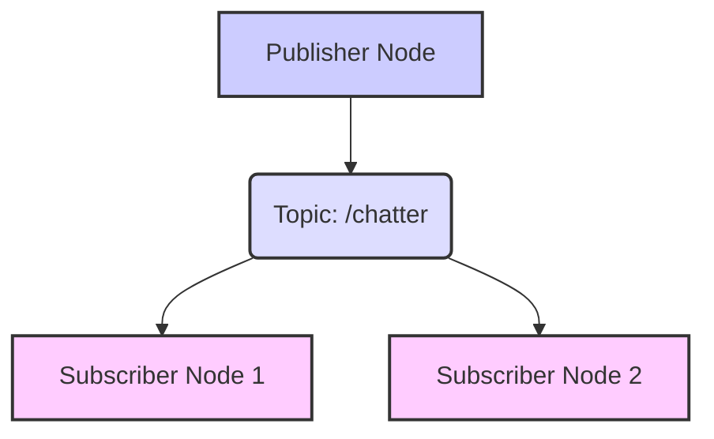

# Working with Nodes and Topics

## 3.1 Creating Basic ROS 2 Nodes

At the heart of any ROS 2 application are **nodes**. A node is simply an executable process that performs computation. Nodes are designed to be modular and single-purpose, allowing complex robot behaviors to be built from many small, interconnected components.

ROS 2 provides client libraries to write nodes in various programming languages. Here, we'll focus on Python (`rclpy`) and C++ (`rclcpp`), the most commonly used.

### 3.1.1 Python Node (rclpy) Structure

A basic Python ROS 2 node typically involves:
1.  Importing `rclpy` and message types.
2.  Initializing `rclpy`.
3.  Creating a node.
4.  Creating a publisher or subscriber.
5.  Spinning the node to keep it alive and process callbacks.
6.  Shutting down `rclpy`.

**Example 3.1: Python Publisher Node (`py_string_publisher.py`)**

```python
import rclpy
from rclpy.node import Node
from std_msgs.msg import String

class SimplePublisher(Node):
    def __init__(self):
        super().__init__('simple_publisher')
        self.publisher_ = self.create_publisher(String, 'chatter', 10)
        timer_period = 0.5  # seconds
        self.timer = self.create_timer(timer_period, self.timer_callback)
        self.i = 0

    def timer_callback(self):
        msg = String()
        msg.data = f'Hello ROS 2! {self.i}'
        self.publisher_.publish(msg)
        self.get_logger().info(f'Publishing: "{msg.data}"')
        self.i += 1

def main(args=None):
    rclpy.init(args=args)
    simple_publisher = SimplePublisher()
    rclpy.spin(simple_publisher) # Keep node alive
    simple_publisher.destroy_node()
    rclpy.shutdown()

if __name__ == '__main__':
    main()
```

### 3.1.2 C++ Node (rclcpp) Structure

C++ nodes follow a similar pattern but involve more explicit memory management and class definitions.

**Example 3.2: C++ Publisher Node (`cpp_int_publisher.cpp`)**

```cpp
#include <chrono>
#include <functional>
#include <memory>
#include <string>

#include "rclcpp/rclcpp.hpp"
#include "std_msgs/msg/int32.hpp"

using namespace std::chrono_literals;

class SimplePublisher : public rclcpp::Node
{
public:
  SimplePublisher()
  : Node("simple_publisher"), count_(0)
  {
    publisher_ = this->create_publisher<std_msgs::msg::Int32>("integer_chatter", 10);
    timer_ = this->create_wall_timer(
      500ms, std::bind(&SimplePublisher::timer_callback, this));
  }

private:
  void timer_callback()
  {
    auto message = std_msgs::msg::Int32();
    message.data = count_++;
    RCLCPP_INFO(this->get_logger(), "Publishing: '%d'", message.data);
    publisher_->publish(message);
  }
  rclcpp::TimerBase::SharedPtr timer_;
  rclcpp::Publisher<std_msgs::msg::Int32>::SharedPtr publisher_;
  size_t count_;
};

int main(int argc, char * argv[])
{
  rclcpp::init(argc, argv);
  rclcpp::spin(std::make_shared<SimplePublisher>());
  rclcpp::shutdown();
  return 0;
}
```

**Practice Task**: Compile the C++ example using `colcon build`.

## 3.2 Publishing and Subscribing to ROS 2 Topics

**Topics** are the most common way for nodes to exchange data asynchronously. A node that sends data is called a **publisher**, and a node that receives data is a **subscriber**. This publish-subscribe pattern allows for a many-to-many communication model where multiple publishers can send data to a topic, and multiple subscribers can receive it, without direct knowledge of each other.

### 3.2.1 Message Types

ROS 2 uses strongly typed messages to ensure data consistency. These messages are defined in `.msg` files, which are then converted into source code in various languages by the build system. Common message types are found in packages like `std_msgs` (e.g., `String`, `Int32`, `Bool`).

**Figure 3.1: Topic Communication Flow**



*Figure 3.1: Illustrates the one-to-many communication model of ROS 2 topics, where a single publisher can distribute messages to multiple subscribers via a designated topic.*

### 3.2.2 Python Subscriber Node (`py_string_subscriber.py`)

```python
import rclpy
from rclpy.node import Node
from std_msgs.msg import String

class SimpleSubscriber(Node):
    def __init__(self):
        super().__init__('simple_subscriber')
        self.subscription = self.create_subscription(
            String,
            'chatter',
            self.listener_callback,
            10)
        self.subscription  # prevent unused variable warning

    def listener_callback(self, msg):
        self.get_logger().info(f'I heard: "{msg.data}"')

def main(args=None):
    rclpy.init(args=args)
    simple_subscriber = SimpleSubscriber()
    rclpy.spin(simple_subscriber)
    simple_subscriber.destroy_node()
    rclpy.shutdown()

if __name__ == '__main__':
    main()
```

### 3.2.3 C++ Subscriber Node (`cpp_int_subscriber.cpp`)

```cpp
#include <memory>

#include "rclcpp/rclcpp.hpp"
#include "std_msgs/msg/int32.hpp"

class SimpleSubscriber : public rclcpp::Node
{
public:
  SimpleSubscriber()
  : Node("simple_subscriber")
  {
    subscription_ = this->create_subscription<std_msgs::msg::Int32>(
      "integer_chatter", 10, std::bind(&SimpleSubscriber::topic_callback, this, _1));
  }

private:
  void topic_callback(const std_msgs::msg::Int32::SharedPtr msg) const
  {
    RCLCPP_INFO(this->get_logger(), "I heard: '%d'", msg->data);
  }
  rclcpp::Subscription<std_msgs::msg::Int32>::SharedPtr subscription_;
};

int main(int argc, char * argv[])
{
  rclcpp::init(argc, argv);
  rclcpp::spin(std::make_shared<SimpleSubscriber>());
  rclcpp::shutdown();
  return 0;
}
```

## 3.3 Understanding Quality of Service (QoS) Policies

**Quality of Service (QoS)** policies in ROS 2 allow developers to specify requirements for how messages are delivered over topics. These policies are critical for tailoring communication behavior to specific application needs, especially in real-time or resource-constrained environments.

### 3.3.1 Key QoS Settings

| Policy          | Description                                                                 | Common Use Case                                    |
| :-------------- | :-------------------------------------------------------------------------- | :------------------------------------------------- |
| **History**     | Keep all messages or keep only the last `N` messages.                       | Sensor data (keep last), critical commands (keep all) |
| **Durability**  | Do messages persist for late-joining subscribers (transient_local) or not (volatile)? | Configuration parameters (transient), raw sensor data (volatile) |
| **Reliability** | Guaranteed message delivery (reliable) or best-effort (best_effort)?       | Critical commands (reliable), high-frequency sensor data (best_effort) |
| **Liveliness**  | How a system detects if a publisher is still active.                         | Fault detection for critical nodes                 |

**Example 3.3: Python Publisher Demonstrating QoS Policies (`qos_publisher.py`)**

```python
import rclpy
from rclpy.node import Node
from std_msgs.msg import String
from rclpy.qos import QoSProfile, ReliabilityPolicy, HistoryPolicy, DurabilityPolicy

class QoSPublisher(Node):
    def __init__(self):
        super().__init__('qos_publisher')

        # Define a QoS profile for reliable, transient_local communication
        qos_profile = QoSProfile(
            reliability=ReliabilityPolicy.RELIABLE,
            history=HistoryPolicy.KEEP_LAST,
            depth=5, # Keep last 5 messages
            durability=DurabilityPolicy.TRANSIENT_LOCAL # Messages persist for late-joiners
        )

        self.publisher_ = self.create_publisher(String, 'qos_chatter', qos_profile)
        timer_period = 1.0  # seconds
        self.timer = self.create_timer(timer_period, self.timer_callback)
        self.i = 0

    def timer_callback(self):
        msg = String()
        msg.data = f'QoS Message: {self.i}'
        self.publisher_.publish(msg)
        self.get_logger().info(f'Publishing: "{msg.data}"')
        self.i += 1

def main(args=None):
    rclpy.init(args=args)
    qos_publisher = QoSPublisher()
    rclpy.spin(qos_publisher)
    qos_publisher.destroy_node()
    rclpy.shutdown()

if __name__ == '__main__':
    main()
```

## 3.4 ROS 2 Command-Line Tools for Topic Introspection

The ROS 2 CLI offers powerful tools for inspecting and debugging topic-based communication:

*   `ros2 topic list [-t]`: Lists all active topics. The `-t` option shows the message type.
*   `ros2 topic info <topic_name>`: Displays information about a specific topic, including its type, publishers, and subscribers.
*   `ros2 topic echo <topic_name>`: Prints messages being published on a topic to the console.
*   `ros2 topic hz <topic_name>`: Reports the publishing frequency of a topic.

These tools are indispensable for verifying that your nodes are communicating as expected.

## Exercises and Practice Tasks

1.  **Implement a Simple Talker-Listener**:
    *   Create a new Python package called `my_python_pkg`.
    *   Inside, implement a publisher node that publishes "Hello from Publisher N!" every second to a topic named `/my_topic` (`std_msgs/String`).
    *   Implement a subscriber node that listens to `/my_topic` and prints the received message.
    *   Run both nodes simultaneously and verify communication using `ros2 topic echo`.
2.  **C++ Counter**:
    *   Create a new C++ package called `my_cpp_pkg`.
    *   Implement a C++ node that publishes an incrementing integer (`std_msgs/Int32`) to a topic named `/my_int_topic` twice per second.
    *   Implement a Python subscriber that listens to `/my_int_topic` and prints the integer.
    *   Compile and run, verifying with `ros2 topic list` and `ros2 topic echo`.
3.  **QoS Experiment**:
    *   Modify the `qos_publisher.py` example to publish to `/qos_test`.
    *   Run the publisher for 5-10 seconds.
    *   Then, launch a new Python subscriber (similar to `py_string_subscriber.py` but subscribing to `/qos_test`) with a QoS profile that has `durability=DurabilityPolicy.VOLATILE`.
    *   Observe if the late-joining subscriber receives past messages.
    *   Change the subscriber's QoS profile to `durability=DurabilityPolicy.TRANSIENT_LOCAL` (and `depth` if `HistoryPolicy.KEEP_LAST` is used) and repeat. Explain the observed difference.
4.  **Topic Debugging**:
    *   Launch your publisher from Exercise 1.
    *   Use `ros2 topic list -t`, `ros2 topic info /my_topic`, and `ros2 topic hz /my_topic` to inspect its properties. What information do these commands provide?
5.  **Node Lifecycle**: Research the concept of ROS 2 node lifecycles (managed nodes). Briefly explain why they are useful for robust robotic systems and how they relate to `ros2 lifecycle` CLI commands.
