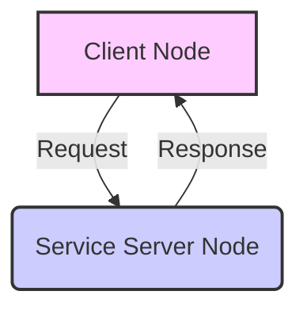
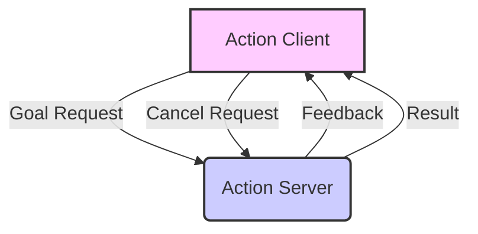

# Implementing Services and Actions

## 4.1 ROS 2 Services: Synchronous Request-Response Communication

ROS 2 **Services** provide a synchronous, request-response communication pattern between nodes. Unlike topics, where data flows continuously and asynchronously, a service call involves a client sending a request message to a server, and the server performing an operation and sending back a single response message. The client typically blocks until it receives this response or a timeout occurs. Services are ideal for tasks that require an immediate result or a one-time operation.

**Figure 4.1: Service Communication Flow**



*Figure 4.1: Illustrates the synchronous request-response mechanism of ROS 2 services, where a client sends a request and waits for a single response from the server.*

### 4.1.1 Implementing a Service Server (Python: `py_add_two_ints_server.py`)

A service server listens for incoming requests, processes them, and sends back a response. To implement a service, you first need to define its message type (request and response structure) in a `.srv` file. For this example, we'll use the pre-defined `example_interfaces/srv/AddTwoInts` service type.

```python
import rclpy
from rclpy.node import Node
from example_interfaces.srv import AddTwoInts

class AddTwoIntsService(Node):
    def __init__(self):
        super().__init__('add_two_ints_server')
        self.srv = self.create_service(AddTwoInts, 'add_two_ints', self.add_two_ints_callback)
        self.get_logger().info('AddTwoInts service server started.')

    def add_two_ints_callback(self, request, response):
        response.sum = request.a + request.b
        self.get_logger().info(f'Incoming request: a={request.a}, b={request.b}. Sum={response.sum}')
        return response

def main(args=None):
    rclpy.init(args=args)
    add_two_ints_server = AddTwoIntsService()
    rclpy.spin(add_two_ints_server)
    rclpy.shutdown()

if __name__ == '__main__':
    main()
```

### 4.1.2 Implementing a Service Client (Python: `py_add_two_ints_client.py`)

A service client sends a request to a service server and waits for its response.

```python
import rclpy
from rclpy.node import Node
from example_interfaces.srv import AddTwoInts
import sys

class AddTwoIntsClient(Node):
    def __init__(self):
        super().__init__('add_two_ints_client')
        self.cli = self.create_client(AddTwoInts, 'add_two_ints')
        while not self.cli.wait_for_service(timeout_sec=1.0):
            self.get_logger().info('service not available, waiting again...')
        self.req = AddTwoInts.Request()

    def send_request(self, a, b):
        self.req.a = a
        self.req.b = b
        self.future = self.cli.call_async(self.req)
        rclpy.spin_until_future_complete(self, self.future) # Blocks until response
        return self.future.result()

def main(args=None):
    rclpy.init(args=args)
    add_two_ints_client = AddTwoIntsClient()
    
    if len(sys.argv) != 3:
        add_two_ints_client.get_logger().info('Usage: ros2 run <package_name> add_two_ints_client <a> <b>')
        add_two_ints_client.destroy_node()
        rclpy.shutdown()
        return
    
    a = int(sys.argv[1])
    b = int(sys.argv[2])
    
    response = add_two_ints_client.send_request(a, b)
    add_two_ints_client.get_logger().info(f'Result of add_two_ints({a}, {b}) = {response.sum}')
    
    add_two_ints_client.destroy_node()
    rclpy.shutdown()

if __name__ == '__main__':
    main()
```

### 4.1.3 C++ Service Server (`cpp_add_two_ints_server.cpp`)

```cpp
#include "rclcpp/rclcpp.hpp"
#include "example_interfaces/srv/add_two_ints.hpp"

#include <memory>

void add(
  const std::shared_ptr<example_interfaces::srv::AddTwoInts::Request> request,
  std::shared_ptr<example_interfaces::srv::AddTwoInts::Response>      response)
{
  response->sum = request->a + request->b;
  RCLCPP_INFO(rclcpp::get_logger("rclcpp"), "Incoming request: a=%ld b=%ld. Sum=%ld",
                request->a, request->b, response->sum);
}

int main(int argc, char **argv)
{
  rclcpp::init(argc, argv);
  std::shared_ptr<rclcpp::Node> node = rclcpp::Node::make_shared("add_two_ints_server");
  rclcpp::Service<example_interfaces::srv::AddTwoInts>::SharedPtr service =
    node->create_service<example_interfaces::srv::AddTwoInts>("add_two_ints", &add);

  RCLCPP_INFO(rclcpp::get_logger("rclcpp"), "Ready to add two ints.");

  rclcpp::spin(node);
  rclcpp::shutdown();
  return 0;
}
```

### 4.1.4 C++ Service Client (`cpp_add_two_ints_client.cpp`)

```cpp
#include <chrono>
#include <cstdlib>
#include <memory>

#include "rclcpp/rclcpp.hpp"
#include "example_interfaces/srv/add_two_ints.hpp"

using namespace std::chrono_literals;

int main(int argc, char **argv)
{
  rclcpp::init(argc, argv);

  if (argc != 3) {
    RCLCPP_INFO(rclcpp::get_logger("rclcpp"), "Usage: ros2 run <package_name> add_two_ints_client <a> <b>");
    return 1;
  }

  std::shared_ptr<rclcpp::Node> node = rclcpp::Node::make_shared("add_two_ints_client");
  rclcpp::Client<example_interfaces::srv::AddTwoInts>::SharedPtr client =
    node->create_client<example_interfaces::srv::AddTwoInts>("add_two_ints");

  auto request = std::make_shared<example_interfaces::srv::AddTwoInts::Request>();
  request->a = atoll(argv[1]);
  request->b = atoll(argv[2]);

  while (!client->wait_for_service(1s)) {
    if (!rclcpp::ok()) {
      RCLCPP_ERROR(rclcpp::get_logger("rclcpp"), "Interrupted while waiting for the service. Exiting.");
      return 0;
    }
    RCLCPP_INFO(rclcpp::get_logger("rclcpp"), "service not available, waiting again...");
  }

  auto result = client->async_send_request(request);
  // Wait for the result.
  if (rclcpp::spin_until_future_complete(node, result) ==
    rclcpp::FutureReturnCode::SUCCESS)
  {
    RCLCPP_INFO(rclcpp::get_logger("rclcpp"), "Result of add_two_ints(%ld, %ld): %ld",
      request->a, request->b, result.get()->sum);
  } else {
    RCLCPP_ERROR(rclcpp::get_logger("rclcpp"), "Failed to call service add_two_ints");
  }

  rclcpp::shutdown();
  return 0;
}
```

## 4.2 ROS 2 Actions: Long-Running Goal-Based Communication

**Actions** are a more complex and powerful communication pattern in ROS 2, designed for long-running, goal-based tasks that may require periodic feedback and the ability to be cancelled. They build upon topics and services, combining their strengths to provide a robust framework for complex robot behaviors.

**Figure 4.2: Action Communication Flow**



*Figure 4.2: Depicts the action communication flow, highlighting the goal-feedback-result cycle and the ability for the client to cancel the ongoing goal.*

An action involves three messages:
1.  **Goal**: The request from the client to the server (e.g., "navigate to X, Y").
2.  **Feedback**: Continuous updates from the server to the client about the goal's progress (e.g., "robot is at X, Y heading to Z").
3.  **Result**: The final outcome of the goal (e.g., "navigation succeeded," "path blocked").

### 4.2.1 Implementing an Action Server (Python: `py_fibonacci_action_server.py`)

Action servers execute the goal and provide feedback and results.

```python
import time

import rclpy
from rclpy.action import ActionServer, ActionClient
from rclpy.node import Node

from example_interfaces.action import Fibonacci # Using a pre-defined action type

class FibonacciActionServer(Node):
    def __init__(self):
        super().__init__('fibonacci_action_server')
        self._action_server = ActionServer(
            self,
            Fibonacci,
            'fibonacci',
            self.execute_callback)
        self.get_logger().info('Fibonacci action server started.')

    def execute_callback(self, goal_handle):
        self.get_logger().info('Executing goal...')
        feedback_msg = Fibonacci.Feedback()
        feedback_msg.sequence = [0, 1]

        # Append two number to the sequence until we reach the target
        for i in range(1, goal_handle.request.order):
            if goal_handle.is_cancel_requested:
                goal_handle.canceled()
                self.get_logger().info('Goal canceled!')
                return Fibonacci.Result() # Return empty result
            
            feedback_msg.sequence.append(feedback_msg.sequence[i] + feedback_msg.sequence[i-1])
            self.get_logger().info(f'Feedback: {feedback_msg.sequence}')
            goal_handle.publish_feedback(feedback_msg)
            time.sleep(1) # Simulate long-running computation

        goal_handle.succeed()
        result = Fibonacci.Result()
        result.sequence = feedback_msg.sequence
        self.get_logger().info('Goal succeeded!')
        return result

def main(args=None):
    rclpy.init(args=args)
    fibonacci_action_server = FibonacciActionServer()
    rclpy.spin(fibonacci_action_server)
    fibonacci_action_server.destroy_node()
    rclpy.shutdown()

if __name__ == '__main__':
    main()
```

### 4.2.2 Implementing an Action Client (Python: `py_fibonacci_action_client.py`)

Action clients send goals, receive feedback, and process results.

```python
import rclpy
from rclpy.action import ActionClient
from rclpy.node import Node

from example_interfaces.action import Fibonacci

class FibonacciActionClient(Node):
    def __init__(self):
        super().__init__('fibonacci_action_client')
        self._action_client = ActionClient(self, Fibonacci, 'fibonacci')
        self.get_logger().info('Fibonacci action client started.')

    def send_goal(self, order):
        self.get_logger().info('Waiting for action server...')
        self._action_client.wait_for_server()

        goal_msg = Fibonacci.Goal()
        goal_msg.order = order

        self.get_logger().info('Sending goal request...')
        self._send_goal_future = self._action_client.send_goal_async(
            goal_msg,
            feedback_callback=self.feedback_callback)

        self._send_goal_future.add_done_callback(self.goal_response_callback)

    def goal_response_callback(self, future):
        goal_handle = future.result()
        if not goal_handle.accepted:
            self.get_logger().info('Goal rejected :(')
            return

        self.get_logger().info('Goal accepted :)')
        self._get_result_future = goal_handle.get_result_async()
        self._get_result_future.add_done_callback(self.get_result_callback)

    def get_result_callback(self, future):
        result = future.result().result
        self.get_logger().info(f'Result: {result.sequence}')
        rclpy.shutdown() # Shutdown after receiving result

    def feedback_callback(self, feedback_msg):
        feedback = feedback_msg.feedback
        self.get_logger().info(f'Received feedback: {feedback.sequence}')

def main(args=None):
    rclpy.init(args=args)
    action_client = FibonacciActionClient()
    
    # You can get the order from command line arguments or hardcode it
    order = 10 
    if len(sys.argv) > 1:
        order = int(sys.argv[1])

    action_client.send_goal(order)
    rclpy.spin(action_client) # Keep client alive until result

if __name__ == '__main__':
    main()
```

## 4.3 ROS 2 Command-Line Tools for Service and Action Introspection

Similar to topics, ROS 2 provides CLI tools for services and actions:

*   `ros2 service list [-t]`: Lists all active services.
*   `ros2 service type <service_name>`: Displays the type of a service.
*   `ros2 service find <service_type>`: Finds services of a given type.
*   `ros2 service call <service_name> <service_type> <request_args>`: Calls a service with specific arguments.

*   `ros2 action list [-t]`: Lists all active actions.
*   `ros2 action info <action_name>`: Displays information about an action, including its type, clients, and servers.
*   `ros2 action send_goal <action_name> <action_type> <goal_args>`: Sends a goal to an action server (e.g., `ros2 action send_goal /fibonacci example_interfaces/action/Fibonacci '{order: 5}'`).

## Exercises and Practice Tasks

1.  **Implement a Simple Sum Service**:
    *   Define a custom ROS 2 service message type `my_robot_interfaces/srv/Sum` that takes two `int64` numbers (`a`, `b`) as a request and returns their `sum` (`int64`).
    *   Implement a Python service server that provides this `Sum` service.
    *   Implement a Python service client that calls this `Sum` service with two numbers from the command line and prints the result.
    *   Verify using `ros2 service list`, `ros2 service type`, and `ros2 service call`.
2.  **Robot Movement Action**:
    *   Define a custom ROS 2 action message type `my_robot_interfaces/action/MoveRobot` with a `goal` of `target_pose` (e.g., `geometry_msgs/msg/Pose`), `feedback` of `current_pose`, and `result` of `success` (boolean).
    *   Implement a Python action server that simulates robot movement towards the `target_pose`, providing `current_pose` as feedback every second.
    *   Implement a Python action client that sends a `MoveRobot` goal and prints feedback and the final result.
    *   Verify using `ros2 action list`, `ros2 action info`, and `ros2 action send_goal`.
3.  **Action Cancellation**: Modify your `MoveRobot` action client from Exercise 2 to include logic for cancelling the goal if the robot is taking too long or if a new higher-priority goal arrives. Observe the action server's behavior when a cancellation is requested.
4.  **C++ Action/Service Implementation**: Choose one of the services or actions implemented in Python and re-implement it in C++ using `rclcpp`. Compare the code structure and debugging experience.
