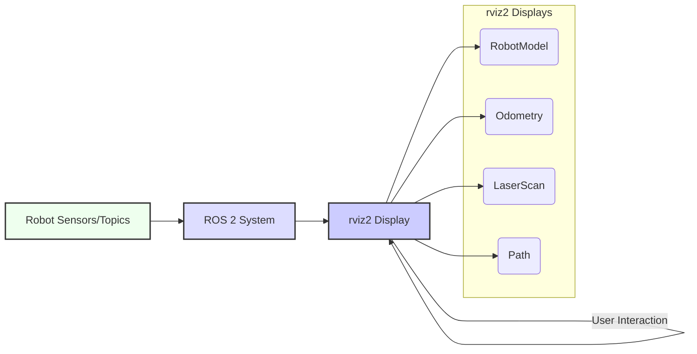

# Basic Robot Control with ROS 2

## 5.1 Integrating ROS 2 for Simulated Robot Control

Controlling a robot, even in simulation, requires orchestrating various ROS 2 communication mechanisms. We will integrate nodes, topics, and potentially services/actions to send commands to a simulated robot and process its sensor feedback. The primary goal is to translate high-level desired movements into low-level commands that the robot's actuators can understand.

**Table 5.1: Key ROS 2 Messages for Robot Control**

| Message Type          | Description                                                                 | Common Use Case                                    |
| :-------------------- | :-------------------------------------------------------------------------- | :------------------------------------------------- |
| `geometry_msgs/msg/Twist` | Represents linear and angular velocity in 3D space. Used for commanding mobile robot movement. | Teleoperation, autonomous navigation               |
| `nav_msgs/msg/Odometry` | Provides a robot's pose (position and orientation) and velocity relative to a fixed frame. | Localization, mapping, state estimation            |
| `sensor_msgs/msg/LaserScan` | Data from a 2D LiDAR sensor, typically an array of range measurements. | Obstacle detection, mapping                        |

*Table 5.1: Overview of essential ROS 2 message types commonly used in robot control and perception.*

### 5.1.1 Launching a Simulated Robot

Before we can control a robot, we need one! Simulators like Gazebo (or even simple ones like `turtlesim`) provide a virtual environment.

**High-level Lab Task**: Launch a simple simulated robot.
*   **Method 1: `turtlesim`**: A beginner-friendly 2D simulator.
    ```bash
    ros2 run turtlesim turtlesim_node
    ros2 run turtlesim turtle_teleop_key
    ```
*   **Method 2: Gazebo with a URDF robot**: For more realistic 3D simulation. We'll use a basic differential drive robot defined by `simple_robot.urdf` and launched with `spawn_robot.launch.py`.
    ```bash
    ros2 launch <your_robot_pkg> spawn_robot.launch.py # This will launch Gazebo and your robot
    ```

## 5.2 Publishing Velocity Commands (`geometry_msgs/Twist`)

Mobile robots are often controlled by sending velocity commands. In ROS 2, the `geometry_msgs/msg/Twist` message type is standard for this. It contains two `Vector3` fields: `linear` (for x, y, z linear velocities) and `angular` (for x, y, z angular velocities). For a typical ground robot, `linear.x` controls forward/backward movement and `angular.z` controls turning.

**Example 5.1: Python Node to Send `Twist` Commands (`velocity_publisher.py`)**

```python
import rclpy
from rclpy.node import Node
from geometry_msgs.msg import Twist

class VelocityPublisher(Node):
    def __init__(self):
        super().__init__('velocity_publisher')
        self.publisher_ = self.create_publisher(Twist, 'cmd_vel', 10) # 'cmd_vel' is a common topic for velocity commands
        timer_period = 0.5  # seconds
        self.timer = self.create_timer(timer_period, self.timer_callback)
        self.get_logger().info('Velocity Publisher node started.')

    def timer_callback(self):
        msg = Twist()
        msg.linear.x = 0.5  # Move forward at 0.5 m/s
        msg.angular.z = 0.2  # Turn left at 0.2 rad/s
        self.publisher_.publish(msg)
        self.get_logger().info(f'Publishing Linear X: {msg.linear.x}, Angular Z: {msg.angular.z}')

def main(args=None):
    rclpy.init(args=args)
    velocity_publisher = VelocityPublisher()
    rclpy.spin(velocity_publisher)
    velocity_publisher.destroy_node()
    rclpy.shutdown()

if __name__ == '__main__':
    main()
```

**High-level Lab Task**: Implement a Python node to publish velocity commands.
*   Run the `velocity_publisher.py` node.
*   If using `turtlesim`, observe the turtle moving. If using your simulated robot, observe its movement in Gazebo.

## 5.3 Processing Sensor Data (`nav_msgs/Odometry`)

Robots perceive their state and environment through sensors. Odometry, typically provided by wheel encoders or IMUs, gives an estimate of the robot's position and orientation over time. In ROS 2, this data is commonly communicated using `nav_msgs/msg/Odometry`.

**Example 5.2: Python Node to Receive and Display Odometry (`odometry_subscriber.py`)**

```python
import rclpy
from rclpy.node import Node
from nav_msgs.msg import Odometry

class OdometrySubscriber(Node):
    def __init__(self):
        super().__init__('odometry_subscriber')
        self.subscription = self.create_subscription(
            Odometry,
            'odom', # 'odom' is a common topic for odometry messages
            self.odometry_callback,
            10)
        self.subscription  # prevent unused variable warning
        self.get_logger().info('Odometry Subscriber node started.')

    def odometry_callback(self, msg):
        position = msg.pose.pose.position
        orientation = msg.pose.pose.orientation # Quaternion
        
        # For simplicity, just printing x, y, and z_rotation (from quaternion)
        self.get_logger().info(f'Robot Pose: X={position.x:.2f}, Y={position.y:.2f}, Z_rot={orientation.z:.2f}')

def main(args=None):
    rclpy.init(args=args)
    odometry_subscriber = OdometrySubscriber()
    rclpy.spin(odometry_subscriber)
    odometry_subscriber.destroy_node()
    rclpy.shutdown()

if __name__ == '__main__':
    main()
```

**High-level Lab Task**: Implement a Python node to subscribe to odometry data.
*   Launch your simulated robot (e.g., in Gazebo).
*   Run the `odometry_subscriber.py` node and `velocity_publisher.py` simultaneously.
*   Observe the odometry values changing as the robot moves.

## 5.4 Visualizing Robots with `rviz2`

`rviz2` is a powerful 3D visualization tool for ROS 2. It allows you to display robot models, sensor data (LiDAR scans, camera images, point clouds), paths, maps, and more. It's an indispensable tool for debugging and understanding the state of your robot.

**Figure 5.1: `rviz2` Interface for Robot Visualization**



*Figure 5.1: Depicts the `rviz2` interface for robot visualization, illustrating how it subscribes to ROS 2 topics to display robot models, odometry, sensor data, and other critical information for debugging and analysis.*

**High-level Lab Task**: Set up `rviz2` for robot visualization.
*   Launch your simulated robot (e.g., with `spawn_robot.launch.py`).
*   Launch `rviz2`:
    ```bash
    rviz2
    ```
*   In `rviz2`, add `RobotModel`, `Odometry`, and any relevant sensor displays (e.g., `LaserScan` for a LiDAR). Configure their topics to match your robot's output.

## 5.5 Developing Simple Teleoperation Nodes

**Teleoperation** refers to controlling a robot remotely, often using a joystick, keyboard, or other input device. A teleoperation node translates these human inputs into velocity commands (`geometry_msgs/Twist`) and publishes them to the robot's control topic.

**Example 5.3: Python Node for Keyboard-Based Teleoperation (`keyboard_teleop.py`)**

```python
import rclpy
from rclpy.node import Node
from geometry_msgs.msg import Twist
import sys
import tty
import termios # For capturing keyboard input without pressing enter

class KeyboardTeleop(Node):
    def __init__(self):
        super().__init__('keyboard_teleop')
        self.publisher_ = self.create_publisher(Twist, 'cmd_vel', 10)
        self.get_logger().info('Keyboard Teleoperation node started. Use WASD to move, Q/E to turn, SPACE to stop.')
        self.settings = termios.tcgetattr(sys.stdin) # Save terminal settings
        self.run_teleop()

    def getKey(self):
        # Capture single key press without waiting for Enter
        tty.setraw(sys.stdin.fileno())
        r = sys.stdin.read(1)
        termios.tcsetattr(sys.stdin.fileno(), termios.TCSADRAIN, self.settings)
        return r

    def run_teleop(self):
        try:
            while rclpy.ok():
                key = self.getKey()
                twist_msg = Twist()
                
                # Basic movements
                if key == 'w': # Forward
                    twist_msg.linear.x = 0.5
                elif key == 's': # Backward
                    twist_msg.linear.x = -0.5
                elif key == 'a': # Turn left
                    twist_msg.angular.z = 0.5
                elif key == 'd': # Turn right
                    twist_msg.angular.z = -0.5
                elif key == ' ': # Stop
                    pass # Twist message initialized to zeros

                elif key == '\x03': # Ctrl+C to exit
                    break
                else:
                    continue # Ignore other keys

                self.publisher_.publish(twist_msg)
                time.sleep(0.1) # Small delay to prevent excessive publishing
        except Exception as e:
            self.get_logger().error(f"Error during teleoperation: {e}")
        finally:
            self.get_logger().info("Teleoperation stopped.")
            twist_msg = Twist() # Send zero velocities to stop the robot
            self.publisher_.publish(twist_msg)
            termios.tcsetattr(sys.stdin.fileno(), termios.TCSADRAIN, self.settings) # Restore terminal settings


def main(args=None):
    rclpy.init(args=args)
    keyboard_teleop = KeyboardTeleop()
    rclpy.spin(keyboard_teleop) # spin is not ideal for this, but keeps node alive for key input
    keyboard_teleop.destroy_node()
    rclpy.shutdown()

if __name__ == '__main__':
    main()
```

**High-level Lab Task**: Create a teleoperation node that translates keyboard inputs into `Twist` commands.
*   Launch your simulated robot (e.g., in Gazebo).
*   Run the `keyboard_teleop.py` node.
*   Use WASD keys to control the robot's movement in the simulator.

## Exercises and Practice Tasks

1.  **Autonomous Square Path**:
    *   Create a ROS 2 Python node that autonomously drives your simulated robot (from `spawn_robot.launch.py`) in a square path (e.g., 1 meter forward, 90 degrees turn, repeat 4 times).
    *   Use `rclpy.create_timer` or `rclpy.Duration` to manage timing and movement segments.
    *   Visualize the robot's path in `rviz2` using an `Odometry` display.
2.  **Simple Obstacle Avoidance**:
    *   If your robot has a simulated LiDAR sensor, create a ROS 2 Python node that subscribes to the `/scan` topic.
    *   Implement a simple obstacle avoidance logic: if an obstacle is detected directly in front, the robot should stop or turn. Otherwise, it moves forward.
    *   Test this in Gazebo by placing obstacles in the robot's path.
3.  **Go-to-Goal Service**:
    *   Revisit the ROS 2 services from the previous chapter.
    *   Implement a service `go_to_pose` that takes a `geometry_msgs/msg/Pose` as a request.
    *   The service server should then command the robot (using `cmd_vel` topics) to navigate to that target pose. For simplicity, ignore complex path planning; a simple proportional controller might suffice.
    *   Visualize the robot's movement to the goal in `rviz2`.
4.  **PID Controller for Velocity**: Research PID controllers. Implement a simple PID controller in a ROS 2 node to achieve a desired linear velocity, responding to current odometry feedback. Compare its performance to a simple open-loop velocity command.
