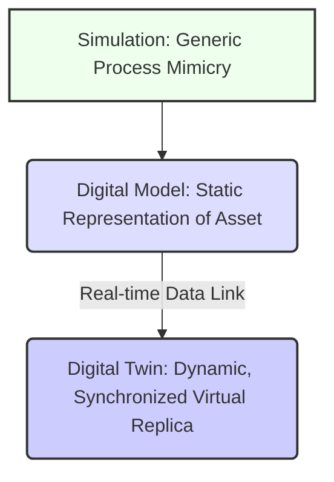

# Introduction to Digital Twins in Robotics

## 6.1 What is a Digital Twin in Robotics?

A **digital twin** in robotics is a virtual replica of a physical robot, its operational environment, and the dynamic processes it undergoes. More than just a 3D model or a simulation, a digital twin is a dynamic, live representation that is continuously updated with data from its physical counterpart. This synchronized connection allows the digital twin to accurately mirror the physical robot's state, behavior, and performance in real-time.

**Key Components of a Robotic Digital Twin:**
1.  **Physical Robot**: The real-world hardware, including sensors, actuators, and control systems.
2.  **Digital Model**: A comprehensive virtual representation of the robot's physical properties, kinematics, dynamics, and software.
3.  **Data Link**: A continuous, bidirectional flow of data between the physical robot and its digital counterpart. This includes sensor readings from the physical robot feeding into the digital twin, and simulation results or control commands from the digital twin influencing the physical robot.
4.  **Operational Environment**: A digital replica of the physical environment in which the robot operates, complete with physics, obstacles, and interactions.

## 6.2 Benefits of Digital Twins for Robot Development

Digital twins offer transformative advantages throughout the entire lifecycle of a robot, from design and development to deployment and maintenance.

**Table 6.1: Benefits of Digital Twins in Robotics**

| Benefit                 | Description                                                                                             | Example in Robotics                                                                   |
| :---------------------- | :------------------------------------------------------------------------------------------------------ | :------------------------------------------------------------------------------------ |
| **Accelerated Design & Development** | Test and validate designs virtually, reducing the need for costly physical prototypes.                | Rapid iteration of robot arm designs; testing new gripper mechanisms in simulation.     |
| **Reduced Risk & Cost** | Identify and mitigate potential failures in a safe, virtual environment before physical deployment.       | Simulating catastrophic failures (e.g., collisions) without damaging hardware.         |
| **Enhanced Performance Optimization** | Run numerous scenarios and optimize control algorithms and robot parameters in simulation.          | Tuning PID controllers for locomotion; optimizing motion paths for efficiency.          |
| **Predictive Maintenance** | Monitor the health of physical components through the digital twin to predict failures and schedule maintenance. | Simulating wear-and-tear on a robot joint to determine optimal replacement time.        |
| **Synthetic Data Generation** | Create vast amounts of labeled data for training AI models, especially for perception tasks.          | Generating diverse images of objects in varying lighting for object detection training. |
| **Remote Monitoring & Control** | Operate and monitor physical robots from a distance, with the digital twin providing real-time insights. | Remotely controlling a Mars rover with a digital twin on Earth for mission planning.    |

*Table 6.1: Highlights the multifaceted advantages that digital twins bring to the field of robotics, spanning from early design phases to operational longevity.*

## 6.3 Types of Robotic Simulation Environments

While digital twins are an advanced concept, they heavily rely on underlying simulation environments. These environments vary in their fidelity, purpose, and capabilities.

1.  **Physics-based Simulators**: These tools focus on accurately modeling the physical interactions (gravity, friction, collisions) between robots and their environment.
    *   **Gazebo**: An open-source 3D robotics simulator widely used in the ROS ecosystem. It's known for its robust physics engine (ODE, Bullet, DART) and strong integration with ROS.
    *   **NVIDIA Isaac Sim**: Built on NVIDIA Omniverse, it offers highly realistic physics (PhysX), advanced rendering, and specialized tools for synthetic data generation and AI training.
    *   **MuJoCo**: A physics engine optimized for contact dynamics and used for complex control and reinforcement learning research.
2.  **High-Fidelity Renderers/Game Engines**: Platforms primarily focused on realistic visual rendering, often adapted for robotics visualization and interaction.
    *   **Unity**: A popular real-time 3D development platform with strong graphics capabilities. The Unity Robotics Hub provides tools for integrating Unity with ROS and other robotics frameworks.
    *   **Unreal Engine**: Another powerful game engine offering cutting-edge graphics and physics, also used in robotics for photorealistic simulations.
3.  **Specialized Simulators**: Designed for specific robotic tasks or domains (e.g., flight simulators for drones, surgical simulators).

## 6.4 Real-World Applications of Digital Twins

Digital twins are transforming various sectors within robotics:

*   **Manufacturing**: Optimizing production lines with robotic arms, predicting machine failures, and virtual commissioning of new factories.
*   **Logistics & Warehousing**: Simulating fleets of autonomous mobile robots (AMRs) to improve route planning, inventory management, and operational efficiency.
*   **Aerospace**: Developing and testing spacecraft and rover systems in extreme virtual conditions before physical construction.
*   **Healthcare**: Training surgical robots, simulating patient interactions, and designing prosthetic limbs.
*   **Exploration (e.g., Mars Rovers)**: A digital twin on Earth mirrors the rover on Mars, allowing engineers to test commands and predict outcomes before sending them to the physical robot.

## 6.5 Differentiating Simulation, Digital Model, and Digital Twin

These terms are often used interchangeably, but they represent distinct concepts:

*   **Simulation**: A generalized term for mimicking the behavior of a real-world system over time. A simulation can be a simple mathematical model or a complex 3D environment. It is often used for "what-if" analysis.
*   **Digital Model**: A static virtual representation of a physical asset. It captures geometry, materials, and some physical properties, but does not necessarily reflect real-time operational data. Think of it as a sophisticated CAD model.
*   **Digital Twin**: The most advanced concept. It is a dynamic digital model that is **continuously synchronized with its physical counterpart** through a real-time data link. It can analyze current performance, predict future behavior, and enable closed-loop control or optimization.

**Figure 6.2: Hierarchy of Simulation, Digital Model, and Digital Twin**

*Figure 6.2: Visualizes the conceptual hierarchy, showing how a digital twin is a specialized, dynamic form of a digital model that engages in real-time data exchange with its physical counterpart, within a broader context of simulation.*

## Exercises and Practice Tasks

1.  **Define Digital Twin**: In your own words, explain the concept of a digital twin in robotics, distinguishing it from a traditional simulation or a mere digital model.
2.  **Scenario Analysis**: Choose a real-world robotic application (e.g., a warehouse robot, a surgical robot, an autonomous vehicle). Describe how a digital twin could be used to enhance its development, operation, and maintenance.
3.  **Simulation Platform Research**: Select two different robotic simulation platforms (e.g., Gazebo and Isaac Sim, or Unity and Webots). Research and compare their key features, advantages, and ideal use cases for a specific robotics task (e.g., mobile robot navigation, robotic arm manipulation).
4.  **Digital Twin Architecture Sketch**: For a simple robotic arm with a camera sensor, sketch a high-level digital twin architecture. Indicate the physical components, their digital representations, and the data flow between them.
5.  **Ethical Considerations**: Discuss potential ethical implications or societal impacts of widespread adoption of digital twins in robotics. Consider aspects like data privacy, job displacement, and decision-making autonomy.
