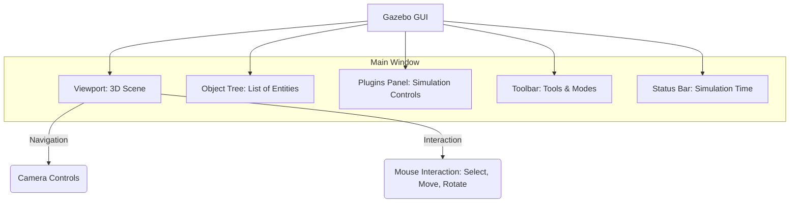

# Gazebo Simulation Basics

## 7.1 Installing and Configuring Gazebo

Gazebo is a powerful 3D robotics simulator that allows you to accurately and efficiently test your robot algorithms in complex indoor and outdoor environments. For ROS 2 Humble, the recommended Gazebo version is **Gazebo Classic** (also known as Gazebo 11), as Gazebo Garden (from the Ignition Robotics project) has newer features but might require a different ROS 2 bridge.

**High-level Lab Task**: Install Gazebo Classic and its ROS 2 bridge.

### 7.1.1 Installation Steps (Ubuntu 22.04)

1.  **Add Gazebo repository**:
    ```bash
    sudo sh -c 'echo "deb http://packages.osrfoundation.org/gazebo/ubuntu-stable $(lsb_release -cs) main" > /etc/apt/sources.list.d/gazebo-stable.list'
    wget https://packages.osrfoundation.org/gazebo.key -O - | sudo apt-key add -
    ```
2.  **Update and Install Gazebo Classic**:
    ```bash
    sudo apt update
    sudo apt install gazebo11
    sudo apt install libgazebo11-dev
    ```
3.  **Install ROS 2 Bridge for Gazebo Classic**:
    ```bash
    sudo apt install ros-humble-gazebo-ros-pkgs # For ROS 2 Humble
    ```
4.  **Verify Installation**: Launch Gazebo directly.
    ```bash
    gazebo
    ```
    This should open the Gazebo GUI with an empty world.

## 7.2 Gazebo User Interface and Basic Controls

The Gazebo GUI provides a visual environment to interact with your simulations.

**Figure 7.1: Gazebo User Interface Components**



*Figure 7.1: Key components of the Gazebo user interface, illustrating the main functional areas for viewing and interacting with simulations.*

### 7.2.1 Basic Controls

*   **Camera Navigation**:
    *   **Pan**: Right-click + drag
    *   **Rotate**: Left-click + drag
    *   **Zoom**: Mouse scroll wheel
*   **Object Manipulation**: Select an object (e.g., a sphere) in the Viewport or Object Tree. Use the toolbar buttons to move, rotate, or scale it.
*   **Simulation Control**: Play, Pause, Step buttons in the toolbar or Plugins Panel.

## 7.3 Launching and Interacting with Robot Models

Gazebo often comes with a set of pre-built robot models. The TurtleBot3 is a popular choice for tutorials.

**High-level Lab Task**: Launch a pre-configured Gazebo world with a simple robot.

1.  **Launch an empty Gazebo world**:
    ```bash
    ros2 launch gazebo_ros gazebo.launch.py empty_world:=true
    ```
    This launches Gazebo via ROS 2.
2.  **Spawn TurtleBot3**: In a new terminal, source your ROS 2 environment and run:
    ```bash
    ros2 launch turtlebot3_gazebo robot_state_publisher.launch.py use_sim_time:=true
    ros2 launch turtlebot3_gazebo spawn_turtlebot3.launch.py x_pos:=0.0 y_pos:=0.0 yaw:=0.0
    ```
    You should see a TurtleBot3 robot appear in your Gazebo world.
3.  **Teleoperate TurtleBot3**: In another terminal:
    ```bash
    ros2 run turtlebot3_teleop telebot3_teleop_key
    ```
    Use the keyboard to control the robot in Gazebo.

## 7.4 Creating Simple Gazebo Environments

Gazebo environments are defined in `.world` files, which are XML-based. You can create custom environments with various primitive shapes and terrains.

**Example 7.2: XML Definition of a Basic Gazebo World (`simple_world.world`)**

```xml
<?xml version="1.0" ?>
<sdf version="1.6">
  <world name="simple_world">
    <gravity>0 0 -9.8</gravity>
    <magnetic_field>6e-06 2.3e-05 -4.2e-05</magnetic_field>
    <include>
      <uri>model://sun</uri>
    </include>
    <include>
      <uri>model://ground_plane</uri>
    </include>

    <model name="my_box">
      <pose>1 0 0.5 0 0 0</pose>
      <link name="link">
        <inertial>
          <mass>1.0</mass>
          <inertia><ixx>0.01</ixx><ixy>0</ixy><ixz>0</ixz><iyy>0.01</iyy><iyz>0</iyz><izz>0.01</izz></inertia>
        </inertial>
        <collision name="collision">
          <geometry>
            <box><size>1 1 1</size></box>
          </geometry>
        </collision>
        <visual name="visual">
          <geometry>
            <box><size>1 1 1</size></box>
          </geometry>
          <material>
            <script>
              <uri>file://media/materials/scripts/gazebo.material</uri>
              <name>Gazebo/Green</name>
            </material>
          </material>
        </visual>
      </link>
    </model>
  </world>
</sdf>
```

**High-level Lab Task**: Create a custom `.world` file in Gazebo.
1.  Save the `simple_world.world` content to your package (e.g., `my_gazebo_worlds/worlds/simple_world.world`).
2.  Launch this world:
    ```bash
    ros2 launch gazebo_ros gazebo.launch.py gazebo_ros_world:=$HOME/path/to/my_gazebo_worlds/worlds/simple_world.world
    ```
    You should see a green box and a ground plane.

## 7.5 Basic Sensor Data Visualization

Gazebo simulates various sensors, and their data can be visualized directly within the GUI or through ROS 2 topics using `rviz2`. For basic visualization, we can inspect properties in the Object Tree or attach visualizers in `rviz2`.

**High-level Lab Task**: Observe sensor data.
*   Launch the TurtleBot3 in Gazebo as shown previously.
*   In `rviz2`, add a `LaserScan` display and set its topic to `/scan` (from TurtleBot3).
*   Add a `Camera` display and set its topic to `/camera/image_raw`.
*   Observe the simulated sensor output.

## Exercises and Practice Tasks

1.  **Custom World with Obstacles**:
    *   Modify `simple_world.world` to include a few more primitive shapes (e.g., cylinders, spheres) at different positions.
    *   Add a simple ramp using a `.sdf` model.
    *   Launch your modified world and verify the objects appear correctly.
2.  **Model Editor Exploration**:
    *   Launch the Gazebo GUI and use the built-in "Model Editor" (File -> Model Editor) to design a simple custom object.
    *   Save your model and then try to load it into a Gazebo world via your `.world` file.
3.  **Basic Model Control**:
    *   Launch TurtleBot3 in Gazebo.
    *   Using `ros2 topic pub` command, send `geometry_msgs/msg/Twist` commands to `/cmd_vel` topic to make the robot move in a square or circle.
    *   Example: `ros2 topic pub /cmd_vel geometry_msgs/msg/Twist "{linear: {x: 0.2, y: 0.0, z: 0.0}, angular: {x: 0.0, y: 0.0, z: 0.5}}" -r 10`
4.  **Logging and Playback**: Research how to record Gazebo simulations (`gz log -d 1`) and play them back (`gz log -f your_log_file.log`). Explain why this feature is useful for debugging and analysis.
5.  **Gazebo Physics Experiment**: Design a simple experiment in Gazebo (e.g., dropping objects of different masses from the same height) to observe basic physics principles like gravity.
