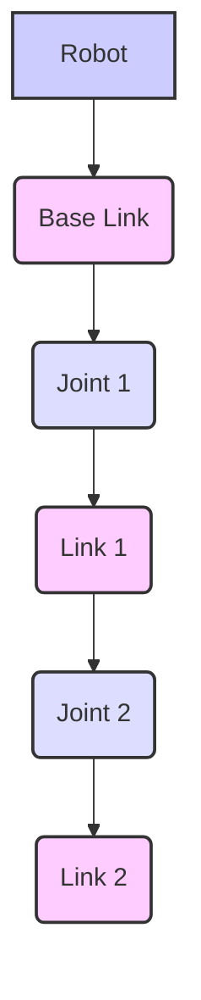

# URDF and Robot Models

## 8.1 Understanding URDF (Unified Robot Description Format)

The **Unified Robot Description Format (URDF)** is an XML file format used in ROS to describe all aspects of a robot model. It defines the robot's physical and visual properties, kinematics (how its parts are connected), and collision models. URDF is essential for visualizing robots in tools like `rviz2` and for simulating them in environments like Gazebo.

**Key Concepts in URDF:**
*   **Link**: Represents a rigid body segment of the robot (e.g., a wheel, a forearm). Links have physical properties like mass, inertia, and visual/collision geometries.
*   **Joint**: Defines the kinematic and dynamic relationship between two links. Joints specify how one link (child) moves relative to another (parent). Common joint types include `revolute` (revolving around an axis), `prismatic` (sliding along an axis), and `fixed` (no movement).
*   **Kinematics**: The study of motion without considering the forces that cause it. URDF defines the forward kinematics (position/orientation of end-effector from joint angles) and inverse kinematics (joint angles from desired end-effector pose) implicitly through its link-joint chain.

**Figure 8.1: URDF Hierarchical Structure**



*Figure 8.1: Illustrates the hierarchical structure of a robot defined by URDF, where links are connected by joints, forming a kinematic chain.*

## 8.2 Creating a Simple Robot Model with URDF

Let's create a URDF model for a simple 2-wheeled mobile robot. This robot will have a base link, two wheels, and a caster wheel.

### 8.2.1 Defining Links and Joints

**Example 8.1: Key Elements of a URDF Link (`my_robot.urdf`)**

```xml
<?xml version="1.0"?>
<robot name="my_mobile_robot">

  <link name="base_link">
    <visual>
      <geometry>
        <box size="0.4 0.2 0.1"/>
      </geometry>
      <material name="blue">
        <color rgba="0 0 0.8 1"/>
      </material>
    </visual>
    <collision>
      <geometry>
        <box size="0.4 0.2 0.1"/>
      </geometry>
    </collision>
    <inertial>
      <mass value="5.0"/>
      <inertia ixx="0.04" ixy="0" ixz="0" iyy="0.08" iyz="0" izz="0.1"/>
    </inertial>
  </link>

  <!-- Left Wheel Link -->
  <link name="left_wheel_link">
    <visual>
      <geometry>
        <cylinder radius="0.05" length="0.04"/>
      </geometry>
      <material name="black">
        <color rgba="0.1 0.1 0.1 1"/>
      </material>
    </visual>
    <collision>
      <geometry>
        <cylinder radius="0.05" length="0.04"/>
      </geometry>
    </collision>
    <inertial>
      <mass value="0.5"/>
      <inertia ixx="0.0004" ixy="0" ixz="0" iyy="0.0004" iyz="0" izz="0.0008"/>
    </inertial>
  </link>

  <!-- Left Wheel Joint -->
  <joint name="left_wheel_joint" type="continuous">
    <parent link="base_link"/>
    <child link="left_wheel_link"/>
    <origin xyz="0.15 0.125 0" rpy="1.57079632679 0 0"/> <!-- rpy: roll, pitch, yaw in radians -->
    <axis xyz="0 0 1"/>
  </joint>

  <!-- ... (Right Wheel and Caster Wheel links and joints would follow a similar pattern) ... -->

</robot>
```

*Figure 8.2: Illustrates the key elements within a URDF link, including visual representation, collision properties for physics, and inertial properties for dynamic simulations.*

*Figure 8.3: Depicts the essential attributes of a URDF joint, showing its parent and child links, origin (position and orientation), and the axis of rotation for movement.*

### 8.2.2 Validating URDF Syntax

It's crucial to validate your URDF files to catch syntax errors. ROS 2 provides a handy tool for this.

**High-level Lab Task**: Validate URDF syntax.
```bash
check_urdf path/to/my_robot.urdf
```
If your URDF is valid, it will output "URDF file is valid".

## 8.3 Loading and Visualizing URDF Models in `rviz2`

`rviz2` is the standard ROS 2 tool for 3D visualization. It can display your robot model, sensor data, maps, and more.

**High-level Lab Task**: Load and visualize URDF in `rviz2`.
1.  **Create a Launch File (`display_my_robot.launch.py`)**:
    ```python
    import os
    from ament_index_python.packages import get_package_share_directory
    from launch import LaunchDescription
    from launch_ros.actions import Node
    from launch.substitutions import Command

    def generate_launch_description():
        # Get URDF via xacro command
        robot_description_content = Command([
            'xacro ', os.path.join(
                get_package_share_directory('my_robot_pkg'),
                'urdf',
                'my_robot.urdf' # Make sure this path is correct
            )
        ])
        robot_description = {'robot_description': robot_description_content}

        node_robot_state_publisher = Node(
            package='robot_state_publisher',
            executable='robot_state_publisher',
            output='screen',
            parameters=[robot_description]
        )

        node_joint_state_publisher_gui = Node(
            package='joint_state_publisher_gui',
            executable='joint_state_publisher_gui',
            name='joint_state_publisher_gui',
            output='screen'
        )

        rviz_config_file = os.path.join(
            get_package_share_directory('my_robot_pkg'),
            'rviz',
            'my_robot.rviz' # Create this RVIZ config file
        )

        node_rviz = Node(
            package='rviz2',
            executable='rviz2',
            name='rviz2',
            output='screen',
            arguments=['-d', rviz_config_file]
        )

        return LaunchDescription([
            node_joint_state_publisher_gui,
            node_robot_state_publisher,
            node_rviz
        ])
    ```
2.  **Launch the URDF**:
    ```bash
    ros2 launch my_robot_pkg display_my_robot.launch.py
    ```
    This will open `rviz2` and `joint_state_publisher_gui`, allowing you to see and manipulate your robot model.

## 8.4 Integrating URDF Models into Gazebo Simulations

Gazebo can load URDF models, but it often requires additional elements defined by SDF (Simulation Description Format) for proper physics simulation (e.g., custom plugins, more detailed collision properties). ROS 2 provides packages to bridge URDF models into Gazebo.

**High-level Lab Task**: Spawn URDF model in Gazebo.
1.  **Create a Launch File (`spawn_my_robot_in_gazebo.launch.py`)**:
    ```python
    import os
    from ament_index_python.packages import get_package_share_directory
    from launch import LaunchDescription
    from launch.actions import IncludeLaunchDescription
    from launch.launch_description_sources import PythonLaunchDescriptionSource
    from launch_ros.actions import Node
    from launch.substitutions import Command

    def generate_launch_description():
        # Get URDF via xacro command
        robot_description_content = Command([
            'xacro ', os.path.join(
                get_package_share_directory('my_robot_pkg'),
                'urdf',
                'my_robot.urdf' # Make sure this path is correct
            )
        ])
        robot_description = {'robot_description': robot_description_content}

        gazebo_ros_dir = get_package_share_directory('gazebo_ros')
        
        # Launch Gazebo
        gazebo = IncludeLaunchDescription(
            PythonLaunchDescriptionSource([os.path.join(
                gazebo_ros_dir, 'launch', 'gazebo.launch.py'
            )]),
            launch_arguments={'world': os.path.join(get_package_share_directory('my_robot_pkg'), 'worlds', 'empty.world')}.items()
        )

        node_robot_state_publisher = Node(
            package='robot_state_publisher',
            executable='robot_state_publisher',
            output='screen',
            parameters=[robot_description]
        )

        spawn_entity = Node(package='gazebo_ros', executable='spawn_entity.py',
                            arguments=['-topic', 'robot_description',
                                       '-entity', 'my_mobile_robot'],
                            output='screen')

        return LaunchDescription([
            gazebo,
            node_robot_state_publisher,
            spawn_entity
        ])
    ```
2.  **Launch in Gazebo**:
    ```bash
    ros2 launch my_robot_pkg spawn_my_robot_in_gazebo.launch.py
    ```
    You should see your `my_robot.urdf` model spawned in Gazebo, subject to its physics engine.

## Exercises and Practice Tasks

1.  **Add a Caster Wheel**:
    *   Extend `my_robot.urdf` to include a fixed caster wheel (a sphere for simplicity) at the front or back of the base link.
    *   Define its link and joint (fixed type).
    *   Validate the URDF and visualize it in `rviz2`.
    *   Spawn it in Gazebo and observe its behavior.
2.  **XACRO for Modularity**: Research XACRO (XML Macros for ROS). Convert `my_robot.urdf` into a XACRO file (`my_robot.urdf.xacro`) to enable modularity (e.g., defining wheel properties once).
3.  **Sensor Integration (Simple)**:
    *   Research how to add a simple `ray` (LiDAR) sensor to your URDF in Gazebo.
    *   Modify your `my_robot.urdf` (or XACRO) to include this sensor.
    *   Spawn the robot in Gazebo and confirm the sensor is present and publishing data (e.g., to a `/scan` topic, viewable with `ros2 topic echo /scan`).
4.  **URDF and SDF Differences**: Compare and contrast URDF and SDF. In what scenarios would you choose one over the other, or use both in conjunction?
5.  **Robot State Publisher**: Explain the role of the `robot_state_publisher` node in ROS 2. Why is it crucial when working with URDF models and `rviz2` or Gazebo?
