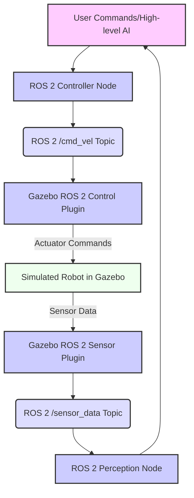
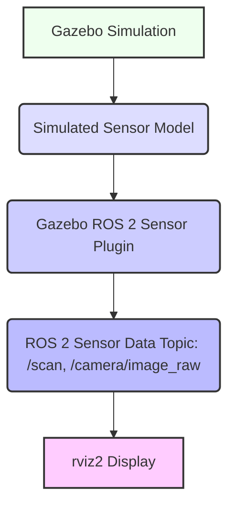

# Advanced Gazebo Features and ROS 2 Integration

## 9.1 Integrating Custom URDF Robots with Gazebo and ROS 2

Building upon the previous chapter, we will now focus on seamlessly integrating your custom URDF robot models into Gazebo and establishing robust ROS 2 control. This involves ensuring that your robot's sensors and actuators in Gazebo can communicate effectively with ROS 2 nodes.

**Figure 9.1: ROS 2 Control Loop for Simulated Robot in Gazebo**



*Figure 9.1: Depicts a typical ROS 2 control loop for a robot simulated in Gazebo, highlighting the bidirectional communication between ROS 2 nodes and Gazebo plugins for sending commands and receiving sensor feedback.*

### 9.1.1 ROS 2 Control Interfaces for Gazebo

For precise control of robot joints in Gazebo from ROS 2, `ros2_control` is the standard framework. It provides a common interface for hardware-agnostic robot control.

**Example 9.1: C++ ROS 2 Node for Controlling Robot (`my_robot_controller.cpp`)**

This example outlines a simple controller. A full `ros2_control` setup is more extensive.

```cpp
#include "rclcpp/rclcpp.hpp"
#include "std_msgs/msg/float64.hpp" // Or specific joint command message

class MyRobotController : public rclcpp::Node
{
public:
  MyRobotController()
  : Node("my_robot_controller")
  {
    // Example: Publisher for a joint command (e.g., to control a wheel)
    joint_command_publisher_ = this->create_publisher<std_msgs::msg::Float64>(
      "/my_robot/left_wheel_velocity_controller/command", 10); // Topic depends on ros2_control setup

    timer_ = this->create_wall_timer(
      500ms, std::bind(&MyRobotController::timer_callback, this));
    RCLCPP_INFO(this->get_logger(), "MyRobotController node started.");
  }

private:
  void timer_callback()
  {
    auto message = std_msgs::msg::Float64();
    message.data = 2.0; // Command a velocity of 2.0 rad/s
    joint_command_publisher_->publish(message);
    RCLCPP_INFO(this->get_logger(), "Commanding joint velocity: %.2f", message.data);
  }

  rclcpp::Publisher<std_msgs::msg::Float64>::SharedPtr joint_command_publisher_;
  rclcpp::TimerBase::SharedPtr timer_;
};

int main(int argc, char * argv[])
{
  rclcpp::init(argc, argv);
  rclcpp::spin(std::make_shared<MyRobotController>());
  rclcpp::shutdown();
  return 0;
}
```

## 9.2 Simulating Advanced Sensors in Gazebo

Gazebo supports a wide range of simulated sensors, including cameras, LiDARs, IMUs, GPS, and more. Integrating these into your URDF (often via XACRO for modularity) and connecting them to ROS 2 topics allows your robot to perceive its simulated environment.

**Example 9.2: XACRO for Lidar and Camera (`my_robot_sensor.urdf.xacro`)**

```xml
<?xml version="1.0"?>
<robot xmlns:xacro="http://www.ros.org/wiki/xacro">

  <xacro:macro name="lidar_sensor" params="parent_link:=base_link lidar_name:=lidar_sensor">
    <joint name="${lidar_name}_joint" type="fixed">
      <parent link="${parent_link}"/>
      <child link="${lidar_name}_link"/>
      <origin xyz="0.1 0 0.1" rpy="0 0 0"/>
    </joint>
    <link name="${lidar_name}_link">
      <visual>
        <geometry>
          <cylinder radius="0.03" length="0.05"/>
        </geometry>
        <material name="black"/>
      </visual>
      <collision>
        <geometry>
          <cylinder radius="0.03" length="0.05"/>
        </geometry>
      </collision>
      <inertial>
        <mass value="0.1"/>
        <inertia ixx="0.0001" ixy="0" ixz="0" iyy="0.0001" iyz="0" izz="0.0001"/>
      </inertial>
    </link>
    <gazebo reference="${lidar_name}_link">
      <sensor name="${lidar_name}" type="ray">
        <pose>0 0 0 0 0 0</pose>
        <visualize>true</visualize>
        <update_rate>10</update_rate>
        <ray>
          <scan>
            <horizontal>
              <samples>360</samples>
              <resolution>1</resolution>
              <min_angle>-3.14</min_angle>
              <max_angle>3.14</max_angle>
            </horizontal>
          </scan>
          <range>
            <min>0.1</min>
            <max>10.0</max>
            <resolution>0.01</resolution>
          </range>
        </ray>
        <plugin name="gazebo_ros_ray_sensor_controller" filename="libgazebo_ros_ray_sensor.so">
          <ros>
            <argument>~/out:=scan</argument>
            <argument>--ros-args -r __ns:=/${lidar_name}</argument>
          </ros>
          <output_type>sensor_msgs/LaserScan</output_type>
          <frame_name>${lidar_name}_link</frame_name>
        </plugin>
      </sensor>
    </gazebo>
  </xacro:macro>

  <xacro:macro name="camera_sensor" params="parent_link:=base_link camera_name:=camera_sensor">
    <joint name="${camera_name}_joint" type="fixed">
      <parent link="${parent_link}"/>
      <child link="${camera_name}_link"/>
      <origin xyz="0.2 0 0.15" rpy="0 0 0"/>
    </joint>
    <link name="${camera_name}_link">
      <visual>
        <geometry>
          <box size="0.02 0.05 0.05"/>
        </geometry>
        <material name="red"/>
      </visual>
      <collision>
        <geometry>
          <box size="0.02 0.05 0.05"/>
        </geometry>
      </collision>
      <inertial>
        <mass value="0.05"/>
        <inertia ixx="0.00001" ixy="0" ixz="0" iyy="0.00001" iyz="0" izz="0.00001"/>
      </inertial>
    </link>
    <gazebo reference="${camera_name}_link">
      <sensor name="${camera_name}" type="camera">
        <pose>0 0 0 0 0 0</pose>
        <visualize>true</visualize>
        <update_rate>10</update_rate>
        <camera>
          <horizontal_fov>1.047</horizontal_fov>
          <image>
            <width>640</width>
            <height>480</height>
            <format>R8G8B8</format>
          </image>
          <clip>
            <near>0.1</near>
            <far>100</far>
          </clip>
        </camera>
        <plugin name="gazebo_ros_camera_controller" filename="libgazebo_ros_camera.so">
          <ros>
            <namespace>${camera_name}</namespace>
            <argument>~/image_raw:=image_raw</argument>
            <argument>~/camera_info:=camera_info</argument>
          </ros>
          <camera_name>${camera_name}</camera_name>
          <frame_name>${camera_name}_link</frame_name>
        </plugin>
      </sensor>
    </gazebo>
  </xacro:macro>
</robot>
```

**Figure 9.2: Data Flow from Simulated Gazebo Sensors to ROS 2 Topics and `rviz2`**



*Figure 9.2: Illustrates the data flow from a simulated sensor within Gazebo, through a Gazebo ROS 2 plugin, to a ROS 2 topic, and finally visualized in `rviz2`.*

## 9.3 Custom Gazebo Plugins

**Gazebo Plugins** are shared libraries (`.so` files) that you can load into Gazebo to extend its functionality. They allow you to add custom robot behaviors, interact with the environment, or implement specialized sensor models. Plugins are written in C++ and use the Gazebo API.

**Example 9.3: C++ Code for a Simple Custom Gazebo Plugin (`my_gazebo_plugin.cpp`)**

```cpp
#include <gazebo/gazebo.hh>
#include <gazebo/physics/physics.hh>
#include <gazebo/common/common.hh>
#include <ignition/math/Pose3.hh>

namespace gazebo
{
  class MyPlugin : public ModelPlugin
  {
    public: void Load(physics::ModelPtr _parent, sdf::ElementPtr /*_sdf*/)
    {
      // Store the pointer to the model
      this->model = _parent;

      // Listen to the update event. This event is broadcast every simulation iteration.
      this->updateConnection = event::Events::ConnectWorldUpdateBegin(
          std::bind(&MyPlugin::OnUpdate, this));
    }

    // Called by the world update start event
    public: void OnUpdate()
    {
      // Apply a small force to the model
      this->model->GetLink("base_link")->AddForce(ignition::math::Vector3d(10, 0, 0));
    }

    // Pointer to the model
    private: physics::ModelPtr model;

    // Pointer to the update event connection
    private: event::ConnectionPtr updateConnection;
  };

  // Register this plugin with the simulator
  GZ_REGISTER_MODEL_PLUGIN(MyPlugin)
}
```

To use this plugin, you would compile it and then reference it in your Gazebo `.world` file or robot URDF/SDF.

## 9.4 Debugging Gazebo Simulations and ROS 2 Integration

Debugging Gazebo and its ROS 2 integration can be challenging. Here are some strategies:

*   **Verbose Logging**: Launch Gazebo with `--verbose` for detailed output: `gazebo --verbose your_world.world`.
*   **ROS 2 Logging**: Use `RCLCPP_INFO` and `RCLCPP_ERROR` in your C++ nodes, and `self.get_logger().info()` in Python nodes. Adjust logging levels with `ros2 topic set_logger_level <node_name> DEBUG`.
*   **`rqt_graph`**: Visualize node and topic connections to ensure data is flowing as expected.
*   **`ros2 topic echo`**: Inspect data on ROS 2 topics.
*   **Gazebo GUI**: Use the Object Tree to inspect model properties, sensor values, and plugin outputs.
*   **`gzclient --verbose`**: For client-side issues.
*   **Physics Debugging**: Gazebo has tools to visualize collisions, joint forces, etc., which can be enabled in the GUI.

## Exercises and Practice Tasks

1.  **Integrate `ros2_control`**:
    *   Research `ros2_control` and its Gazebo plugins (`gazebo_ros2_control`).
    *   Modify your `my_robot.urdf` and associated launch files to integrate `ros2_control` for your robot's wheels.
    *   Implement a C++ controller (using `ros2_control`'s `ControllerManager`) that can command wheel velocities.
    *   Verify by sending commands and observing the robot's movement in Gazebo.
2.  **Custom Sensor Plugin**:
    *   Create a simple Gazebo plugin that simulates a very basic proximity sensor (e.g., publishes `std_msgs/msg/Bool` when an object is within a certain range).
    *   Integrate this plugin into your robot's URDF/SDF.
    *   Verify its functionality by placing objects near the robot in Gazebo and monitoring the published topic.
3.  **Environment Interaction**:
    *   Create a Gazebo world with a few dynamic objects (e.g., a ball).
    *   Implement a ROS 2 node that can detect the ball (e.g., using a simulated camera and simple color detection).
    *   Use your robot to "push" the ball to a target location, utilizing ROS 2 control and potentially the custom Gazebo plugin from Exercise 2.
4.  **Sim-to-Real Considerations**: Discuss the challenges of transferring control algorithms developed in Gazebo to a physical robot (sim-to-real gap). What factors contribute to this gap, and what strategies can mitigate it?
5.  **Performance Tuning**: Research Gazebo performance optimization techniques (e.g., reducing visual complexity, adjusting physics parameters). Apply some of these techniques to your Gazebo world and measure the impact on simulation real-time factor.
