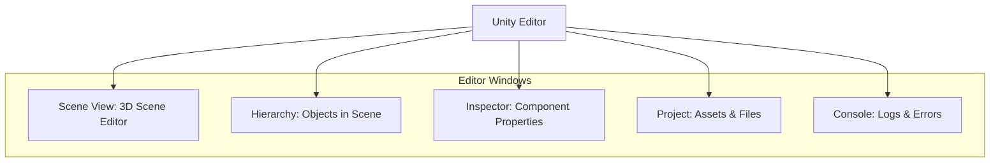

# Introduction to Unity Robotics Hub

## 10.1 Benefits of Unity for High-Fidelity Robotics

While Gazebo excels at physics-driven simulations within the ROS ecosystem, **Unity** offers unparalleled capabilities for high-fidelity visualization, photorealistic rendering, and rich interactive experiences. Developed as a powerful game engine, Unity has evolved into a versatile platform for diverse applications, including robotics.

**Key Benefits of Unity for Robotics:**
*   **Photorealistic Rendering**: Create visually stunning robot models and environments, crucial for human-robot interaction studies, marketing, and intuitive debugging.
*   **Rich User Interfaces**: Design sophisticated graphical user interfaces (GUIs) for controlling and monitoring robots, leveraging Unity's extensive UI toolkit.
*   **Interactive Environments**: Build complex, dynamic environments with interactive elements, custom behaviors, and advanced scene management.
*   **Cross-Platform Deployment**: Develop once and deploy to various platforms, including desktop, web, and VR/AR, opening up new possibilities for robotics applications.
*   **Large Asset Store**: Access a vast library of 3D models, textures, and tools to accelerate development.
*   **Human-Robot Interaction (HRI) Studies**: Conduct more immersive and realistic HRI experiments due to the visual fidelity and interactive capabilities.

## 10.2 Installing and Configuring Unity Robotics Hub

The **Unity Robotics Hub** is a collection of Unity packages and tools designed to streamline the development of robotic applications within Unity. It includes critical components like the ROS-TCP-Connector and URDF Importer.

### 10.2.1 Installation Steps

**High-level Lab Task**: Install Unity Hub and Unity Editor.
1.  **Install Unity Hub**: Download and install Unity Hub from the official Unity website. Unity Hub manages different Unity Editor versions and projects.
2.  **Install Unity Editor**: Use Unity Hub to install a recommended LTS (Long Term Support) version of the Unity Editor (e.g., 2022.3 LTS).

**High-level Lab Task**: Create a new Unity project and install Unity Robotics Hub packages.
1.  **Create New Project**: Open Unity Hub, create a new 3D project.
2.  **Install ROS-TCP-Connector**:
    *   Open the newly created Unity project.
    *   Go to `Window > Package Manager`.
    *   Click the `+` icon, then `Add package by name...`.
    *   Enter `com.unity.robotics.ros-tcp-connector` and click `Add`.
3.  **Install URDF Importer**:
    *   Repeat the process for `com.unity.robotics.urdf-importer`.

**Example 10.1: Markdown detailing Unity Hub, Editor, and ROS-TCP-Connector setup steps (`unity_ros_tcp_setup.md`)**

```markdown
# Unity Robotics Hub Setup Guide

This guide details the installation and configuration of Unity Hub, Unity Editor, and essential Unity Robotics Hub packages (ROS-TCP-Connector and URDF Importer) for robotics development.

## 1. Install Unity Hub

1.  **Download Unity Hub**: Go to [https://unity.com/download](https://unity.com/download) and download Unity Hub.
2.  **Run Installer**: Follow the instructions to install Unity Hub on your system.

## 2. Install Unity Editor (LTS Recommended)

1.  **Open Unity Hub**: Launch Unity Hub.
2.  **Installs Tab**: Navigate to the "Installs" tab on the left sidebar.
3.  **Add Editor**: Click the "Install Editor" button.
4.  **Select LTS**: Choose a recommended LTS (Long Term Support) version (e.g., Unity 2022.3 LTS) and click "Install". Ensure "Microsoft Visual Studio Community" is selected if you plan to write C# scripts.

## 3. Create a New Unity Project

1.  **Open Unity Hub**: Go to the "Projects" tab.
2.  **New Project**: Click "New Project".
3.  **Select Template**: Choose a "3D Core" template.
4.  **Project Name and Location**: Provide a project name (e.g., `RoboticsBookProject`) and location. Click "Create Project".

## 4. Install Unity Robotics Hub Packages

Once your Unity project opens:

1.  **Open Package Manager**: Go to `Window > Package Manager`.
2.  **Add ROS-TCP-Connector**:
    *   Click the `+` icon in the top-left corner of the Package Manager window.
    *   Select `Add package by name...`.
    *   Enter `com.unity.robotics.ros-tcp-connector` and click `Add`.
3.  **Add URDF Importer**:
    *   Repeat the process for `com.unity.robotics.urdf-importer`.

You have now successfully set up your Unity environment for robotics development!
```

## 10.3 Integrating ROS 2 with Unity using ROS-TCP-Connector

The **ROS-TCP-Connector** is the bridge that enables communication between Unity and a ROS 2 system. It allows Unity to act as both a ROS 2 publisher and subscriber, exchanging messages over TCP/IP sockets. This effectively turns your Unity scene into a ROS 2 node.

**Figure 10.1: Communication Bridge between Unity and ROS 2 using ROS-TCP-Connector**

```mermaid
graph TD
    UN[Unity Node: Robot in Scene] -- TCP/IP Sockets --> RC[ROS-TCP-Connector (Unity Package)];
    RC -- ROS 2 Messages --> R2S[ROS 2 System: External Nodes];
    R2S -- ROS 2 Messages --> RC;
    RC -- TCP/IP Sockets --> UN;
    style UN fill:#fcf,stroke:#333,stroke-width:2px;
    style RC fill:#ccf,stroke:#333,stroke-width:2px;
    style R2S fill:#ddf,stroke:#333,stroke-width:2px;
```

*Figure 10.1: Illustrates the bidirectional communication bridge established by the ROS-TCP-Connector, linking a Unity scene with an external ROS 2 system via TCP/IP sockets for message exchange.*

### 10.3.1 Setting Up ROS 2 Communication

**High-level Lab Task**: Set up ROS 2 communication between Unity and an external ROS 2 node.
1.  **Add ROSConnection Component**: In your Unity scene, create an empty GameObject and add a `ROSConnection` component to it. Configure the ROS IP and ROS Port to match your ROS 2 system (default: `127.0.0.1:10000`).
2.  **Create a ROS 2 Subscriber/Publisher Script**: Write a C# script (e.g., `UnityRobotController.cs`) that uses `RosMessagePublisher` or `RosMessageSubscriber` from the ROS-TCP-Connector to send/receive ROS 2 messages.

**Example 10.2: C# Script for Controlling a Robot in Unity (`UnityRobotController.cs`)**

```csharp
using UnityEngine;
using Unity.Robotics.ROSTCPConnector;
using RosMessageTypes.Geometry; // Example for Twist message

public class UnityRobotController : MonoBehaviour
{
    // ROS Connector
    private ROSConnection ros;
    // ROS Topic to subscribe to for Twist commands
    public string rosTopic = "/cmd_vel";

    // Robot's Rigidbody
    private Rigidbody rb;

    void Start()
    {
        ros = ROSConnection.Get = ROSConnection.instance;
        rb = GetComponent<Rigidbody>(); // Assuming this script is on the robot GameObject

        // Subscribe to the ROS topic
        ros.Subscribe<TwistMsg>(rosTopic, ReceiveTwistMessage);
    }

    void ReceiveTwistMessage(TwistMsg twistMessage)
    {
        // Apply linear velocity
        rb.velocity = transform.forward * (float)twistMessage.linear.x;
        // Apply angular velocity
        rb.angularVelocity = transform.up * (float)twistMessage.angular.z;
    }
}
```

## 10.4 Importing and Controlling Robot Models

The **URDF Importer** package allows you to bring your existing URDF robot models directly into Unity. This is a critical step for bridging your ROS-based robot descriptions with the Unity simulation environment.

### 10.4.1 URDF Import Process

**High-level Lab Task**: Import a simple URDF robot model into Unity.
1.  **Import URDF File**: Go to `Robotics > URDF Importer > Import URDF` in the Unity Editor menu. Select your `my_robot.urdf` file.
2.  **Configure Robot**: The importer will create a GameObject hierarchy. Attach `Rigidbody` components to links that should have physics. Add the `UnityRobotController.cs` script (from Example 10.2) to the base link GameObject of your robot.

**Example 10.3: Markdown outlining the URDF import process (`unity_urdf_import_process.md`)**

```markdown
# URDF Import Process into Unity

This guide details the steps to import a URDF (Unified Robot Description Format) robot model into your Unity project using the Unity Robotics Hub's URDF Importer.

## 1. Prepare Your URDF File

Ensure your URDF file is valid and includes all necessary visual, collision, and joint definitions. External mesh files (e.g., `.dae`, `.stl`) should be correctly referenced and placed within your Unity project's `Assets` folder if not already.

## 2. Open URDF Importer

1.  Open your Unity Project.
2.  From the top menu bar, go to `Robotics > URDF Importer > Import URDF`.

## 3. Select Your URDF File

1.  In the "Import URDF" window that appears, click the "Browse" button next to "URDF File Path".
2.  Navigate to and select your `.urdf` file (e.g., `my_robot.urdf`).
3.  Click "Open".

## 4. Configure Import Settings

The Import URDF window offers several settings. Common configurations include:

*   **Axis Conversion**: Ensure the correct axis conversion (e.g., Z-up to Y-up for Unity).
*   **Generate Colliders**: Automatically generate colliders for collision detection.
*   **Generate Rigidbody**: Add `Rigidbody` components to links for physics simulation.
*   **Materials**: Configure how URDF materials are imported into Unity.

Adjust these settings as needed for your specific robot model and simulation requirements.

## 5. Import Robot

1.  Click the "Import" button.
2.  The URDF Importer will process your file and create a new GameObject hierarchy in your scene representing your robot. This GameObject will be located under the `Assets/URDF` folder (or similar, depending on settings).

## 6. Post-Import Configuration (Optional but Recommended)

1.  **Add `ROSConnection`**: If your robot needs to communicate with ROS, ensure a `ROSConnection` GameObject exists in your scene.
2.  **Add Controller Script**: Attach a C# script (e.g., `UnityRobotController.cs` from Example 10.2) to the base link GameObject of your imported robot to enable ROS 2-based control.
3.  **Configure Physics**: Review the `Rigidbody` and `Collider` components on your robot's links. Adjust mass, friction, and collision layers as necessary for accurate physics simulation.

Your URDF robot is now successfully imported and ready for interaction within Unity!
```

**High-level Lab Task**: Control the imported robot model from a ROS 2 teleoperation node.
1.  Launch your `ros2_teleop_unity.py` node (from example 10.4).
2.  In Unity, press Play.
3.  Use the keyboard to control the robot model in your Unity scene.

**Example 10.4: Python ROS 2 Node for Teleoperating a Unity Robot (`ros2_teleop_unity.py`)**

```python
import rclpy
from rclpy.node import Node
from geometry_msgs.msg import Twist
import sys
import tty
import termios # For capturing keyboard input without pressing enter
import time

class UnityTeleop(Node):
    def __init__(self):
        super().__init__('unity_teleop')
        self.publisher_ = self.create_publisher(Twist, 'unity_cmd_vel', 10) # Topic must match Unity ROSConnection subscription
        self.get_logger().info('Unity Teleoperation node started. Use WASD to move, Q/E to turn, SPACE to stop.')
        self.settings = termios.tcgetattr(sys.stdin) # Save terminal settings
        self.run_teleop()

    def getKey(self):
        tty.setraw(sys.stdin.fileno())
        r = sys.stdin.read(1)
        termios.tcsetattr(sys.stdin.fileno(), termios.TCSADRAIN, self.settings)
        return r

    def run_teleop(self):
        try:
            while rclpy.ok():
                key = self.getKey()
                twist_msg = Twist()
                
                if key == 'w': # Forward
                    twist_msg.linear.x = 0.5
                elif key == 's': # Backward
                    twist_msg.linear.x = -0.5
                elif key == 'a': # Turn left
                    twist_msg.angular.z = 0.5
                elif key == 'd': # Turn right
                    twist_msg.angular.z = -0.5
                elif key == ' ': # Stop
                    pass 
                elif key == '\x03': # Ctrl+C to exit
                    break
                else:
                    continue

                self.publisher_.publish(twist_msg)
                time.sleep(0.1)
        except Exception as e:
            self.get_logger().error(f"Error during Unity teleoperation: {e}")
        finally:
            self.get_logger().info("Unity Teleoperation stopped.")
            twist_msg = Twist() 
            self.publisher_.publish(twist_msg)
            termios.tcsetattr(sys.stdin.fileno(), termios.TCSADRAIN, self.settings)

def main(args=None):
    rclpy.init(args=args)
    unity_teleop = UnityTeleop()
    rclpy.spin(unity_teleop)

if __name__ == '__main__':
    main()
```

## 10.5 Creating Custom Unity Scenes for Robotics Simulation

Unity's intuitive editor allows for rapid creation of complex 3D scenes. You can drag and drop assets, define terrain, add lighting, and configure physics materials to build highly realistic simulation environments for your robots.

**Figure 10.2: Unity Editor Layout for Robotics Simulation**



*Figure 10.2: Shows the typical layout of the Unity Editor, highlighting key windows and their functions relevant for setting up robotics simulation scenes.*

**High-level Lab Task**: Create a custom Unity scene for robotics simulation.
1.  In Unity, create a new scene.
2.  Add a 3D Plane for the ground.
3.  Add some primitive 3D objects (cubes, spheres) and apply physics materials to them (e.g., varying friction, bounciness).
4.  Import your URDF robot into this new scene.
5.  Configure lighting and cameras for optimal visualization.

## Exercises and Practice Tasks

1.  **Unity Project Setup**:
    *   Install Unity Hub and Unity Editor (LTS recommended).
    *   Create a new 3D project.
    *   Install `com.unity.robotics.ros-tcp-connector` and `com.unity.robotics.urdf-importer` via Package Manager.
    *   Output: A functioning Unity project with Robotics Hub installed.
2.  **URDF Robot in Unity**:
    *   Import a simple URDF robot model (e.g., `my_robot.urdf` from Chapter 8) into your Unity project.
    *   Attach a `Rigidbody` component to the base link and ensure correct colliders are generated.
    *   Output: Robot model correctly displayed and able to interact physically in Unity.
3.  **ROS 2 Teleoperation of Unity Robot**:
    *   Add a `ROSConnection` component to an empty GameObject in your Unity scene.
    *   Attach the `UnityRobotController.cs` script to your robot's base link.
    *   Run the `ros2_teleop_unity.py` ROS 2 node.
    *   Play the Unity scene and control your robot using keyboard input.
    *   Output: Robot in Unity moves in response to ROS 2 commands.
4.  **Custom Scene Design**:
    *   Create a custom Unity scene representing a simple indoor environment (e.g., a room with a table and chairs).
    *   Import your URDF robot into this scene.
    *   Add custom physics materials to objects to simulate realistic interactions.
    *   Output: A visually engaging and physically interactive robotics simulation scene in Unity.
5.  **Data Exchange (Publisher)**: Extend the `UnityRobotController.cs` script to publish simulated sensor data (e.g., the robot's current pose) back to a ROS 2 topic. Verify this data using `ros2 topic echo`.
