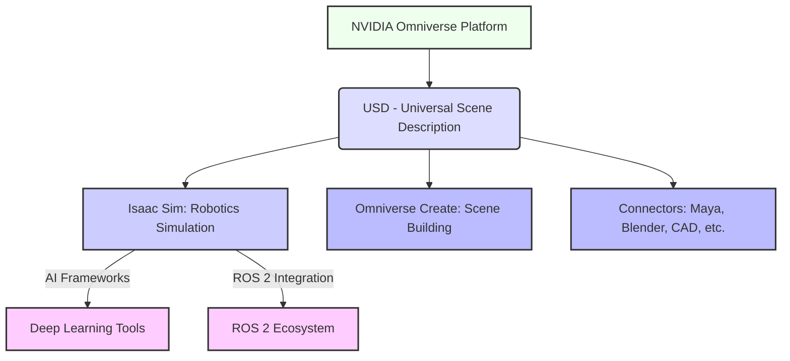
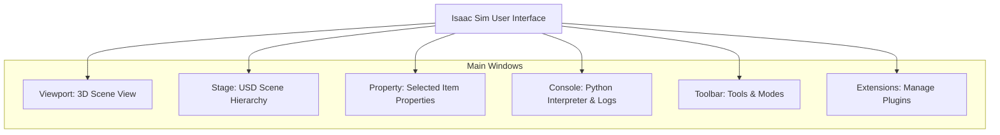

# Introduction to NVIDIA Isaac Sim

## 11.1 The AI-Robot Brain: NVIDIA Isaac Sim

NVIDIA Isaac Sim is a powerful, scalable robotics simulation application and synthetic data generation tool built on NVIDIA Omniverse. It provides a high-fidelity, physically accurate virtual environment for developing, testing, and training AI-powered robots. Unlike traditional simulators, Isaac Sim leverages the capabilities of Omniverse to offer photorealistic rendering, advanced physics, and seamless integration with NVIDIA's deep learning frameworks. This makes it an indispensable tool for engineers and researchers working on the "AI-Robot Brain."

**Key Capabilities of NVIDIA Isaac Sim:**
*   **Physically Accurate Simulation**: Utilizes NVIDIA PhysX 5 for realistic dynamics, collisions, and material properties.
*   **Photorealistic Rendering**: Leverages NVIDIA RTX rendering technology to create visually stunning and high-fidelity environments.
*   **Synthetic Data Generation**: Generates vast amounts of diverse, labeled data for training AI models, crucial for perception tasks where real-world data is scarce or expensive.
*   **AI Integration**: Seamlessly integrates with NVIDIA's AI platforms (e.g., Isaac ROS, cuDNN) and popular deep learning frameworks like PyTorch and TensorFlow.
*   **Scalability**: Capable of simulating single robots to large multi-robot fleets in complex environments.
*   **ROS 2 Compatibility**: Provides robust support for ROS 2, enabling developers to use familiar tools and communication patterns.

## 11.2 The Omniverse Platform and its Role in Isaac Sim

Isaac Sim is not a standalone application; it is built on **NVIDIA Omniverse**, an extensible platform for virtual collaboration and physically accurate simulation. Omniverse connects various 3D design tools and applications into a shared virtual space, all based on Universal Scene Description (USD).

**Figure 11.1: NVIDIA Omniverse Ecosystem with Isaac Sim**

*Figure 11.1: Illustrates NVIDIA Omniverse as the foundational platform for Isaac Sim, highlighting its reliance on USD and integration with various 3D tools and AI/robotics ecosystems.*

**Key aspects of Omniverse for Isaac Sim:**
*   **USD (Universal Scene Description)**: A powerful, open-source 3D scene description technology developed by Pixar. USD is the foundation of Omniverse, allowing for interoperability between different applications and a collaborative workflow. In Isaac Sim, everything—robots, environments, sensors—is represented as USD assets.
*   **Real-time Collaboration**: Multiple users can work on the same simulation scene simultaneously.
*   **Extensibility**: Omniverse is modular, allowing developers to build custom tools and extensions.

## 11.3 Benefits for AI-Driven Robotics and Synthetic Data Generation

Isaac Sim is particularly strong for AI-driven robotics due to its synthetic data generation capabilities. Training robust AI models, especially for perception, often requires vast amounts of diverse and accurately labeled data. Acquiring this data from the real world is expensive, time-consuming, and often difficult to label precisely.

**Synthetic Data Generation (SDG)** in Isaac Sim allows you to:
*   **Generate Diverse Data**: Vary lighting, textures, object poses, camera angles, and background elements to create highly diverse datasets.
*   **Automatic Labeling**: Obtain perfect ground truth labels (bounding boxes, segmentation masks, depth maps) automatically, eliminating manual annotation.
*   **Overcome Edge Cases**: Easily simulate rare events or challenging scenarios that are difficult or dangerous to reproduce in the real world.
*   **Reduce Bias**: Control the distribution of data to minimize biases present in real-world datasets.

## 11.4 Isaac Sim User Interface and Main Components

The Isaac Sim user interface provides a comprehensive environment for building, running, and inspecting simulations. It is a highly customizable Omniverse Kit application.

**Figure 11.2: Isaac Sim GUI Layout**

*Figure 11.2: Shows the typical layout of the Isaac Sim graphical user interface, highlighting key panels for 3D scene manipulation, USD hierarchy management, property editing, and console interaction.*

## 11.5 Hardware and Software Prerequisites

Running Isaac Sim effectively requires specific hardware and software.

### Hardware Requirements:
*   **NVIDIA RTX GPU**: Isaac Sim heavily leverages NVIDIA's RTX graphics cards for rendering and simulation. An RTX 30 Series or 40 Series GPU is highly recommended.
*   **Processor**: A modern multi-core CPU (Intel i7/i9 or AMD Ryzen 7/9 equivalent or better).
*   **RAM**: Minimum 32 GB RAM, 64 GB recommended.
*   **Storage**: Fast SSD (NVMe preferred) with at least 100 GB free space.

### Software Requirements:
*   **Operating System**: Ubuntu 20.04 LTS or 22.04 LTS.
*   **NVIDIA Drivers**: Latest proprietary NVIDIA GPU drivers.
*   **NVIDIA Omniverse Launcher**: Used to install and manage Isaac Sim.

## Exercises and Practice Tasks

1.  **Define Isaac Sim**: In your own words, define NVIDIA Isaac Sim and explain its primary advantages over traditional robotics simulators.
2.  **Omniverse Exploration**: Research the NVIDIA Omniverse platform. Beyond Isaac Sim, identify two other Omniverse applications and describe how they could be used in a robotics development pipeline.
3.  **Synthetic Data Scenario**: Propose a scenario where synthetic data generation from Isaac Sim would be critically important for training an AI model for a humanoid robot. What kind of data would you generate, and what challenges would it address?
4.  **Hardware Assessment**: Evaluate your current computer hardware. Does it meet the recommended specifications for Isaac Sim? If not, what components would need to be upgraded, and why?
5.  **Installation and Sample Scene**:
    *   Follow the `install_isaac_sim_guide.md` to install NVIDIA Omniverse Launcher and Isaac Sim.
    *   Launch Isaac Sim and load any of the provided sample scenes (e.g., `Isaac Gym Environments/Franka`).
    *   Navigate the scene using the camera controls.
    *   Output: Confirmation of successful installation and basic scene interaction.
6.  **USD Basics**: Research the Universal Scene Description (USD) format. Briefly explain why USD is a good choice for representing complex robotic scenes and enabling interoperability.
