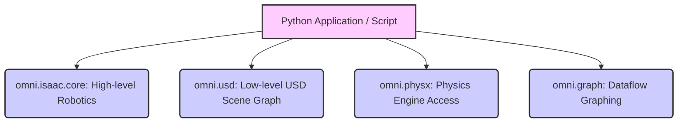
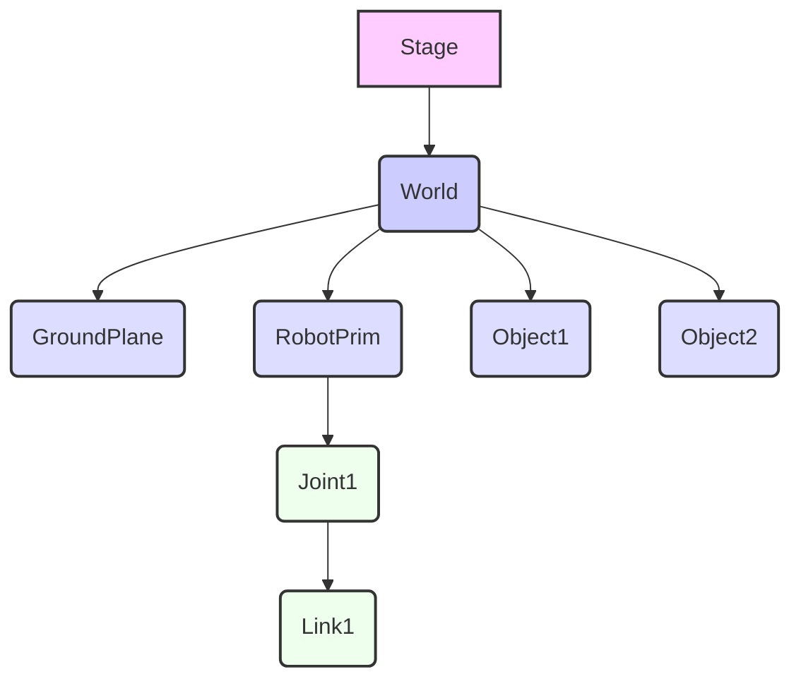

# Isaac Sim Environment Setup and Basics

## 12.1 Configuring Isaac Sim for Custom Development

To unlock the full potential of NVIDIA Isaac Sim, especially for AI-driven robotics, configuring your development environment is crucial. This typically involves setting up a dedicated Python environment, understanding the powerful Python API, and preparing for programmatic scene creation and manipulation.

### 12.1.1 Python Environment Setup for Isaac Sim Scripting

Isaac Sim is heavily scriptable with Python. It comes with its own Python environment, but for external development and managing dependencies, it's best to use your system's Python with the Isaac Sim Python environment activated.

**High-level Lab Task**: Set up a dedicated Python environment for Isaac Sim scripting.
1.  **Locate Isaac Sim's Python**: Find the Python executable within your Isaac Sim installation (e.g., `~/.local/share/ov/pkg/isaac_sim-202X.X.X/python.sh`).
2.  **Create a Virtual Environment**:
    ```bash
    /path/to/isaac_sim-202X.X.X/python.sh -m pip install virtualenv
    /path/to/isaac_sim-202X.X.X/python.sh -m virtualenv ~/isaac_sim_dev_env
    source ~/isaac_sim_dev_env/bin/activate
    ```
3.  **Install Required Packages**: Install any Python packages you need (e.g., `numpy`, `torch`) into this virtual environment.
    ```bash
    pip install numpy torch
    ```
4.  **Connect VS Code**: Configure your IDE (e.g., VS Code) to use this virtual environment's Python interpreter for Isaac Sim projects.

## 12.2 The Python API for Isaac Sim (OmniGraph, Omniverse Kit)

Isaac Sim provides a comprehensive Python API built upon the Omniverse Kit SDK. This API allows you to programmatically control almost every aspect of the simulator, from scene construction and physics manipulation to sensor configuration and AI integration. Key modules include:

*   **`omni.isaac.core`**: High-level robotics utilities (robots, prims, tasks, applications).
*   **`omni.usd`**: Low-level USD scene graph manipulation.
*   **`omni.physx`**: Access to the PhysX physics engine.
*   **`omni.graph`**: For building dataflow graphs (OmniGraph) for complex behaviors.

**Figure 12.1: Isaac Sim Python API Structure**



*Figure 12.1: Illustrates the modular structure of the Isaac Sim Python API, highlighting key modules developers interact with for robotics development.*

## 12.3 Programmatic Scene Creation

Instead of manually building scenes in the GUI, you can create and modify them dynamically using Python scripts. This is crucial for automation, testing, and synthetic data generation.

**Example 12.1: Python Script to Create a Falling Sphere (`create_falling_sphere.py`)**

This script creates a simple scene with a ground plane and a sphere that falls due to gravity.

```python
import carb
from omni.isaac.kit import SimulationApp

# Start the Isaac Sim simulation app
CONFIG = {"headless": False} # Set to True for running without GUI
simulation_app = SimulationApp(CONFIG)

from omni.isaac.core import World
from omni.isaac.core.objects import DynamicSphere, FixedCuboid
from omni.isaac.core.utils.nucleus import get_assets_root_path
from omni.isaac.core.utils.stage import add_reference_to_stage

import numpy as np

class FallingSphereApp:
    def __init__(self):
        self._world = World(stage_units_in_meters=1.0)
        self._world.scene.add_default_ground_plane()

        # Add a dynamic sphere
        self._world.scene.add(
            DynamicSphere(
                prim_path="/World/Sphere",
                name="falling_sphere",
                position=np.array([0.0, 0.0, 2.0]),
                radius=0.1,
                mass=1.0,
                color=np.array([0.0, 0.0, 1.0]),
            )
        )
        print("Falling sphere created!")

        self._world.reset()

    def run(self):
        self._world.run()

        # Simulate for a few seconds
        for _ in range(500): # ~5 seconds at 60Hz
            self._world.step(render=True)
            if simulation_app.is_exiting():
                break

        simulation_app.close()

if __name__ == "__main__":
    app = FallingSphereApp()
    app.run()
```

## 12.4 Manipulating Objects and Physics Interactions

You can programmatically control an object's position, rotation, scale, and even its physical properties like friction and restitution.

**Example 12.2: Python Script Demonstrating Object Manipulation (`object_manipulation.py`)**

```python
import carb
from omni.isaac.kit import SimulationApp
CONFIG = {"headless": False}
simulation_app = SimulationApp(CONFIG)

from omni.isaac.core import World
from omni.isaac.core.objects import DynamicCuboid
import numpy as np
import time

class ObjectManipulationApp:
    def __init__(self):
        self._world = World(stage_units_in_meters=1.0)
        self._world.scene.add_default_ground_plane()

        self.my_cuboid = self._world.scene.add(
            DynamicCuboid(
                prim_path="/World/MyCuboid",
                name="movable_cuboid",
                position=np.array([0.0, 0.0, 0.5]),
                scale=np.array([0.2, 0.2, 0.2]),
                color=np.array([1.0, 0.0, 0.0]),
                mass=1.0,
            )
        )
        self._world.reset()

    def run(self):
        self._world.run()

        # Wait for the cuboid to be initialized
        for _ in range(100):
            self._world.step(render=True)
        
        # Change position
        self.my_cuboid.set_world_pose(position=np.array([0.5, 0.5, 1.0]))
        print(f"Cuboid moved to: {self.my_cuboid.get_world_pose()[0]}")
        
        for _ in range(100):
            self._world.step(render=True)

        # Apply a force
        self.my_cuboid.apply_at_point_force(
            force=np.array([1000.0, 0.0, 0.0]),
            point=self.my_cuboid.get_world_pose()[0]
        )
        print("Applied force.")

        for _ in range(500):
            self._world.step(render=True)
            if simulation_app.is_exiting():
                break
        
        simulation_app.close()

if __name__ == "__main__":
    app = ObjectManipulationApp()
    app.run()
```

**Example 12.3: Python Script to Load an External USD Model (`load_external_usd.py`)**

```python
import carb
from omni.isaac.kit import SimulationApp
CONFIG = {"headless": False}
simulation_app = SimulationApp(CONFIG)

from omni.isaac.core import World
from omni.isaac.core.utils.nucleus import get_assets_root_path
from omni.isaac.core.utils.stage import add_reference_to_stage
import os

class LoadUSDApp:
    def __init__(self):
        self._world = World(stage_units_in_meters=1.0)
        self._world.scene.add_default_ground_plane()

        # Assuming you have a custom_model.usd in your assets root
        # Example for a simple cube USD (replace with your actual USD path)
        assets_root_path = get_assets_root_path()
        cube_usd_path = os.path.join(assets_root_path, "Props/Blocks/block_white.usd")
        if not os.path.exists(cube_usd_path):
            print(f"Warning: Sample USD not found at {cube_usd_path}. Please adjust path or ensure asset is present.")
            # Fallback to a simpler cube if sample not found
            from omni.isaac.core.objects import FixedCuboid
            self._world.scene.add(
                FixedCuboid(
                    prim_path="/World/DefaultCube",
                    name="default_cube",
                    position=np.array([0.0, 0.0, 0.5]),
                    scale=np.array([0.2, 0.2, 0.2]),
                )
            )
            print("Loaded default cube as fallback.")
        else:
            add_reference_to_stage(usd_path=cube_usd_path, prim_path="/World/CustomCube")
            print(f"Loaded custom USD from: {cube_usd_path}")

        self._world.reset()

    def run(self):
        self._world.run()
        for _ in range(500):
            self._world.step(render=True)
            if simulation_app.is_exiting():
                break
        simulation_app.close()

if __name__ == "__main__":
    app = LoadUSDApp()
    app.run()
```

**Figure 12.2: Scene Graph Hierarchy in USD**



*Figure 12.2: Illustrates a simplified USD scene graph hierarchy, showing how a stage contains a world, which in turn contains various prims like ground planes, robots, and other objects, organized in a tree-like structure.*

## Exercises and Practice Tasks

1.  **Isaac Sim Python Setup**:
    *   Create a dedicated Python virtual environment for Isaac Sim scripting.
    *   Install `numpy` and any other essential libraries into this environment.
    *   Output: A Python environment correctly configured for Isaac Sim.
2.  **Scene with Multiple Objects**:
    *   Modify `create_falling_sphere.py` to create a scene with at least three different dynamic primitive shapes (e.g., sphere, cuboid, cylinder) at varying initial positions and masses.
    *   Observe how they interact under gravity.
    *   Output: A scene with multiple dynamic objects behaving physically.
3.  **Advanced Object Manipulation**:
    *   Extend `object_manipulation.py` to continuously apply forces or set velocities to an object, making it move in a specific pattern (e.g., a circle or a figure-eight).
    *   Output: Object performing a complex trajectory.
4.  **Custom Asset Loading**:
    *   Find or create a simple `.usd` model (e.g., a custom table or chair) outside of Isaac Sim.
    *   Use `load_external_usd.py` to load this custom model into an Isaac Sim scene.
    *   Output: Custom USD model successfully loaded and displayed in Isaac Sim.
5.  **Recording and Playback**: Research how to record and playback simulations in Isaac Sim using the Python API. Implement a script that records a brief simulation of objects interacting and then plays it back.