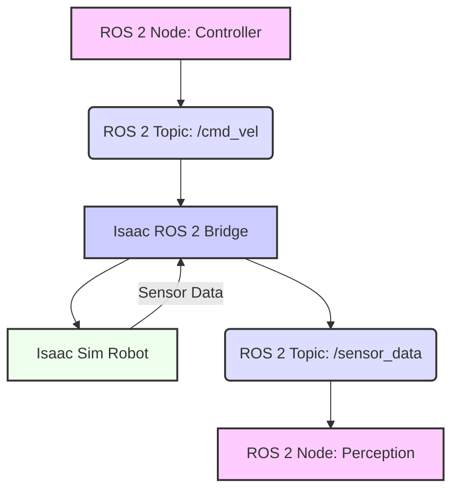

# Robot Integration and Control in Isaac Sim

## 13.1 Importing Robot Models into Isaac Sim

Isaac Sim provides robust capabilities for importing various robot models, including those defined in URDF (Unified Robot Description Format) or natively in USD (Universal Scene Description). Importing a robot is the first step towards simulating its behavior and integrating it into your robotic applications.

### 13.1.1 Importing URDF Robots

While Isaac Sim is fundamentally a USD-native simulator, it offers tools to import URDF files, converting them to USD for use within Omniverse.

**High-level Lab Task**: Import a sample URDF robot (e.g., Franka Emika Panda) into an Isaac Sim scene.
1.  **Launch Isaac Sim**: Open Isaac Sim from the Omniverse Launcher.
2.  **Open URDF Importer**: Go to `File -> Import -> URDF` in the Isaac Sim GUI.
3.  **Select URDF**: Navigate to and select a URDF file (e.g., a downloaded Franka Emika Panda URDF).
4.  **Configure Import Options**: Adjust options like `Merge fixed joints` or `Fix base link` as needed.
5.  **Import**: Click `Import`. The robot model will appear in your scene.

**Example 13.1: Python Script to Import a URDF Robot (`import_urdf_robot.py`)**

```python
import carb
from omni.isaac.kit import SimulationApp

CONFIG = {"headless": False}
simulation_app = SimulationApp(CONFIG)

from omni.isaac.core import World
from omni.isaac.core.utils.nucleus import get_assets_root_path
from omni.isaac.core.utils.stage import add_reference_to_stage
from omni.isaac.urdf import _urdf
import numpy as np
import os

class ImportURDFRobotApp:
    def __init__(self):
        self._world = World(stage_units_in_meters=1.0)
        self._world.scene.add_default_ground_plane()

        # Assuming the Franka Emika Panda URDF is available via Isaac Sim's assets
        # Path to a sample URDF asset
        assets_root_path = get_assets_root_path()
        franka_urdf_path = os.path.join(assets_root_path, "Robots/Franka/franka_alt_fingers.usd") 
        # Note: Often URDFs are converted to USD and then referenced. 
        # For a raw URDF file import, the _urdf.acquire_urdf_interface() is used in specific contexts.
        # This example uses a pre-converted USD for simplicity consistent with Isaac Sim asset workflow.

        # Directly adding a USD robot from Isaac Sim assets
        # For actual URDF import, you'd typically use omni.isaac.urdf.urdf_converter.UrdfConverter
        # This example leverages a pre-existing USD for simplicity
        add_reference_to_stage(
            usd_path=franka_urdf_path,
            prim_path="/World/Franka"
        )
        self.franka = self._world.scene.get_object_if_exists("franka_robot")
        if self.franka is None:
            from omni.isaac.core.articulations import Articulation
            self.franka = self._world.scene.add(
                Articulation(
                    prim_path="/World/Franka",
                    name="franka_robot",
                    usd_path=franka_urdf_path,
                    position=np.array([0.0, 0.0, 0.0])
                )
            )

        print("Franka Emika Panda robot imported (or referenced)!")

        self._world.reset()

    def run(self):
        self._world.run()
        for _ in range(500):
            self._world.step(render=True)
            if simulation_app.is_exiting():
                break
        simulation_app.close()

if __name__ == "__main__":
    app = ImportURDFRobotApp()
    app.run()
```

## 13.2 Controlling Robot Joints and Actuators

Once a robot is imported, you can control its individual joints and actuators using Isaac Sim's Python API. This allows for precise manipulation and movement.

**Example 13.2: Python Script Demonstrating Direct Joint Control (`joint_control.py`)**

```python
import carb
from omni.isaac.kit import SimulationApp
CONFIG = {"headless": False}
simulation_app = SimulationApp(CONFIG)

from omni.isaac.core import World
from omni.isaac.core.articulations import Articulation
import numpy as np
import time

class JointControlApp:
    def __init__(self):
        self._world = World(stage_units_in_meters=1.0)
        self._world.scene.add_default_ground_plane()

        # Add a simple robot (e.g., an existing one from assets or custom imported)
        # Here we use a Franka robot as an example
        robot_asset_path = get_assets_root_path() + "/Robots/Franka/franka_alt_fingers.usd"
        
        self.franka = self._world.scene.add(
            Articulation(
                prim_path="/World/Franka",
                name="franka_robot",
                usd_path=robot_asset_path,
                position=np.array([0.0, 0.0, 0.0]),
            )
        )
        self._world.reset()

    def run(self):
        self._world.run()

        # Wait for the robot to be initialized
        self.franka.wait_until_initialized()
        
        # Get joint names
        joint_names = self.franka.get_joints_names()
        print(f"Robot joint names: {joint_names}")

        # Set joint positions
        # Assuming the Franka has 7 joints for its arm (dof_0 to dof_6)
        # Adjust target_joint_positions based on your robot's DoF
        target_joint_positions = np.array([0.0, -0.7, 0.0, -2.4, 0.0, 1.0, 0.7]) 
        
        # Control the robot
        for i in range(500): # Simulate for ~5 seconds
            self._world.step(render=True)
            if simulation_app.is_exiting():
                break
            
            # Apply desired joint positions
            self.franka.set_joint_positions(target_joint_positions)
            
            # Optionally, get current joint positions for feedback
            # current_positions = self.franka.get_joint_positions()
            # print(f"Current Joint Positions: {current_positions}")
            
        simulation_app.close()

if __name__ == "__main__":
    app = JointControlApp()
    app.run()
```

## 13.3 ROS 2 Control for Isaac Sim Robots

The **Isaac ROS 2 Bridge** is a crucial component that allows seamless communication between Isaac Sim and the ROS 2 ecosystem. This enables you to use familiar ROS 2 tools and libraries to control your simulated robots and process sensor data.

**Figure 13.1: Data Flow for ROS 2 Control of an Isaac Sim Robot**



*Figure 13.1: Visualizes the bidirectional data flow enabled by the Isaac ROS 2 Bridge, connecting external ROS 2 nodes for control and perception with a robot simulated in Isaac Sim.*

**High-level Lab Task**: Set up ROS 2 bridge for Isaac Sim and integrate a ROS 2 teleoperation node to control the robot.
1.  **Launch Isaac Sim with ROS 2 Bridge**: Launch Isaac Sim with the appropriate extensions enabled for ROS 2 bridge.
2.  **Run ROS 2 Teleop Node**: Execute a standard ROS 2 teleoperation node (e.g., `ros2_teleop_unity.py` from previous chapter, modified to publish to Isaac Sim's `cmd_vel` topic).

**Example 13.3: Python ROS 2 Node for Teleoperating an Isaac Sim Robot (`isaac_ros2_teleop.py`)**

```python
import rclpy
from rclpy.node import Node
from geometry_msgs.msg import Twist
import sys
import tty
import termios
import time

class IsaacSimTeleop(Node):
    def __init__(self):
        super().__init__('isaac_sim_teleop')
        self.publisher_ = self.create_publisher(Twist, 'cmd_vel', 10) # Isaac Sim's default
        self.get_logger().info('Isaac Sim Teleoperation node started. Use WASD to move, Q/E to turn, SPACE to stop.')
        self.settings = termios.tcgetattr(sys.stdin)
        self.run_teleop()

    def getKey(self):
        tty.setraw(sys.stdin.fileno())
        r = sys.stdin.read(1)
        termios.tcsetattr(sys.stdin.fileno(), termios.TCSADRAIN, self.settings)
        return r

    def run_teleop(self):
        try:
            while rclpy.ok():
                key = self.getKey()
                twist_msg = Twist()
                
                if key == 'w':
                    twist_msg.linear.x = 0.5
                elif key == 's':
                    twist_msg.linear.x = -0.5
                elif key == 'a':
                    twist_msg.angular.z = 0.5
                elif key == 'd':
                    twist_msg.angular.z = -0.5
                elif key == ' ':
                    pass 
                elif key == '\x03':
                    break
                else:
                    continue

                self.publisher_.publish(twist_msg)
                time.sleep(0.1)
        except Exception as e:
            self.get_logger().error(f"Error during teleoperation: {e}")
        finally:
            self.get_logger().info("Teleoperation stopped.")
            twist_msg = Twist() 
            self.publisher_.publish(twist_msg)
            termios.tcsetattr(sys.stdin.fileno(), termios.TCSADRAIN, self.settings)

def main(args=None):
    rclpy.init(args=args)
    isaac_sim_teleop = IsaacSimTeleop()
    rclpy.spin(isaac_sim_teleop)

if __name__ == '__main__':
    main()
```

## 13.4 Simulating Basic Sensors Attached to Robots

Isaac Sim provides highly realistic sensor simulation, essential for developing and testing perception algorithms. You can add various sensors (cameras, LiDARs, IMUs) to your robot models and configure their properties.

**Figure 13.2: Isaac Sim Sensor Integration Pipeline**

```mermaid
graph TD
    RC[Robot Component (USD Prim)] --> SC[Sensor Component (USD Prim)];
    SC --> PS[Physics Simulation (PhysX)];
    PS --> DS[Data Generation (Renderer/Annotator)];
    DS --> DO[Data Output (ROS 2 Topic/Python API)];
    style RC fill:#efe,stroke:#333,stroke-width:2px;
    style SC fill:#ddf,stroke:#333,stroke-width:2px;
    style PS fill:#ccf,stroke:#333,stroke-width:2px;
    style DS fill:#bbf,stroke:#333,stroke-width:2px;
    style DO fill:#fcf,stroke:#333,stroke-width:2px;
```

*Figure 13.2: Illustrates the pipeline for sensor integration in Isaac Sim, from the sensor component on a robot prim through physics and data generation, to its output via ROS 2 or Python API.*

**High-level Lab Task**: Add a simulated camera to the robot and view its output.
1.  **Modify Robot USD**: Add a camera prim to your robot's USD definition, specifying its position, orientation, and camera properties.
2.  **Configure ROS 2 Camera Node**: If using ROS 2, ensure the camera sensor is publishing to a ROS 2 topic (e.g., `/camera/image_raw`).
3.  **Visualize in `rviz2`**: Launch `rviz2` and add an `Image` display, subscribing to the camera topic.

**Example 13.4: Python Script to Visualize Simulated Camera Output (`isaac_sim_camera_feed.py`)**

```python
import rclpy
from rclpy.node import Node
from sensor_msgs.msg import Image
from cv_bridge import CvBridge # Assuming cv_bridge is installed
import cv2
import numpy as np

class IsaacSimCameraFeed(Node):
    def __init__(self):
        super().__init__('isaac_sim_camera_feed')
        self.subscription = self.create_subscription(
            Image,
            '/front_camera/rgb/image_raw', # Topic name depends on camera setup in Isaac Sim
            self.camera_callback,
            10)
        self.subscription
        self.bridge = CvBridge()
        self.get_logger().info('Isaac Sim Camera Feed subscriber started.')

    def camera_callback(self, msg):
        try:
            cv_image = self.bridge.imgmsg_to_cv2(msg, desired_encoding='bgr8')
            cv2.imshow("Isaac Sim Camera Feed", cv_image)
            cv2.waitKey(1) # Refresh window
        except Exception as e:
            self.get_logger().error(f"Error processing camera image: {e}")

def main(args=None):
    rclpy.init(args=args)
    isaac_sim_camera_feed = IsaacSimCameraFeed()
    rclpy.spin(isaac_sim_camera_feed)
    isaac_sim_camera_feed.destroy_node()
    cv2.destroyAllWindows()
    rclpy.shutdown()

if __name__ == '__main__':
    main()
```

## 13.5 Developing Simple Teleoperation Interfaces for Isaac Sim

Teleoperation in Isaac Sim is similar to other simulators, leveraging ROS 2 topics to send commands.

**High-level Lab Task**: Develop simple teleoperation interfaces for Isaac Sim robots.
*   Launch Isaac Sim with your robot and ROS 2 Bridge.
*   Run the `isaac_ros2_teleop.py` node (Example 13.3).
*   Use keyboard inputs to control your robot in Isaac Sim.

## Exercises and Practice Tasks

1.  **Franka Panda Import & Control**:
    *   Import the Franka Emika Panda URDF into Isaac Sim.
    *   Using the `joint_control.py` script, command the robot to move its arm through a simple predefined trajectory (e.g., pick and place motion without grasping).
    *   Verify the robot's movement in the Isaac Sim viewport.
2.  **ROS 2 Teleop Setup**:
    *   Launch Isaac Sim with the ROS 2 Bridge enabled and your robot loaded.
    *   Run the `isaac_ros2_teleop.py` node.
    *   Control the robot's base or a specific joint using keyboard commands.
    *   Output: Robot in Isaac Sim responds to ROS 2 teleop commands.
3.  **Simulated LiDAR Visualization**:
    *   Add a simulated LiDAR sensor to your robot's USD definition in Isaac Sim.
    *   Ensure its data is published to a ROS 2 topic (e.g., `/scan`).
    *   Visualize the LiDAR point cloud in `rviz2`.
    *   Output: `rviz2` displays point cloud data from the simulated LiDAR.
4.  **Custom Sensor Integration**: Research how to add a custom sensor (e.g., a force-torque sensor on the end-effector) to your robot in Isaac Sim. Implement a simple Python script to read data from this sensor.
5.  **Robot Recording & Playback**: Isaac Sim allows recording simulation states. Research and implement a Python script that records a sequence of robot movements and then plays them back. This is useful for creating reproducible test scenarios.