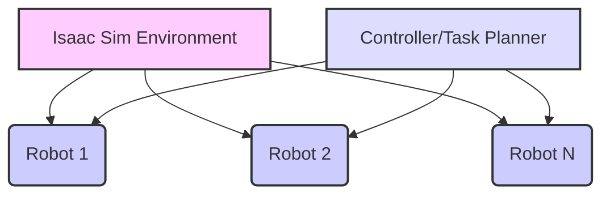
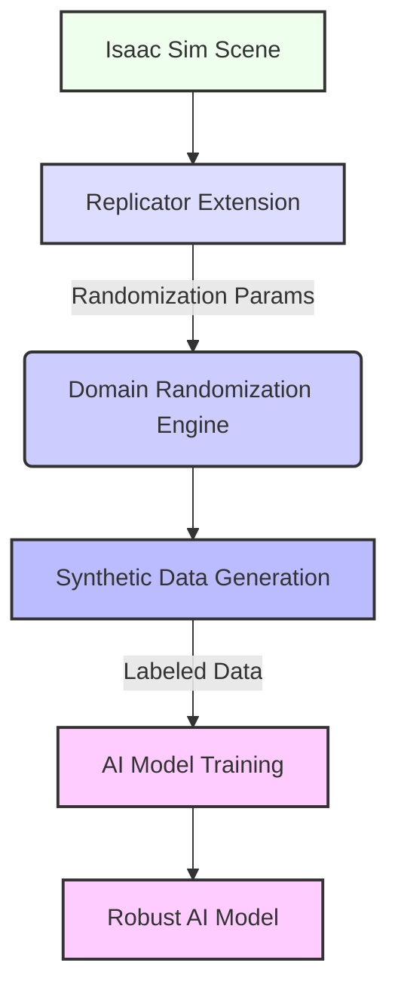

# Advanced Isaac Sim for Complex Scenarios

## 15.1 Implementing Multi-Robot Simulations

Complex robotic tasks often involve coordination between multiple robots. Isaac Sim provides robust capabilities for simulating multi-robot systems, allowing you to develop and test swarm intelligence, collaborative manipulation, and fleet management algorithms in a scalable and realistic environment.

**High-level Lab Task**: Create a multi-robot scene in Isaac Sim, controlling each robot independently or cooperatively.
1.  **Add Multiple Robots**: Load several instances of a robot model (e.g., a simple mobile robot or a manipulator) into an Isaac Sim scene.
2.  **Assign Unique IDs/Names**: Ensure each robot has a unique identifier for control and monitoring.
3.  **Implement Control Logic**: Develop a Python script that can send individual or coordinated commands to each robot.

**Example 15.1: Python Script for Controlling Multiple Robots (`multi_robot_control.py`)**

```python
import carb
from omni.isaac.kit import SimulationApp
CONFIG = {"headless": False}
simulation_app = SimulationApp(CONFIG)

from omni.isaac.core import World
from omni.isaac.core.articulations import Articulation
import numpy as np
import time

class MultiRobotControlApp:
    def __init__(self):
        self._world = World(stage_units_in_meters=1.0)
        self._world.scene.add_default_ground_plane()

        # Load multiple instances of a robot (e.g., a simple mobile base)
        robot_asset_path = get_assets_root_path() + "/Robots/Clearpath/Jackal/jackal.usd" # Example asset

        self.robot1 = self._world.scene.add(
            Articulation(
                prim_path="/World/Robot1",
                name="jackal_robot1",
                usd_path=robot_asset_path,
                position=np.array([1.0, 0.0, 0.0]),
            )
        )
        self.robot2 = self._world.scene.add(
            Articulation(
                prim_path="/World/Robot2",
                name="jackal_robot2",
                usd_path=robot_asset_path,
                position=np.array([-1.0, 0.0, 0.0]),
            )
        )
        self._world.reset()

    def run(self):
        self._world.run()
        self.robot1.wait_until_initialized()
        self.robot2.wait_until_initialized()

        for _ in range(500): # Simulate for ~5 seconds
            self._world.step(render=True)
            if simulation_app.is_exiting():
                break
            
            # Example: Control robot1 to move forward, robot2 to rotate
            self.robot1.set_joint_velocities(np.array([1.0, 0.0, 0.0])) # Linear X velocity
            self.robot2.set_joint_velocities(np.array([0.0, 0.0, 1.0])) # Angular Z velocity

        simulation_app.close()

if __name__ == "__main__":
    app = MultiRobotControlApp()
    app.run()
```

**Figure 15.1: Multi-Robot Simulation Architecture in Isaac Sim**



*Figure 15.1: Depicts a multi-robot simulation architecture within Isaac Sim, showing how a central controller or task planner can orchestrate multiple robot agents simultaneously.*

## 15.2 Advanced Physics and Material Properties

Isaac Sim's PhysX engine enables highly realistic physics simulations. You can explore advanced features like deformable objects, fluid dynamics (through extensions), and custom material properties to create more immersive and challenging environments for your robots.

**High-level Lab Task**: Design custom physics assets (e.g., deformable objects, liquids) and integrate them into a scene.
1.  **Create Custom USD**: Define a custom asset (e.g., a deformable cloth or a soft body) in USD, specifying its physics properties.
2.  **Integrate into Scene**: Load the custom USD into your Isaac Sim scene.
3.  **Observe Interactions**: Simulate the robot interacting with the custom physics asset.

**Example 15.2: USD File Defining a Custom Physics Asset (`custom_physics_asset.usd`)**

This is a simplified representation. A full USD for a complex physics asset would be more extensive.

```usd
#usda 1.0
(
    defaultPrim = "DeformableCloth"
    upAxis = "Z"
)

def Xform "DeformableCloth"
{
    reorder nameChildren = ["Mesh", "PhysicsMaterial"]
    
    def "Mesh"
    {
        asset inputs:usdPrim = @./cloth_mesh.usd@
        custom primvar texCoords = [ (0, 0), (1, 0), (0, 1), (1, 1) ] (
            elementSize = 2
            interpolation = "vertex"
        )
        uniform token[] primvars:textureMapping = ["UVMap"]
        double3[] extent = [(-0.5, -0.5, 0), (0.5, 0.5, 0)]
        float3[] points = [
            (-0.5, -0.5, 0), (0.5, -0.5, 0), (-0.5, 0.5, 0), (0.5, 0.5, 0)
        ]
        int[] faceVertexCounts = [4]
        int[] faceVertexIndices = [0, 1, 3, 2]
    }

    def PhysicsMaterial "PhysicsMaterial"
    {
        uniform token physics:material:frictionCombineMode = "Multiply"
        uniform token physics:material:restitutionCombineMode = "Max"
        uniform float physics:material:staticFriction = 0.5
        uniform float physics:material:dynamicFriction = 0.3
        uniform float physics:material:restitution = 0.1
        uniform float physics:material:youngsModulus = 1000000
        uniform float physics:material:poissonsRatio = 0.3
        uniform float physics:material:dampingRatio = 0.1
        uniform float physics:material:density = 1000
        uniform bool physics:material:enableCollision = true
    }
}
```

## 15.3 Integrating External AI Frameworks

Isaac Sim can serve as a powerful backend for external AI frameworks. You can stream sensor data from Isaac Sim to your custom PyTorch or TensorFlow models and then send control commands back to the simulator.

**High-level Lab Task**: Connect Isaac Sim to an external machine learning framework.
1.  **Data Streaming**: Use the Isaac ROS 2 Bridge or Python API to stream sensor data (e.g., camera images, LiDAR point clouds) from Isaac Sim.
2.  **External Inference**: Process this data with a custom AI model (e.g., an object detection model in PyTorch) running outside Isaac Sim.
3.  **Command Sending**: Send control commands (e.g., `Twist` messages) back to the Isaac Sim robot based on the AI model's output.

**Example 15.3: Python Script for Interfacing Isaac Sim with an External AI Framework (`external_ai_integration.py`)**

```python
import rclpy
from rclpy.node import Node
from sensor_msgs.msg import Image
from geometry_msgs.msg import Twist
from cv_bridge import CvBridge
import torch
import torchvision.transforms as transforms
from PIL import Image as PILImage
import numpy as np

class ExternalAIIntegrationNode(Node):
    def __init__(self):
        super().__init__('external_ai_integration_node')
        self.camera_sub = self.create_subscription(
            Image,
            '/front_camera/rgb/image_raw',
            self.camera_callback,
            10)
        self.cmd_vel_pub = self.create_publisher(Twist, '/cmd_vel', 10)
        self.bridge = CvBridge()

        # Load your external AI model here (e.g., a simple classifier)
        # self.model = torch.load("path/to/my_model.pth")
        # self.model.eval()
        self.transform = transforms.Compose([
            transforms.Resize((224, 224)),
            transforms.ToTensor(),
            transforms.Normalize(mean=[0.485, 0.456, 0.406], std=[0.229, 0.224, 0.225]),
        ])

        self.get_logger().info('External AI Integration Node started.')

    def camera_callback(self, msg):
        try:
            cv_image = self.bridge.imgmsg_to_cv2(msg, desired_encoding='rgb8')
            pil_image = PILImage.fromarray(cv_image)
            
            # Preprocess image and run inference
            input_tensor = self.transform(pil_image)
            input_batch = input_tensor.unsqueeze(0) # Create a mini-batch as expected by a model
            
            # --- Dummy inference for demonstration ---
            # In a real scenario, you'd run self.model(input_batch)
            # Dummy output: if sees "red" (mocked), turn left
            if np.mean(cv_image[:,:,0]) > 100: # Simple heuristic for "reddish" image
                 prediction = "turn_left"
            else:
                 prediction = "move_forward"
            # --- End dummy inference ---

            twist_msg = Twist()
            if prediction == "turn_left":
                twist_msg.angular.z = 0.5
                self.get_logger().info("AI: Turning left.")
            else:
                twist_msg.linear.x = 0.2
                self.get_logger().info("AI: Moving forward.")
            
            self.cmd_vel_pub.publish(twist_msg)

        except Exception as e:
            self.get_logger().error(f"Error in AI processing: {e}")

def main(args=None):
    rclpy.init(args=args)
    external_ai_node = ExternalAIIntegrationNode()
    rclpy.spin(external_ai_node)
    external_ai_node.destroy_node()
    rclpy.shutdown()

if __name__ == '__main__':
    main()
```

## 15.4 Large-Scale Synthetic Data Generation and Domain Randomization

For training robust AI models, especially with deep reinforcement learning, massive amounts of diverse data are often required. Isaac Sim's **Replicator** extension enables large-scale synthetic data generation with programmable randomization. **Domain Randomization** is a technique where you systematically vary non-essential aspects of the simulation (e.g., lighting, textures, object positions, robot appearance) to create data that is diverse enough for your AI model to generalize from simulation to the real world (sim-to-real transfer).

**Figure 15.2: Synthetic Data Generation Pipeline with Domain Randomization**



*Figure 15.2: Outlines the synthetic data generation pipeline within Isaac Sim, showing how the Replicator extension and Domain Randomization engine are used to produce large, diverse, and labeled datasets for robust AI model training.*

**High-level Lab Task**: Set up a synthetic data generation pipeline using replicators for various lighting, textures, and object poses.
1.  **Define Scene**: Create an Isaac Sim scene with the target objects and robot.
2.  **Configure Replicator**: Use the `omni.replicator.core` API to define randomization rules for lights, materials, object positions, camera angles, etc.
3.  **Generate Data**: Run the simulation and let Replicator automatically capture diverse images and ground truth annotations.

**Example 15.4: Python Script for Large-Scale Synthetic Data Generation (`synthetic_data_replicator_config.py`)**

```python
import carb
from omni.isaac.kit import SimulationApp
CONFIG = {"headless": False}
simulation_app = SimulationApp(CONFIG)

from omni.isaac.core import World
from omni.isaac.core.objects import DynamicCuboid
from omni.isaac.core.utils.nucleus import get_assets_root_path
import numpy as np
import os
import omni.replicator.core as rep

class LargeScaleSDGApp:
    def __init__(self):
        self._world = World(stage_units_in_meters=1.0)
        self._world.scene.add_default_ground_plane()

        # Add objects
        assets_root_path = get_assets_root_path()
        cube_asset = os.path.join(assets_root_path, "Props/Blocks/block_white.usd")
        
        # Create objects with Replicator
        self.cube_prims = rep.create.prims(
            count=10,
            usd_path=cube_asset,
            position=rep.distribution.uniform((-5, -5, 0.5), (5, 5, 2)),
            scale=rep.distribution.uniform(0.1, 0.3),
            rotation=rep.distribution.uniform((0,0,0), (360,360,360)),
        )

        # Create a camera
        camera_prim = rep.create.camera(position=(0,0,5), look_at=(0,0,0))
        render_product = rep.create.render_product(camera_prim, (1024, 1024))

        # Add random light
        rep.create.light(
            light_type="Dome",
            intensity=rep.distribution.uniform(1000, 5000),
            color=rep.distribution.uniform((0.1,0.1,0.1), (1.0,1.0,1.0)),
        )

        # Add annotators
        self.writer = rep.WriterRegistry.get("BasicWriter")
        self.writer.initialize(output_dir=os.getcwd() + "/_out_large_sdg",
                               rgb=True, bounding_box_2d_tight=True, semantic_segmentation=True)

        self._world.reset()

    def run(self):
        self._world.run()
        # Trigger randomization and data capture for 100 frames
        with rep.trigger.on_frame(num_frames=100):
            with rep.create.prims(self.cube_prims):
                rep.modify.pose(
                    position=rep.distribution.uniform((-5, -5, 0.5), (5, 5, 2)),
                    rotation=rep.distribution.uniform((0, 0, 0), (360, 360, 360)),
                )
        
            self.writer.write(render_product)

        simulation_app.close()

if __name__ == "__main__":
    app = LargeScaleSDGApp()
    app.run()
```

## Exercises and Practice Tasks

1.  **Multi-Robot Control**:
    *   Load two identical mobile robots (e.g., Jackal) into an Isaac Sim scene.
    *   Write a Python script to control one robot to move forward and the other to rotate simultaneously.
    *   Extend the script to make them follow each other or move in formation.
    *   Output: Two robots performing coordinated movements in Isaac Sim.
2.  **Custom Deformable Object**:
    *   Research how to create and simulate a deformable object (e.g., a cloth or a soft body) in Isaac Sim using USD.
    *   Integrate this object into a scene and simulate a robot interacting with it (e.g., pushing or grasping).
    *   Output: Robot interacting with a realistic deformable object.
3.  **External RL Integration**:
    *   Using the `isaac_sim_rl_env.py` (from previous chapter) as a base, integrate it with an external RL framework (e.g., Stable Baselines3 or RLib).
    *   Train a simple policy (e.g., for a sphere to reach a target) and observe its learning progress.
    *   Output: RL agent successfully trained using Isaac Sim as the environment.
4.  **Large-Scale SDG Configuration**:
    *   Modify `synthetic_data_replicator_config.py` to generate synthetic data for an object detection task in a more complex scene.
    *   Add randomization for at least three different parameters (e.g., object color, light intensity, camera angle).
    *   Generate a dataset of at least 50 images with annotations.
    *   Output: A diverse synthetic dataset for your chosen task.
5.  **Sim-to-Real Considerations with Domain Randomization**: Research advanced strategies for sim-to-real transfer beyond basic domain randomization (e.g., domain adaptation, structured randomization). Discuss how these techniques can further bridge the gap between simulation and real-world robot performance.
