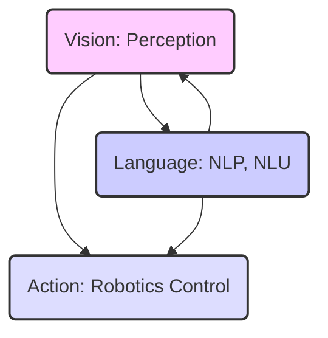
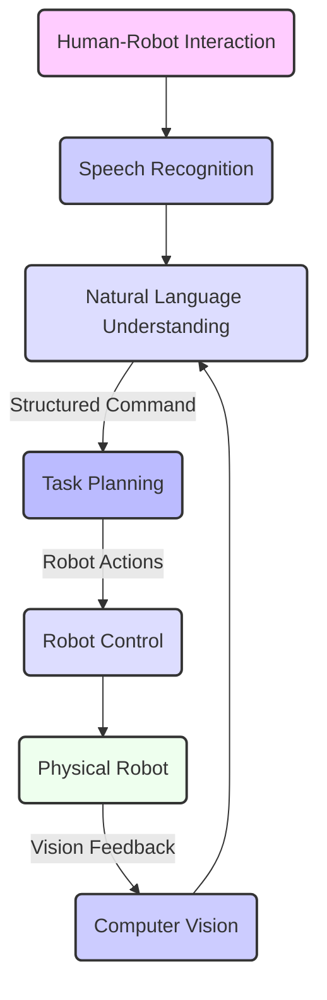

# Introduction to Vision-Language-Action (VLA)

## 16.1 Understanding Vision-Language-Action (VLA)

**Vision-Language-Action (VLA)** represents a paradigm shift in AI and robotics, focusing on creating intelligent systems that can perceive their environment through vision, understand and process human commands through natural language, and execute physical actions in the real world. This convergence aims to enable robots to operate more autonomously, intelligently, and intuitively alongside humans.

**Figure 16.1: The VLA Triangle**

*Figure 16.1: Illustrates the VLA triangle, a conceptual framework where Vision, Language, and Action are interconnected and mutually influential components of an intelligent robotic system.*

### 16.1.1 Significance in Advanced Robotics

The ability to bridge vision, language, and action is crucial for several reasons:
*   **Intuitive Human-Robot Interaction**: Humans communicate naturally through language and perceive the world visually. VLA allows robots to understand and respond to commands in a more human-like manner.
*   **Complex Task Execution**: Robots can tackle more abstract and complex tasks by interpreting high-level commands, rather than relying on pre-programmed sequences.
*   **Learning from Human Feedback**: Robots can learn from verbal instructions and visual demonstrations, accelerating their training and adaptability.
*   **Addressing Ambiguity**: Language is inherently ambiguous. Integrating visual context helps resolve ambiguities in commands.

## 16.2 Core Components of a VLA System

A typical VLA system comprises three primary, interconnected components:

1.  **Computer Vision (Vision)**:
    *   **Purpose**: To enable the robot to "see" and understand its physical environment.
    *   **Tasks**: Object detection, object recognition, pose estimation, scene understanding, semantic segmentation, visual tracking.
    *   **Inputs**: Camera feeds (RGB, depth, stereo), LiDAR data.
    *   **Outputs**: Semantic maps, object locations, object identities, grasp poses.
2.  **Natural Language Processing (Language)**:
    *   **Purpose**: To allow the robot to understand and generate human language.
    *   **Tasks**: Speech recognition (ASR), Natural Language Understanding (NLU), Natural Language Generation (NLG), dialogue management.
    *   **Inputs**: Human speech, text commands.
    *   **Outputs**: Structured commands, intent, entities, contextual understanding.
3.  **Robotic Action Planning (Action)**:
    *   **Purpose**: To translate high-level goals into executable robot movements and manipulations.
    *   **Tasks**: Task planning, motion planning, inverse kinematics, robot control, execution monitoring.
    *   **Inputs**: Structured commands from NLU, perception data from Vision.
    *   **Outputs**: Joint commands, end-effector poses, navigation goals.

**Figure 16.2: High-level VLA System Architecture**

*Figure 16.2: Outlines a high-level VLA system architecture, illustrating the flow of information from human interaction through perception and language understanding to robot action, with visual feedback informing the loop.*

## 16.3 Challenges and Opportunities in VLA Integration

Integrating vision, language, and action presents significant challenges but also opens up vast opportunities for robotics:

**Challenges:**
*   **Ambiguity Resolution**: Natural language is often ambiguous; vision is needed to clarify referents (e.g., "pick up the red block").
*   **Grounding Language**: Connecting abstract linguistic concepts (e.g., "clean") to concrete robot actions.
*   **Real-time Processing**: VLA systems require low-latency processing of diverse sensor data and complex AI models.
*   **Robustness to Novelty**: Generalizing to new objects, environments, and commands not seen during training.
*   **Safety and Ethics**: Ensuring robots respond safely and predictably, especially in human-robot co-existence.

**Opportunities:**
*   **Enhanced Autonomy**: Robots can perform more complex tasks with less human intervention.
*   **Natural Interaction**: Humans can communicate with robots more intuitively, reducing training time and increasing accessibility.
*   **Faster Deployment**: Robots can adapt to new environments and tasks more quickly through high-level instructions.
*   **Learning from Humans**: Robots can leverage human knowledge expressed through language and visual cues.

## 16.4 Reviewing Existing VLA Frameworks and Research Trends

The field of VLA is rapidly evolving, driven by advancements in large language models (LLMs), vision transformers, and reinforcement learning.

*   **Foundation Models**: LLMs like GPT-4 and multimodal models (e.g., GPT-4V, PaLM-E) are providing powerful building blocks for NLU and even action planning, enabling more generalized robotic policies.
*   **Embodied AI**: Research focuses on developing AI agents that learn and act in physical environments, often within VLA contexts.
*   **Sim-to-Real Transfer**: Techniques to bridge the gap between simulation-trained VLA policies and real-world robot deployment remain a critical area of research.
*   **Hardware-Software Co-design**: Optimizing robot hardware (e.g., dexterous hands, advanced sensors) alongside VLA software for optimal performance.

## 16.5 Differentiating VLA from Traditional Robotics Control

Traditional robotics control often relies on precise programming, explicit state machines, and detailed models of the environment. VLA, in contrast, aims for a more flexible, adaptive, and human-centric approach.

**Table 16.1: VLA vs. Traditional Robotics Control**

| Feature            | Traditional Robotics Control           | Vision-Language-Action (VLA)                         |
| :----------------- | :------------------------------------- | :--------------------------------------------------- |
| **Command Input**  | Explicit code, predefined waypoints, GUI | Natural language (speech/text), visual demonstrations |
| **Task Definition**| Hard-coded sequences, state machines   | High-level goals, learned policies, human-like reasoning |
| **Adaptability**   | Limited, requires re-programming       | High, adapts to new objects/scenarios via learning     |
| **Perception**     | Model-based, specific sensor processing | Data-driven, deep learning for general scene understanding |
| **Interaction**    | Formal, precise                        | Intuitive, human-like                                |

*Table 16.1: Compares key aspects of VLA with traditional robotics control, emphasizing VLA's shift towards natural, adaptive, and human-centric robot intelligence.*

## Exercises and Practice Tasks

1.  **VLA Component Breakdown**: For a robot tasked with "making coffee," identify specific computer vision, natural language processing, and action planning sub-tasks.
2.  **Challenge Identification**: Choose one VLA challenge (e.g., ambiguity resolution). Propose a conceptual solution that integrates vision and language to address it.
3.  **Research Trend Summary**: Select a recent research paper or a project on VLA or Embodied AI. Summarize its main contribution and explain how it advances the field.
4.  **VLA for Humanoids**: Discuss how VLA capabilities are particularly beneficial for humanoid robots compared to other robot morphologies. What unique advantages does the humanoid form factor offer for VLA?
5.  **Ethical Considerations**: Beyond general AI ethics, discuss a specific ethical consideration unique to VLA-enabled robots, especially those interacting closely with humans. How might this be mitigated?
