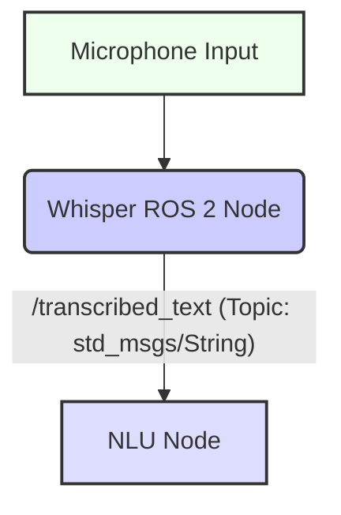

# Speech Recognition for Robotics (Whisper)

## 17.1 Automatic Speech Recognition (ASR) in Human-Robot Interaction

**Automatic Speech Recognition (ASR)** is a technology that converts spoken language into written text. In robotics, ASR is a critical component for enabling natural and intuitive human-robot interaction (HRI). It allows robots to understand verbal commands, requests, and questions from users, moving beyond button presses or predefined gestures.

### 17.1.1 Principles of ASR

The ASR pipeline typically involves several stages:
1.  **Audio Input**: Capturing raw audio signals from a microphone.
2.  **Feature Extraction**: Converting raw audio into a sequence of features that represent phonetic information.
3.  **Acoustic Model**: Maps acoustic features to phonemes or sub-word units.
4.  **Language Model**: Predicts sequences of words, based on grammar and vocabulary.
5.  **Decoder**: Combines information from the acoustic and language models to produce the most likely word sequence (transcription).

## 17.2 OpenAI Whisper: Capabilities and Limitations

**OpenAI Whisper** is a general-purpose ASR model trained on a large dataset of diverse audio. It is highly capable of transcribing speech in multiple languages and translating them into English, offering impressive accuracy.

**Figure 17.1: ASR Pipeline with Whisper**

```mermaid
graph TD
    AI[Audio Input (Microphone/File)] --> FE(Feature Extraction);
    FE --> W(Whisper Model);
    W -- Transcribed Text --> TO[Text Output];
    style AI fill:#fcf,stroke:#333,stroke-width:2px;
    style FE fill:#ccf,stroke:#333,stroke-width:2px;
    style W fill:#ddf,stroke:#333,stroke-width:2px;
    style TO fill:#bbf,stroke:#333,stroke-width:2px;
```

*Figure 17.1: Illustrates the Automatic Speech Recognition (ASR) pipeline, highlighting how audio input is processed by the Whisper model to generate transcribed text.*

### 17.2.1 Capabilities
*   **High Accuracy**: Generally provides excellent transcription quality across various accents and languages.
*   **Multilingual Support**: Can transcribe and translate speech in many languages.
*   **Robustness**: Handles some background noise and different speaking styles.

### 17.2.2 Limitations
*   **Computational Cost**: Large models can be resource-intensive, challenging for real-time edge deployment.
*   **Latency**: Real-time performance can be affected by model size and processing speed.
*   **Contextual Understanding**: Primarily a transcription model; lacks deep contextual understanding for complex robot commands without further NLU.
*   **Noise Sensitivity**: While robust, extreme noise or overlapping speech can still degrade performance.

## 17.3 Real-time Speech Transcription with Whisper

Implementing real-time speech transcription from a microphone input involves capturing audio chunks, processing them with Whisper, and outputting the transcribed text.

**High-level Lab Task**: Set up a Python environment with Whisper and necessary audio libraries.
1.  **Install Whisper**:
    ```bash
    pip install openai-whisper
    pip install stable-ts # For better real-time handling
    pip install pyaudio # For microphone input
    ```
2.  **Install FFmpeg**: Whisper relies on FFmpeg for audio processing.
    ```bash
    sudo apt update && sudo apt install ffmpeg
    ```

**Example 17.1: Python Script for Real-time Microphone Transcription (`whisper_transcriber.py`)**

```python
import whisper
import pyaudio
import wave
import time
import os
import collections
import threading
import numpy as np

# Audio recording parameters
CHUNK = 1024
FORMAT = pyaudio.paInt16
CHANNELS = 1
RATE = 16000 # Whisper models expect 16KHz audio
RECORD_SECONDS = 5 # Record in 5-second chunks
AUDIO_QUEUE = collections.deque()
RUNNING = True

def record_audio_thread():
    p = pyaudio.PyAudio()
    stream = p.open(format=FORMAT,
                    channels=CHANNELS,
                    rate=RATE,
                    input=True,
                    frames_per_buffer=CHUNK)
    print("Recording started...")
    frames = []
    while RUNNING:
        try:
            data = stream.read(CHUNK, exception_on_overflow=False)
            frames.append(data)
            if len(frames) * CHUNK >= RATE * RECORD_SECONDS:
                audio_data = b''.join(frames)
                AUDIO_QUEUE.append(audio_data)
                frames = [] # Reset frames for next chunk
        except Exception as e:
            print(f"Error in recording thread: {e}")
            break
    print("Recording stopped.")
    stream.stop_stream()
    stream.close()
    p.terminate()

def transcribe_thread():
    # Load the Whisper model (e.g., 'base.en' for English)
    model = whisper.load_model("base.en")
    print("Whisper model loaded...")
    while RUNNING or len(AUDIO_QUEUE) > 0:
        if len(AUDIO_QUEUE) > 0:
            audio_data = AUDIO_QUEUE.popleft()
            audio_np = np.frombuffer(audio_data, dtype=np.int16).astype(np.float32) / 32768.0
            
            # Pad or truncate to 30 seconds as Whisper expects
            if len(audio_np) < RATE * 30:
                audio_np = np.pad(audio_np, (0, RATE * 30 - len(audio_np)))
            else:
                audio_np = audio_np[:RATE * 30]

            result = model.transcribe(audio_np, fp16=False) # Use fp16=True for GPU
            text = result["text"].strip()
            if text:
                print(f"Transcribed: {text}")
        else:
            time.sleep(0.1) # Wait for audio
    print("Transcription stopped.")

def main():
    global RUNNING
    audio_thread = threading.Thread(target=record_audio_thread)
    transcribe_thread_obj = threading.Thread(target=transcribe_thread)

    audio_thread.start()
    transcribe_thread_obj.start()

    try:
        while True:
            time.sleep(1)
    except KeyboardInterrupt:
        print("Exiting...")
    finally:
        RUNNING = False
        audio_thread.join()
        transcribe_thread_obj.join()

if __name__ == '__main__':
    main()
```

## 17.4 Integrating Whisper's Output into ROS 2

To make Whisper's transcription useful for a robot, its output needs to be integrated into the ROS 2 ecosystem. This is typically done by creating a ROS 2 node that encapsulates the Whisper functionality and publishes the transcribed text to a ROS 2 topic.

**Figure 17.2: ROS 2 Integration of Whisper**



*Figure 17.2: Illustrates the integration of OpenAI Whisper into a ROS 2 system, showing how microphone input is processed by a dedicated Whisper ROS 2 node, which then publishes the transcribed text to a standard ROS 2 topic for further processing.*

**Example 17.2: ROS 2 Node for Real-time Speech Transcription (`ros2_whisper_node.py`)**

```python
import rclpy
from rclpy.node import Node
from std_msgs.msg import String
import whisper
import pyaudio
import wave
import time
import collections
import threading
import numpy as np

# Audio recording parameters
CHUNK = 1024
FORMAT = pyaudio.paInt16
CHANNELS = 1
RATE = 16000 # Whisper models expect 16KHz audio
RECORD_SECONDS = 5 # Record in 5-second chunks

class WhisperROS2Node(Node):
    def __init__(self):
        super().__init__('ros2_whisper_node')
        self.publisher_ = self.create_publisher(String, 'transcribed_text', 10)
        self.get_logger().info('Whisper ROS 2 Node started. Loading model...')
        
        # Load the Whisper model
        self.whisper_model = whisper.load_model("base.en")
        self.get_logger().info('Whisper model loaded.')

        # Audio recording setup
        self.p = pyaudio.PyAudio()
        self.stream = self.p.open(format=FORMAT,
                                channels=CHANNELS,
                                rate=RATE,
                                input=True,
                                frames_per_buffer=CHUNK,
                                stream_callback=self._audio_callback)
        self.audio_buffer = collections.deque()
        self.recording_thread = threading.Thread(target=self._transcribe_loop)
        self.recording_thread.daemon = True # Allow program to exit even if thread is running
        self.recording_thread.start()
        self.running = True

    def _audio_callback(self, in_data, frame_count, time_info, status):
        self.audio_buffer.append(in_data)
        return (in_data, pyaudio.paContinue)

    def _transcribe_loop(self):
        while self.running:
            if len(self.audio_buffer) * CHUNK >= RATE * RECORD_SECONDS:
                audio_data = b''.join(list(self.audio_buffer))
                self.audio_buffer.clear()
                audio_np = np.frombuffer(audio_data, dtype=np.int16).astype(np.float32) / 32768.0

                if len(audio_np) < RATE * 30:
                    audio_np = np.pad(audio_np, (0, RATE * 30 - len(audio_np)))
                else:
                    audio_np = audio_np[:RATE * 30]

                result = self.whisper_model.transcribe(audio_np, fp16=False)
                text = result["text"].strip()
                if text:
                    msg = String()
                    msg.data = text
                    self.publisher_.publish(msg)
                    self.get_logger().info(f'Published: "{text}"')
            else:
                time.sleep(0.1)

    def destroy_node(self):
        self.running = False
        self.recording_thread.join()
        self.stream.stop_stream()
        self.stream.close()
        self.p.terminate()
        super().destroy_node()

def main(args=None):
    rclpy.init(args=args)
    whisper_node = WhisperROS2Node()
    rclpy.spin(whisper_node)
    rclpy.shutdown()

if __name__ == '__main__':
    main()
```

## 17.5 Evaluating ASR Performance in Robotic Environments

Evaluating ASR performance in robotic environments is crucial due to potential challenges like background noise, varying speaker distances, and robot-generated sounds.

### 17.5.1 Key Metrics
*   **Word Error Rate (WER)**: The most common metric, measuring how many words were incorrectly transcribed.
*   **Latency**: Time taken from speech input to text output.
*   **Robustness**: Performance in noisy conditions.

### 17.5.2 Strategies for Improvement
*   **Noise Reduction**: Use microphone arrays and signal processing techniques.
*   **Fine-tuning**: Fine-tune ASR models on domain-specific robotic commands.
*   **Contextual Clues**: Use visual or NLU context to improve transcription accuracy.

## Exercises and Practice Tasks

1.  **Whisper Environment Setup**:
    *   Set up a Python virtual environment.
    *   Install `openai-whisper`, `stable-ts`, `pyaudio`, and `ffmpeg`.
    *   Output: Python environment ready for Whisper transcription.
2.  **Transcribe from File**:
    *   Record a short WAV file (e.g., 5-10 seconds) of yourself saying a few robot commands.
    *   Modify `whisper_transcriber.py` to transcribe this WAV file instead of microphone input.
    *   Output: Accurate text transcription of your WAV file.
3.  **Real-time Microphone Transcription**:
    *   Run `whisper_transcriber.py` with microphone input.
    *   Speak various commands and observe the real-time transcriptions.
    *   Output: Real-time transcription appearing in the console.
4.  **ROS 2 Whisper Integration**:
    *   Create a ROS 2 Python package.
    *   Integrate `ros2_whisper_node.py` into this package.
    *   Run the ROS 2 node and `ros2 topic echo /transcribed_text`.
    *   Output: Transcribed speech published to a ROS 2 topic.
5.  **Command Parser Node**:
    *   Create a simple ROS 2 Python node (`command_parser_node.py`) that subscribes to `/transcribed_text`.
    *   When a specific keyword (e.g., "move", "stop") is detected, print a confirmation message.
    *   Output: Robot acknowledging simple commands based on transcription.
