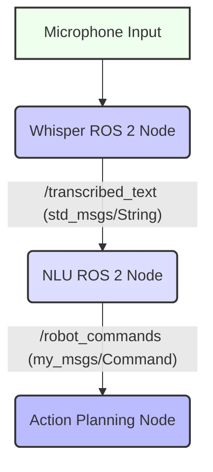

# Natural Language Understanding for Robot Commands

## 18.1 Principles of Natural Language Understanding (NLU) for Robotics

**Natural Language Understanding (NLU)** is a subfield of NLP (Natural Language Processing) focused on enabling computers to comprehend the meaning of human language. In robotics, NLU is crucial for translating human commands (often derived from ASR) into structured, actionable instructions that a robot can execute. It involves not just recognizing words but understanding their intent and extracting relevant entities.

### 18.1.1 Key NLU Tasks for Robotics
1.  **Intent Recognition**: Identifying the core purpose or goal of a command (e.g., "move", "pick up", "report status").
2.  **Entity Extraction (Named Entity Recognition)**: Identifying and extracting specific pieces of information relevant to the intent (e.g., "forward 1 meter", "red block", "battery level").
3.  **Coreference Resolution**: Understanding pronouns and other references (e.g., "it" referring to "the red block").
4.  **Disambiguation**: Resolving ambiguities in language (e.g., "turn left" might mean relative to the robot or an absolute direction).

**Figure 18.1: NLU Pipeline from Raw Text to Structured Command**

```mermaid
graph TD
    RT[Raw Text Input (from ASR)] --> TE(Tokenization);
    TE --> IR(Intent Recognition);
    TE --> EE(Entity Extraction);
    IR --> SC(Structured Command);
    EE --> SC;
    style RT fill:#fcf,stroke:#333,stroke-width:2px;
    style TE fill:#ccf,stroke:#333,stroke-width:2px;
    style IR fill:#ddf,stroke:#333,stroke-width:2px;
    style EE fill:#ddf,stroke:#333,stroke-width:2px;
    style SC fill:#bbf,stroke:#333,stroke-width:2px;
```

*Figure 18.1: Illustrates the Natural Language Understanding (NLU) pipeline, showing how raw text input is processed through tokenization, intent recognition, and entity extraction to yield a structured, actionable command.*

## 18.2 Techniques for Extracting Intent and Entities

### 18.2.1 Rule-Based Systems
Simple NLU systems can be built using predefined rules and regular expressions. This is effective for very narrow, domain-specific commands.

### 18.2.2 Machine Learning-Based Systems
More robust NLU relies on machine learning models.
*   **Traditional ML**: Algorithms like SVMs or Logistic Regression with handcrafted features.
*   **Deep Learning**: Recurrent Neural Networks (RNNs), Convolutional Neural Networks (CNNs), and Transformer models (like BERT) are highly effective for intent recognition and entity extraction.

### 18.2.3 Leveraging Large Language Models (LLMs)

**Large Language Models (LLMs)**, such as OpenAI's GPT series or open-source alternatives, have revolutionized NLU. They can often perform zero-shot or few-shot intent recognition and entity extraction with remarkable accuracy, requiring less labeled training data for new domains.

**Table 18.1: Comparison of NLU Approaches**

| Approach        | Pros                                      | Cons                                       | Use Case in Robotics                                   |
| :-------------- | :---------------------------------------- | :----------------------------------------- | :----------------------------------------------------- |
| **Rule-Based**  | Simple to implement, high precision for known phrases | Brittle, hard to scale, poor generalization | Very specific, narrow commands                             |
| **Traditional ML** | More flexible than rules, good for small datasets | Requires feature engineering               | Medium complexity, fixed command sets                      |
| **Deep Learning** | High accuracy, learns complex patterns   | Requires large datasets, computationally intensive | Complex, diverse commands, adaptable to new phrases        |
| **LLMs**        | Highly flexible, few-shot learning, strong generalization | High computational cost, potential for hallucination | Open-ended commands, complex dialogues, rapidly changing tasks |

*Table 18.1: Compares various NLU approaches based on their strengths, weaknesses, and suitability for different applications in robotics.*

## 18.3 Designing a Robot's Command Vocabulary and Grammar

For effective NLU, especially with simpler models, it's beneficial to design a clear command vocabulary and grammar. This defines the set of commands the robot is expected to understand and the structure of those commands.

**Example 18.2: YAML Defining a Robot's Command Vocabulary (`command_vocabulary.yaml`)**

```yaml
# command_vocabulary.yaml
intents:
  - name: move
    phrases: ["move", "go", "navigate", "drive"]
    entities:
      - name: direction
        type: enum
        values: ["forward", "backward", "left", "right"]
      - name: distance
        type: number
        unit: ["meter", "meters", "cm"]
      - name: speed
        type: number
        unit: ["m/s", "cm/s"]
  - name: turn
    phrases: ["turn", "rotate"]
    entities:
      - name: direction
        type: enum
        values: ["left", "right", "clockwise", "counter-clockwise"]
      - name: angle
        type: number
        unit: ["degree", "degrees", "rad", "radians"]
  - name: pick_up
    phrases: ["pick up", "grasp", "take"]
    entities:
      - name: object
        type: string
        from: ["apple", "banana", "cup", "block"]
  - name: report_status
    phrases: ["report status", "what is", "how is"]
    entities:
      - name: attribute
        type: enum
        values: ["battery level", "location", "temperature"]
```

## 18.4 Integrating NLU Output with a Robot's Action Planning System

The output of NLU—a structured command (intent + entities)—serves as the input to the robot's action planning system. This allows the robot to translate human language into concrete actions.

**Figure 18.2: Integration of ASR and NLU in a ROS 2 System**



*Figure 18.2: Illustrates the integration of ASR and NLU within a ROS 2 system, showing the flow from microphone input, through the Whisper node for transcription, to the NLU node for parsing, and finally to an action planning node as a structured command.*

### 18.4.1 Python NLU Parser (`robot_nlu_parser.py`)

This script would take transcribed text and convert it to structured JSON.

```python
import json
import re

class RobotNLUParser:
    def __init__(self, vocabulary_path="command_vocabulary.yaml"):
        # Load vocabulary from YAML (simplified here)
        # In a real system, you'd load and parse the YAML
        self.vocabulary = {
            "move": {"phrases": ["move", "go", "navigate", "drive"], "entities": {"direction": ["forward", "backward", "left", "right"], "distance": "number"}},
            "turn": {"phrases": ["turn", "rotate"], "entities": {"direction": ["left", "right"], "angle": "number"}},
            "pick_up": {"phrases": ["pick up", "grasp"], "entities": {"object": ["apple", "banana"]}},
            "report_status": {"phrases": ["report", "what is"], "entities": {"attribute": ["battery level", "location"]}},
        }
        
    def parse_command(self, text):
        text = text.lower()
        
        # Simple rule-based intent recognition
        if "move" in text or "go" in text or "drive" in text:
            intent = "move"
        elif "turn" in text or "rotate" in text:
            intent = "turn"
        elif "pick up" in text or "grasp" in text:
            intent = "pick_up"
        elif "report" in text or "what is" in text:
            intent = "report_status"
        else:
            return {"intent": "unknown", "raw_text": text}
        
        # Simple entity extraction
        entities = {}
        if intent == "move":
            if "forward" in text: entities["direction"] = "forward"
            if "backward" in text: entities["direction"] = "backward"
            match = re.search(r'(\d+)\s*(meter|meters)', text)
            if match: entities["distance"] = f"{match.group(1)} {match.group(2)}"
        elif intent == "turn":
            if "left" in text: entities["direction"] = "left"
            if "right" in text: entities["direction"] = "right"
            match = re.search(r'(\d+)\s*(degree|degrees)', text)
            if match: entities["angle"] = f"{match.group(1)} {match.group(2)}"
        
        return {"intent": intent, "entities": entities}

if __name__ == '__main__':
    parser = RobotNLUParser()
    test_commands = [
        "move forward 1 meter",
        "turn right 90 degrees",
        "pick up the apple",
        "what is the battery level",
        "go to the kitchen"
    ]
    for cmd in test_commands:
        parsed = parser.parse_command(cmd)
        print(f"'{cmd}' -> {json.dumps(parsed)}")
```

### 18.4.2 ROS 2 NLU Node (`ros2_nlu_node.py`)

This node subscribes to transcribed text and publishes structured commands.

```python
import rclpy
from rclpy.node import Node
from std_msgs.msg import String
# Assuming a custom message type for structured commands: my_msgs/msg/Command
# This would require defining a .msg file like:
# string intent
# string[] entities_keys
# string[] entities_values
# (or a more complex nested structure)
from my_msgs.msg import Command # Placeholder for custom message

from robot_nlu_parser import RobotNLUParser # Import the parser

class ROS2NLUNode(Node):
    def __init__(self):
        super().__init__('ros2_nlu_node')
        self.subscription = self.create_subscription(
            String,
            'transcribed_text',
            self.listener_callback,
            10)
        self.publisher_ = self.create_publisher(Command, 'robot_commands', 10)
        self.nlu_parser = RobotNLUParser()
        self.get_logger().info('ROS 2 NLU Node started.')

    def listener_callback(self, msg):
        self.get_logger().info(f'Received transcribed text: "{msg.data}"')
        parsed_command = self.nlu_parser.parse_command(msg.data)
        self.get_logger().info(f'Parsed command: {parsed_command}')

        cmd_msg = Command()
        cmd_msg.intent = parsed_command.get("intent", "unknown")
        cmd_msg.entities_keys = list(parsed_command.get("entities", {}).keys())
        cmd_msg.entities_values = [str(v) for v in parsed_command.get("entities", {}).values()]
        
        self.publisher_.publish(cmd_msg)
        self.get_logger().info(f'Published structured command: Intent={cmd_msg.intent}, Entities={cmd_msg.entities_keys}')


def main(args=None):
    rclpy.init(args=args)
    ros2_nlu_node = ROS2NLUNode()
    rclpy.spin(ros2_nlu_node)
    ros2_nlu_node.destroy_node()
    rclpy.shutdown()

if __name__ == '__main__':
    main()
```

## Exercises and Practice Tasks

1.  **Command Vocabulary Definition**:
    *   Expand `command_vocabulary.yaml` to include commands for a mobile robot to navigate to specific named locations (e.g., "go to kitchen", "go to bedroom") and interact with objects (e.g., "open door", "close window").
    *   For each new intent, define appropriate entities and phrases.
    *   Output: An extended `command_vocabulary.yaml` file.
2.  **Rule-Based NLU Parser**:
    *   Refine `robot_nlu_parser.py` to handle the expanded vocabulary from Exercise 1.
    *   Implement more sophisticated rule-based parsing using regular expressions or simple keyword matching to extract entities like `location` and `object`.
    *   Test your parser with a diverse set of commands.
    *   Output: A Python script capable of parsing complex commands.
3.  **LLM-based NLU (API Integration)**:
    *   Research how to integrate a small, locally runnable LLM (e.g., from Hugging Face Transformers) or an LLM API (e.g., OpenAI GPT-3.5) into `robot_nlu_parser.py`.
    *   Use the LLM to extract intent and entities from commands, potentially using few-shot prompting.
    *   Compare the performance and robustness against your rule-based parser.
    *   Output: `robot_nlu_parser_llm.py` with LLM integration.
4.  **ROS 2 NLU Pipeline**:
    *   Create a custom ROS 2 message type `Command` in a `my_msgs` package to represent the structured NLU output (`intent`, `entities`).
    *   Integrate `ros2_nlu_node.py` with your `robot_nlu_parser.py`.
    *   Run `ros2_whisper_node.py` (from previous chapter) and `ros2_nlu_node.py`.
    *   Speak commands and verify that structured commands are published on `/robot_commands` topic.
    *   Output: A functioning ASR-NLU ROS 2 pipeline.
5.  **Contextual NLU**: Research how NLU systems handle conversational context (e.g., "What about the blue one?"). How would you extend your NLU parser to understand follow-up questions? Consider concepts like dialogue state tracking.
