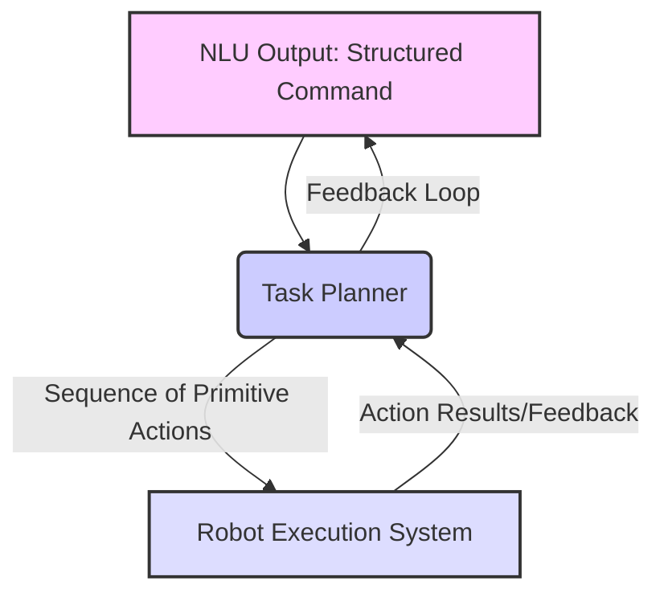
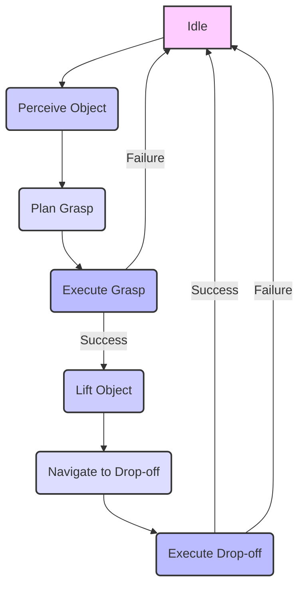

# Robot Action and Task Planning

## 19.1 Principles of Robot Action Selection and Task Planning

**Robot Action and Task Planning** is the bridge between understanding a human command (NLU output) and executing it physically. It involves breaking down a high-level goal into a sequence of primitive robot actions, considering the robot's capabilities, the environment, and task constraints. This process is crucial for autonomous and intelligent robot behavior.

### 19.1.1 Key Concepts
*   **Primitive Actions**: Basic, executable operations a robot can perform (e.g., `move_base`, `pick_object`, `open_gripper`).
*   **Task Plan**: A sequence of primitive actions that, when executed, achieve a high-level goal.
*   **State Representation**: How the robot and its environment are described at any given time.
*   **Planning Domain**: The set of actions, states, and their effects that the planner operates within.

## 19.2 Translating NLU Commands to Primitive Actions

The structured output from an NLU system (e.g., `{'intent': 'move', 'target': 'kitchen'}`) serves as the input to the task planner. The planner's job is to translate this semantic understanding into a series of robot-executable actions.

**Figure 19.1: Task Planning Pipeline from NLU Output to Primitive Actions**



*Figure 19.1: Illustrates the task planning pipeline, showing how structured commands from NLU are processed by a task planner to generate sequences of primitive actions for robot execution, often with feedback loops for dynamic adjustments.*

### 19.2.1 Defining Primitive Actions

Primitive actions are the building blocks of any task plan. They are typically implemented as ROS 2 actions or services for robustness and feedback.

**Example 19.1: Python Module Defining Primitive Robot Actions as ROS 2 Action Clients (`robot_actions.py`)**

This module would contain functions to call ROS 2 actions like navigation or manipulation.

```python
import rclpy
from rclpy.action import ActionClient
from rclpy.node import Node
from nav_msgs.msg import Odometry # Example for move_base feedback
# Assuming custom action types for MoveBase, PickObject, PlaceObject
from my_robot_interfaces.action import MoveBase, PickObject, PlaceObject 
import time

class RobotActions(Node):
    def __init__(self):
        super().__init__('robot_actions_client')
        self.move_base_client = ActionClient(self, MoveBase, 'move_base')
        self.pick_object_client = ActionClient(self, PickObject, 'pick_object')
        self.place_object_client = ActionClient(self, PlaceObject, 'place_object')
        self.get_logger().info('Robot Action Clients initialized.')

    def send_move_base_goal(self, pose):
        goal_msg = MoveBase.Goal()
        goal_msg.target_pose = pose # geometry_msgs/Pose
        self.move_base_client.wait_for_server()
        self._send_goal_future = self.move_base_client.send_goal_async(
            goal_msg,
            feedback_callback=self._move_base_feedback_callback)
        self._send_goal_future.add_done_callback(self._move_base_goal_response_callback)
        return self._send_goal_future

    def _move_base_feedback_callback(self, feedback_msg):
        feedback = feedback_msg.feedback
        self.get_logger().info(f'Move Base Feedback: Current Pose X={feedback.current_pose.position.x:.2f}')

    def _move_base_goal_response_callback(self, future):
        goal_handle = future.result()
        if not goal_handle.accepted:
            self.get_logger().info('Move Base Goal rejected :(')
            return
        self.get_logger().info('Move Base Goal accepted :)')
        self._get_result_future = goal_handle.get_result_async()
        self._get_result_future.add_done_callback(self._move_base_get_result_callback)

    def _move_base_get_result_callback(self, future):
        result = future.result().result
        self.get_logger().info(f'Move Base Result: {result.success}')

# Example usage within a planner
if __name__ == '__main__':
    rclpy.init()
    node = RobotActions()
    # Example: Send a simple goal
    # from geometry_msgs.msg import Pose, Point, Quaternion
    # target_pose = Pose(position=Point(x=1.0, y=0.0, z=0.0), orientation=Quaternion(x=0.0, y=0.0, z=0.0, w=1.0))
    # node.send_move_base_goal(target_pose)
    rclpy.spin(node)
    node.destroy_node()
    rclpy.shutdown()
```

## 19.3 Implementing a Basic Action Planning System

A basic task planner takes an NLU command, queries its knowledge base for relevant actions, and sequences them.

**High-level Lab Task**: Implement a Python-based task planner that takes a structured NLU command and generates a sequence of primitive actions.
1.  **Define NLU Command Format**: Use a dictionary or a custom ROS 2 message for structured commands.
2.  **Map Intent to Actions**: Create a mapping from NLU intents to sequences of `RobotActions` calls.

**Example 19.2: ROS 2 Node that Implements Task Planning Logic (`task_planner_node.py`)**

```python
import rclpy
from rclpy.node import Node
from my_msgs.msg import Command # Structured NLU command
from geometry_msgs.msg import Pose, Point, Quaternion

from robot_actions import RobotActions # Import our robot actions client

class TaskPlannerNode(Node):
    def __init__(self):
        super().__init__('task_planner_node')
        self.nlu_subscription = self.create_subscription(
            Command,
            'robot_commands',
            self.nlu_command_callback,
            10)
        self.robot_actions_client = RobotActions() # Our action clients node

        self.get_logger().info('Task Planner Node started.')

    async def nlu_command_callback(self, msg):
        self.get_logger().info(f'Received NLU command: Intent={msg.intent}, Entities={msg.entities_keys}={msg.entities_values}')
        
        if msg.intent == "move":
            # Example: "move to kitchen"
            # In a real system, "kitchen" would map to a known Pose
            target_location = msg.entities_values[msg.entities_keys.index("target")] if "target" in msg.entities_keys else "default"
            self.get_logger().info(f"Planning to move to: {target_location}")
            
            # Simple mapping for demonstration
            if target_location == "kitchen":
                target_pose = Pose(position=Point(x=3.0, y=0.0, z=0.0), orientation=Quaternion(x=0.0, y=0.0, z=0.0, w=1.0))
                # await self.robot_actions_client.send_move_base_goal(target_pose) # Async call
                self.get_logger().info(f"Generated action: Move to {target_pose}")
            else:
                self.get_logger().info("Unknown target location for move command.")

        elif msg.intent == "pick_object":
            object_name = msg.entities_values[msg.entities_keys.index("object")] if "object" in msg.entities_keys else "unknown_object"
            self.get_logger().info(f"Generated action: Pick up {object_name}")
            # await self.robot_actions_client.send_pick_object_goal(object_name)
            
        else:
            self.get_logger().warn(f"Unsupported intent: {msg.intent}")

def main(args=None):
    rclpy.init(args=args)
    task_planner_node = TaskPlannerNode()
    rclpy.spin(task_planner_node)
    task_planner_node.destroy_node()
    rclpy.shutdown()

if __name__ == '__main__':
    main()
```

## 19.4 Hierarchical Task Planning and State Machines

For more complex tasks, simple sequential planning is insufficient.
*   **Hierarchical Task Planning (HTP)**: Decomposes high-level tasks into smaller sub-tasks, recursively, until primitive actions are reached.
*   **State Machines**: Represent the robot's behavior as a set of states and transitions between them, triggered by events or conditions. This provides a structured way to manage task execution flow.

**Figure 19.2: State Machine for a Typical Robotic Task (e.g., Pick and Place)**



*Figure 19.2: A state machine diagram illustrating the sequential states and transitions involved in a common robotic task like pick and place.*

**Example 19.3: Python Script Demonstrating a State Machine (`complex_task_state_machine.py`)**

```python
from enum import Enum
import time

class RobotState(Enum):
    IDLE = 1
    PERCEIVING_OBJECT = 2
    PLANNING_GRASP = 3
    EXECUTING_GRASP = 4
    LIFTING_OBJECT = 5
    NAVIGATING_TO_DROPOFF = 6
    EXECUTING_DROPOFF = 7
    TASK_COMPLETE = 8
    TASK_FAILED = 9

class PickAndPlaceStateMachine:
    def __init__(self):
        self.current_state = RobotState.IDLE
        print(f"State: {self.current_state}")

    def transition(self, event):
        if self.current_state == RobotState.IDLE:
            if event == "command_received":
                self.current_state = RobotState.PERCEIVING_OBJECT
        elif self.current_state == RobotState.PERCEIVING_OBJECT:
            if event == "object_detected":
                self.current_state = RobotState.PLANNING_GRASP
            elif event == "object_not_found":
                self.current_state = RobotState.TASK_FAILED
        elif self.current_state == RobotState.PLANNING_GRASP:
            if event == "plan_successful":
                self.current_state = RobotState.EXECUTING_GRASP
            elif event == "plan_failed":
                self.current_state = RobotState.TASK_FAILED
        elif self.current_state == RobotState.EXECUTING_GRASP:
            if event == "grasp_successful":
                self.current_state = RobotState.LIFTING_OBJECT
            elif event == "grasp_failed":
                self.current_state = RobotState.TASK_FAILED
        # ... and so on for other states

        print(f"Event: {event}, New State: {self.current_state}")
        return self.current_state

    def run_task(self):
        # Simulate a task flow
        self.transition("command_received")
        time.sleep(1)
        self.transition("object_detected")
        time.sleep(1)
        self.transition("plan_successful")
        time.sleep(1)
        self.transition("grasp_successful")
        time.sleep(1)
        # Assuming rest of the task continues to success
        self.current_state = RobotState.TASK_COMPLETE
        print(f"Final State: {self.current_state}")

if __name__ == '__main__':
    sm = PickAndPlaceStateMachine()
    sm.run_task()
```

## 19.5 Integrating Action Planning with ROS 2 Execution Systems

Action planning systems often integrate with existing ROS 2 execution frameworks.
*   **Nav2**: The ROS 2 navigation stack for mobile robots. It provides capabilities for global and local path planning, obstacle avoidance, and executive control.
*   **MoveIt 2**: A powerful framework for mobile manipulation, providing tools for motion planning, kinematics, collision checking, and control for robotic arms and grippers.

**High-level Lab Task**: Create ROS 2 action clients to execute these primitive actions on a simulated robot.
*   **Integrate with Nav2**: Use `nav2_msgs/action/NavigateToPose` to send navigation goals.
*   **Integrate with MoveIt 2**: Use `moveit_msgs/action/MoveGroup` to send manipulation goals.

## Exercises and Practice Tasks

1.  **Primitive Action Definition**:
    *   For a robot operating in a kitchen to prepare a simple meal, define at least 5 primitive actions.
    *   For each action, specify its input parameters and expected output/result.
    *   Output: A Markdown table summarizing primitive actions.
2.  **Basic Task Planner**:
    *   Expand `task_planner_node.py` to handle NLU commands for a simple pick-and-place task (e.g., "pick up the red block and place it on the table").
    *   Map the NLU intent and entities to a sequence of `move_base`, `pick_object`, and `place_object` actions.
    *   Output: Planner generates the correct sequence of actions.
3.  **State Machine for Obstacle Avoidance**:
    *   Design a simple state machine for a mobile robot to navigate a corridor and avoid dynamic obstacles.
    *   Define states like `MOVE_FORWARD`, `AVOID_OBSTACLE`, `RECOVER`.
    *   Implement the transitions based on sensor readings (e.g., LiDAR).
    *   Output: Python state machine implementation.
4.  **Nav2 Integration**:
    *   Research `Nav2`'s `NavigateToPose` action.
    *   Modify `robot_actions.py` to include a client for this action.
    *   Modify `task_planner_node.py` to send a `NavigateToPose` goal based on an NLU command (e.g., "go to the living room").
    *   Output: Robot navigates to a specified pose in simulation.
5.  **MoveIt 2 Integration**:
    *   Research `MoveIt 2`'s `MoveGroup` action.
    *   Propose how you would integrate `MoveIt 2` into your `robot_actions.py` to handle manipulation commands (e.g., "pick up the cup"). What information would be needed from NLU and perception?
