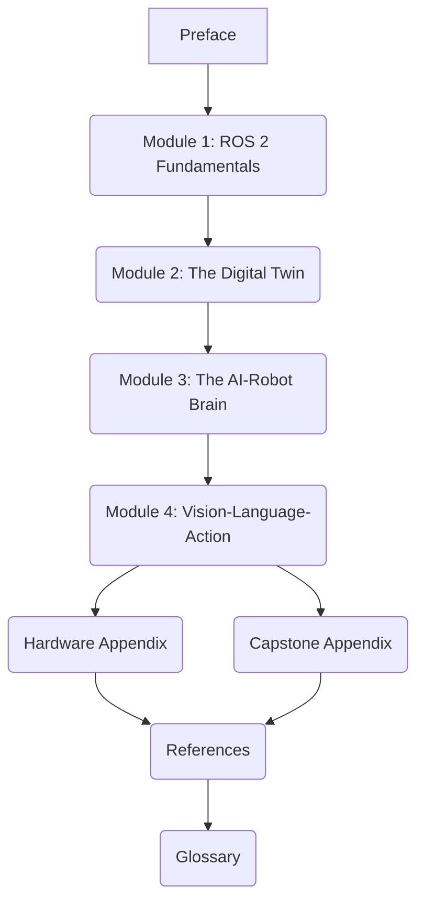

# Preface: Embodied Intelligence in the Age of Robotics

## P.1 Welcome to Physical AI & Humanoid Robotics

In an era increasingly defined by artificial intelligence, the next frontier lies not just in enhancing digital intelligence, but in extending it into the physical realm. Welcome to the world of **Physical AI and Humanoid Robotics** – a domain where computational brains meet mechanical bodies, enabling machines to perceive, reason, and act within the complex, unpredictable tapestry of the real world. This book serves as your comprehensive guide to understanding and building these embodied intelligent systems.

This textbook is designed for university-level students, researchers, and professionals embarking on capstone projects or advanced studies in robotics, AI, and engineering. Our primary motivation is to bridge the theoretical understanding of AI with the practical realities of robotics, providing a hands-on approach to designing, simulating, and controlling advanced robotic platforms.

## P.2 The Authors' Vision and Motivation

Our vision for "Physical AI & Humanoid Robotics" stems from a deep conviction that the future of AI is inherently physical. As AI models grow in sophistication, their impact is maximized when they can interact with and reshape our physical environment. Humanoid robots, with their human-like form factors, are uniquely poised to serve as the ultimate platform for this embodied intelligence, facilitating natural interaction and operation in spaces designed by and for humans.

We believe that a holistic understanding of this field requires not just theoretical knowledge but also practical experience with the leading-edge tools that drive innovation. Therefore, this book meticulously integrates the use of **ROS 2**, **Gazebo**, **Unity**, and **NVIDIA Isaac Sim** – foundational technologies that empower the creation of sophisticated robotic brains and bodies.

## P.3 Book Structure and How to Navigate Its Modules

This book is structured into four core modules, each designed to build upon the last, guiding you from foundational concepts to advanced integration techniques. Complementing these modules are essential appendices that provide practical resources, and a comprehensive glossary and reference section.

**Figure P.1: High-Level Book Structure**

*Figure P.1: A high-level overview of the book's modular structure, illustrating the progressive flow from foundational concepts (ROS 2) through advanced integration (VLA) and culminating in practical appendices and references.*

### Core Modules:

*   **Module 1: The Robotic Nervous System (ROS 2)**: Establish a strong foundation in ROS 2, the communication backbone of modern robots.
*   **Module 2: The Digital Twin (Gazebo & Unity)**: Learn to create and utilize high-fidelity virtual replicas of robots and environments for safe and efficient development.
*   **Module 3: The AI-Robot Brain (NVIDIA Isaac)**: Dive into NVIDIA Isaac Sim, a powerful platform for AI-driven simulation, perception, and synthetic data generation.
*   **Module 4: Vision-Language-Action (VLA)**: Explore the cutting-edge integration of computer vision, natural language understanding, and action planning to create truly intelligent robotic behaviors.

### Appendices & Resources:

*   **Hardware Appendix**: Practical guide to setting up hardware platforms like the NVIDIA Jetson Orin.
*   **Capstone Appendix**: Guidelines and insights for undertaking a comprehensive Physical AI and Humanoid Robotics project.
*   **References & Glossary**: A meticulously curated list of sources and definitions of key terms.

## P.4 Conventions Used Throughout This Book

To ensure clarity and consistency, this book employs the following conventions:

*   **Code Snippets**: All code examples are presented in dedicated blocks, often with accompanying file paths, and are designed to be reproducible. Pay close attention to environment setup and dependencies.
*   **Lab Tasks**: High-level lab tasks are provided within each chapter, encouraging hands-on application of concepts. Detailed step-by-step instructions will be found within companion code repositories or specific lab sections.
*   **Diagrams**: Visual representations (e.g., flowcharts, architecture diagrams) are used to clarify complex concepts. Where possible, text-based diagrams are included for accessibility.
*   **Word Count Targets**: Each chapter has an estimated word count to guide depth and scope.
*   **APA Citation**: All external sources and technical claims are cited using APA 7th edition style to maintain academic rigor.

## P.5 Prerequisites and Target Audience

### Prerequisites for Readers

While we strive to make complex topics accessible, readers will benefit significantly from:

*   **Basic Linux Command-Line Proficiency**: Essential for navigating development environments and running ROS 2 commands.
*   **Foundational Programming Skills**: Experience with Python is highly recommended, and a basic understanding of C++ will be beneficial for advanced ROS 2 topics.
*   **General Robotics and AI Interest**: A curiosity about how robots work and how AI can enable their intelligence.

### Target Audience

This book is specifically tailored for:

*   **University Students**: Those enrolled in capstone courses, advanced robotics, AI, or mechatronics programs.
*   **Researchers**: Seeking practical guidance on implementing Physical AI and Humanoid Robotics systems.
*   **Engineers and Developers**: Transitioning into or specializing in embodied AI and robotic development.

## Exercises and Practice Tasks

1.  **Reflect on Prerequisites**: Review your own skills against the listed prerequisites. Identify any areas where you might need to brush up. How do you plan to address these?
2.  **Explore the Repository**: Browse the companion GitHub repository for this book. Familiarize yourself with the directory structure for code examples (`book/src/`) and assets (`book/docs/assets/`).
3.  **Future Impact**: Based on your current understanding, what is one significant way you believe Physical AI will change the world in the next decade? Write a short paragraph explaining your thoughts.
4.  **Learning Path**: Given the book's modular structure, which module are you most keen to start with, and why? Consider your existing knowledge and future goals.
